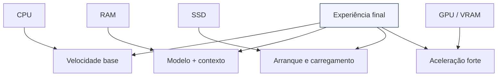
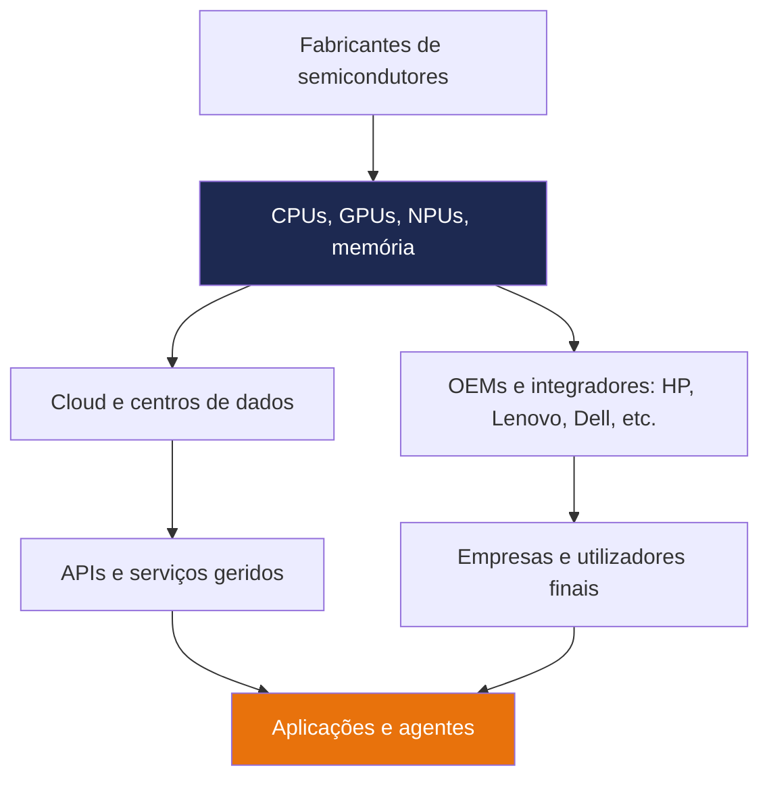

# Introdução ao livro

> *"A inteligência artificial deixou de ser uma curiosidade técnica: é agora uma infraestrutura estratégica, com custos, dependências e vantagens económicas muito reais."*

---

## Porque existe este capítulo?

Antes de construir o EmpresaIQ, vale a pena responder a quatro perguntas simples:

1. O que é, afinal, a IA moderna?
2. Quanto custa correr IA com qualidade aceitável em hardware real?
3. Quem são os principais players da indústria e o que controlam?
4. Que impacto económico isto já está a ter nas empresas e no mercado de trabalho?

Este capítulo dá-lhe o mapa mental para perceber o resto do livro sem precisar de jargão técnico.

---

## O que é a IA moderna?

Quando se fala de IA hoje, normalmente fala-se de **modelos de linguagem** e de **modelos multimodais**.

- Um modelo de linguagem lê texto, reconhece padrões e gera respostas plausíveis.
- Um modelo multimodal também interpreta imagens, áudio ou vídeo.
- Um agente de IA acrescenta ferramentas, memória e capacidade de agir.

Na prática, a IA moderna é uma máquina de probabilidade extremamente sofisticada: aprendeu com enormes quantidades de dados e depois generaliza para novas tarefas.

O ponto importante é este: **a IA não é magia**. Tem uma cadeia de valor concreta, custos concretos e limitações concretas.

---

## Quanto custa correr IA?

O custo de IA depende de duas abordagens muito diferentes:

- **Cloud/API**: paga por utilização, mas delega a infraestrutura.
- **Local/on-premises**: compra hardware uma vez e controla tudo internamente.

### Custos típicos na cloud

Com APIs de grandes modelos, o custo varia com o volume de uso. Em equipas pequenas, os valores parecem baixos no início, mas crescem depressa quando a empresa integra IA em processos diários.

| Cenário | Custo típico | Observação |
| --- | --- | --- |
| Uso ocasional | Baixo | Adequado para testes e protótipos |
| Uso diário por equipa | Médio | O custo sobe com rapidez |
| Automação intensiva | Alto | Pode tornar-se uma despesa operacional relevante |

### Custos típicos em hardware local

Para IA local, o custo é mais previsível. O investimento inicial depende de quão ambicioso quer ser.

| Nível | Hardware típico | Custo aproximado | Para que serve |
| --- | --- | --- | --- |
| Entrada | CPU moderna, 16 GB RAM, SSD | Baixo a moderado | Modelos pequenos e uso básico |
| Intermédio | 32 GB RAM, CPU forte, SSD rápido | Moderado | Melhor fluidez e modelos maiores quantizados |
| Avançado | GPU com VRAM dedicada | Elevado | Mais velocidade e modelos mais pesados |

:::tip 💡 Regra prática
Se o objetivo for aprendizagem, protótipo e privacidade, uma máquina de escritório já chega para muito. Se quiser throughput elevado, a GPU acelera bastante, mas também aumenta o custo.
:::

:::warning O custo não é só compra
Além do preço do hardware, há energia, refrigeração, manutenção, backups e tempo de administração. IA local troca custo variável por custo de posse.
:::

---

## O que o hardware realmente faz diferença?

Em IA local, os componentes mais importantes são:

- **CPU**: define o ritmo geral de inferência quando não há GPU.
- **RAM**: limita o tamanho do modelo e o contexto que consegue manter.
- **SSD**: influencia o carregamento do modelo e a responsividade do sistema.
- **GPU / VRAM**: acelera drasticamente o processamento quando existe suporte.

Para muitas empresas, o maior erro é olhar apenas para o processador. Em IA local, **RAM insuficiente mata a experiência muito mais depressa do que uma CPU média**.

O resultado prático é simples: a mesma IA pode parecer excelente num portátil bem configurado e frustrante num equipamento subdimensionado.

---

## Quem são os principais players da indústria?

A indústria está concentrada em alguns blocos principais.

| Player | Força principal | O que influencia | Custo que arrasta |
| --- | --- | --- | --- |
| OpenAI | Modelos fechados de grande qualidade | APIs, copilots, produtividade | Uso por token e dependência de cloud |
| Google | Ecossistema e multimodalidade | Pesquisa, integração com cloud e workspace | Consumo cloud e lock-in de plataforma |
| Anthropic | Segurança e assistentes de texto | Ambientes empresariais e uso intensivo de texto | Modelos premium com custo elevado |
| Microsoft | Distribuição e integração empresarial | Copilot, Azure, produtividade corporativa | Licenças, cloud e integração enterprise |
| Meta | Modelos open source de grande impacto | Acesso livre a modelos base | Custo menor de licença, maior custo operacional |
| Mistral | Modelos eficientes e europeus | Alternativas leves e empresariais | Custo de adoção e integração |
| Alibaba / Qwen | Modelos competitivos e multilingues | Custo, eficiência e ecossistema aberto | Hardware e tuning local |
| Intel | CPUs, NPUs e plataformas PC/servidor | Portáteis, desktops e inferência assistida | Custo do equipamento e eficiência energética |
| NVIDIA | GPUs, CUDA e aceleração massiva | Treino, inferência e servidores IA | GPUs, energia e infraestrutura de arrefecimento |
| AMD | CPUs e GPUs concorrenciais | PCs, estações e servidores alternativos | Melhor relação preço/desempenho em alguns cenários |
| SMCI (Supermicro) | Servidores e integração para IA | Racks, nós GPU e time-to-market em data center | Custo de chassis, integração e operação |
| TSMC (por vezes escrita como "SMC") | Fabrico avançado de chips | Capacidade produtiva de nós avançados | Custo upstream de toda a cadeia |
| HP | OEM de portáteis, desktops e workstations | Equipamentos empresariais e ciclo de renovação | Compra inicial, suporte e parque instalado |

O ponto estratégico é este: **quem controla o modelo, controla parte da cadeia económica da IA**. Isso significa acesso, preço, privacidade, localização dos dados e dependência tecnológica.

Mas a cadeia é maior do que o modelo. Na prática, a IA depende de uma pilha completa:

### O papel de cada camada

| Camada | Exemplos | Função | Tipo de custo |
| --- | --- | --- | --- |
| Semicondutores | TSMC, Intel Foundry, Samsung | Produção dos chips | Investimento industrial enorme |
| Hardware de processamento | Intel, NVIDIA, AMD | CPUs, GPUs, NPUs | Custo por unidade e energia |
| OEMs | HP, Dell, Lenovo, Asus | Montagem e venda de equipamentos | Compra inicial e suporte |
| Cloud | Azure, AWS, Google Cloud | Infraestrutura elástica | Custo recorrente e escalável |
| Modelos | OpenAI, Google, Anthropic, Meta, Qwen, Mistral | Inteligência propriamente dita | Licença, API ou operação local |
| Integração | Apps, agentes, copilots | Levar a IA para o negócio | Desenvolvimento, manutenção e adoção |

### Precos de referencia: GPUs e infraestrutura (resumo claro)

Os valores abaixo sao faixas tipicas de mercado para referencia rapida. Variam por regiao, volume, disponibilidade, contratos e suporte.

| Categoria | Faixa de preco tipica (USD) | O que inclui |
| --- | --- | --- |
| GPU workstation entrada (NVIDIA RTX profissional) | 1.000 - 4.000 | Uso local, prototipo e inferencia leve |
| GPU datacenter media (geracao A/H) | 10.000 - 35.000 | Inferencia/treino em servidor |
| GPU datacenter topo (H200/B200 e similares) | 30.000 - 60.000+ | IA de alta densidade e throughput elevado |
| Servidor 4x GPU | 80.000 - 220.000+ | Chassis, CPU, RAM, rede e 4 aceleradores |
| Servidor 8x GPU | 180.000 - 500.000+ | Plataforma para treino pesado e inferencia em escala |
| Rack de IA completo | 500.000 - 2.000.000+ | Multiplos servidores, networking e distribuicao eletrica |

### Precos de referencia: CPUs e equipamento base

Para nao ficar tudo centrado em GPU, aqui estao faixas tipicas de CPU e hardware de apoio.

| Item | Faixa de preco tipica (USD) | Nota pratica |
| --- | --- | --- |
| CPU desktop media (Intel Core i7 / AMD Ryzen 7) | 250 - 500 | Boa base para IA local leve e produtividade |
| CPU desktop alta (Intel Core i9 / AMD Ryzen 9) | 450 - 900 | Melhor desempenho para inferencia em CPU |
| CPU servidor (Intel Xeon / AMD EPYC) | 800 - 6.000+ | Depende muito de nucleos, cache e geracao |
| RAM 32 GB DDR4/DDR5 | 80 - 180 | Minimo confortavel para muitos fluxos locais |
| RAM 64 GB DDR4/DDR5 | 170 - 380 | Mais margem para contexto e multitarefa |
| SSD NVMe 1 TB | 60 - 130 | Sistema e modelos locais |
| SSD NVMe 2 TB | 110 - 260 | Mais espaco para multiplos modelos |
| Placa-mae/workstation board | 200 - 900 | Variavel por chipset e expansao |
| Fonte e arrefecimento robusto | 120 - 500 | Critico para estabilidade em carga continua |

### Valor de equipamentos completos (referencia rapida)

| Perfil de equipamento | Faixa tipica (USD) | Uso mais comum |
| --- | --- | --- |
| Portatil empresarial (16-32 GB RAM) | 900 - 2.500 | Equipas de negocio e IA local basica |
| Desktop profissional sem GPU de datacenter | 1.200 - 3.500 | Equipas tecnicas e prototipagem |
| Workstation com GPU dedicada | 2.500 - 10.000+ | Equipa de dados e inferencia acelerada |
| Servidor de entrada para IA (1-2 GPU) | 15.000 - 80.000 | Piloto on-premises |

:::warning Nota sobre precos
Nao existe "preco unico" para NVIDIA ou para qualquer fornecedor. O preco real depende de: stock, canal, suporte, servicos, prazo de entrega e local geografico.
:::

### NVIDIA: preco de equipamentos e stack completa

Quando se fala em "preco da NVIDIA", normalmente estao misturados varios niveis de compra:

| Nivel | Exemplo | Faixa tipica |
| --- | --- | --- |
| Componente | GPU individual | de milhares a dezenas de milhares de USD |
| Sistema | Servidor certificado (4x/8x GPU) | dezenas a centenas de milhares de USD |
| Plataforma | Racks e fabric de alto desempenho | centenas de milhares a milhoes de USD |

Para empresas, o custo final de uma plataforma NVIDIA inclui normalmente:

- aceleradores (GPU);
- CPU/RAM/armazenamento;
- rede (Ethernet/InfiniBand e switches);
- energia e arrefecimento;
- suporte, garantia e operacao.

### SMCI e TSMC: porque contam para o preco final

- **SMCI (Supermicro)**: e um integrador chave em servidores de IA. Muitas empresas compram "solucao pronta" com SMCI em vez de montar tudo internamente, reduzindo tempo de implementacao.
- **TSMC** (por vezes mencionada informalmente como "SMC"): fabrica chips de ponta para grande parte da industria. Quando ha pressao de capacidade ou mudancas de custo de fabrico, o efeito propaga-se para GPUs, servidores e cloud.

Em resumo: mesmo quando compra de um unico fornecedor, esta a pagar toda a cadeia industrial por tras.

### Custo total de infraestrutura: CAPEX + OPEX

| Bloco | Custo inicial (CAPEX) | Custo recorrente (OPEX) |
| --- | --- | --- |
| Hardware | Alto | Medio (substituicao e ampliacao) |
| Energia | Baixo | Medio a alto |
| Arrefecimento e espaco | Medio | Medio |
| Operacao e suporte | Medio | Medio a alto |
| Software/plataforma | Baixo a medio | Medio |

Em projetos reais, o erro mais comum e olhar apenas para o preco da GPU. O custo total e sempre a soma de infraestrutura + operacao.

### Investimento em datacenter (ordens de grandeza)

Os valores mudam muito por pais, energia, terreno e densidade de computacao, mas estas ordens de grandeza ajudam na leitura executiva.

| Escala | Investimento tipico | O que normalmente cobre |
| --- | --- | --- |
| Micro datacenter empresarial | 200.000 - 2.000.000 USD | Sala tecnica, energia redundante, rede, alguns racks |
| Datacenter medio regional | 10M - 150M USD | Infraestrutura eletrica, cooling, seguranca, conectividade |
| Hyperscale | 500M - varios B USD | Campus multi-edificio, energia dedicada e alta densidade IA |

:::warning Datacenter para IA nao e datacenter tradicional
Quando aumenta a densidade de GPU, sobem muito os custos de energia, arrefecimento, distribuicao eletrica e operacao. O CAPEX inicial e apenas parte da conta.
:::

### Impacto da energia: custo e competitividade

| Fator energetico | Efeito direto | Efeito economico |
| --- | --- | --- |
| Preco do kWh | Aumenta OPEX mensal | Reduz margem de servicos IA |
| Eficiencia (watts por token) | Mais respostas por unidade de energia | Vantagem de custo no longo prazo |
| Arrefecimento | Consumo extra para manter estabilidade | Impacta TCO e necessidade de investimento |
| Disponibilidade da rede | Menos downtime | Mais produtividade e previsibilidade |

Regra pratica: quem otimiza energia e eficiencia do hardware ganha vantagem estrutural no custo por inferencia.

### Impacto geografico: Europa, Estados Unidos, China e outros

| Regiao | Forca atual | Risco principal | Efeito no preco |
| --- | --- | --- | --- |
| Estados Unidos | Lideranca em modelos, cloud e ecossistema de software | Dependencia de cadeias globais de fabrico | Precos premium em alta procura |
| Europa | Regulacao, industria especializada e foco em soberania digital | Escala menor em hyperscale e chips | Pode pagar mais por menor escala, mas ganha em compliance |
| China | Escala industrial, integracao vertical e forte mercado interno | Restricoes comerciais e acesso a tecnologias especificas | Forte variacao por restricoes e substituicao tecnologica |
| Outros (India, Sudeste Asiatico, Medio Oriente, America Latina) | Crescimento acelerado e novas zonas de data center | Dependencia de importacao e energia | Custos logisticos e cambiais mais sensiveis |

### Para onde a industria caminha

As tendencias mais fortes para os proximos anos:

1. **Mais inferencia, menos foco exclusivo em treino**: empresas querem custo por resposta mais baixo.
2. **Modelos menores e mais eficientes**: melhor relacao qualidade/custo no edge e on-premises.
3. **Cadeia hibrida**: parte em cloud, parte local, consoante sensibilidade dos dados.
4. **Pressao por eficiencia energetica**: watts por token tornam-se metrica de negocio.
5. **Diversificacao de fornecedores**: AMD, Intel, integradores (SMCI) e OEMs ganham espaco em cenarios de custo.

:::tip ✅ Resumo executivo
Se quer previsibilidade de custo e controlo de dados, invista em arquitetura hibrida: IA local para cargas sensiveis e cloud para picos. Isto reduz dependencia e estabiliza o custo total.
:::

### Porque a NVIDIA pesa tanto?

A NVIDIA tornou-se dominante porque juntou três coisas: GPUs muito fortes, o ecossistema CUDA e uma oferta madura para treino e inferência. Isso fez com que muitos projetos de IA dependessem não só do chip, mas também do software à volta dele.

Na prática, quando uma empresa compra uma GPU NVIDIA, não está só a pagar hardware. Está também a pagar:

- compatibilidade;
- velocidade de execução;
- suporte a bibliotecas de IA;
- menor risco técnico;
- maior procura no mercado, o que mantém os preços elevados.

### Onde a Intel e a AMD entram?

A Intel continua a ser decisiva em PCs empresariais, portáteis e servidores, e a AMD ganhou muito espaço com excelente relação preço/desempenho em CPUs e GPUs. Para IA local, isto importa porque nem toda a empresa precisa de uma GPU topo de gama.

Em muitos cenários, uma máquina com CPU Intel ou AMD forte, bastante RAM e SSD rápido é suficiente para modelos quantizados e fluxos de trabalho úteis.

### E a HP?

A HP entra na parte mais visível da cadeia: o equipamento que chega à secretária do utilizador.

Os OEMs como a HP são importantes porque determinam:

- que CPU e GPU vem no equipamento;
- quanta RAM está instalada de fábrica;
- se o portátil é fácil de reparar ou expandir;
- quanto custa renovar o parque informático;
- quão padronizado é o ambiente da empresa.

Isto afeta directamente o custo total da adoção de IA local, porque muitas empresas não compram “IA”; compram postos de trabalho capazes de a executar.

:::info Regra prática de compra
Se uma empresa já vai renovar portáteis, vale a pena pensar no equipamento como plataforma de IA, não apenas como máquina de escritório. Um portátil com 16 GB pode servir para produtividade normal, mas 32 GB começa a mudar o jogo para IA local.
:::

:::info Porque isto interessa à sua empresa
Se uma empresa depende de uma API fechada, depende também do preço, das regras de uso e da disponibilidade do fornecedor. Se usa modelos locais ou abertos, ganha margem de manobra.
:::

---

## O impacto económico já começou

A IA não está apenas a mudar produtos. Está a mudar custos, processos e produtividade.

### Efeitos positivos

- Redução do tempo gasto em tarefas repetitivas
- Aumento da produtividade individual
- Automação de apoio ao cliente, análise documental e geração de texto
- Acesso a capacidades avançadas em pequenas equipas
- Maior competitividade para PME que antes não conseguiam escalar

### Efeitos de risco

- Pressão sobre funções administrativas e repetitivas
- Dependência de plataformas externas e de APIs pagas
- Aumento de desigualdade entre empresas que adotam IA e as que não adotam
- Custos escondidos em integração, governação e segurança

Em muitos setores, a questão já não é se a IA vai ser usada. É **quem vai capturar o valor económico dessa produtividade extra**.

### Impacto macroeconomico na economia

| Dimensao | Impacto observado | Efeito esperado |
| --- | --- | --- |
| Produtividade | Mais output por trabalhador em tarefas cognitivas | Crescimento de margem e competitividade |
| Emprego | Menos tarefas repetitivas, mais procura por perfis tecnicos e de supervisao | Requalificacao e mudanca de funcoes |
| Investimento | Mais CAPEX em computacao, energia e conectividade | Reorganizacao setorial e novos polos industriais |
| Comercio internacional | Dependencia de chips, GPUs e cloud global | Sensibilidade geopolitica e cambial |
| Politica industrial | Incentivos a semicondutores, energia e soberania digital | Corrida por autonomia tecnologica |

Em resumo: IA ja e tema de politica economica, nao apenas de tecnologia. Empresas que dominam custo de hardware + energia + operacao ficam em vantagem no ciclo economico.

---

## Impacto no trabalho e nas empresas

IA não elimina automaticamente empregos, mas altera tarefas.

Um contabilista, um advogado ou um gestor continuam a ser necessários. O que muda é a quantidade de trabalho manual que cada pessoa consegue fazer num dia.

| Área | Antes da IA | Depois da IA |
| --- | --- | --- |
| Administração | Processos manuais | Mais automatização e triagem |
| Suporte ao cliente | Respostas repetitivas | Assistentes e base de conhecimento |
| Jurídico | Leitura integral manual | Pesquisa e resumo assistidos |
| Marketing | Produção lenta de conteúdos | Iteração rápida e personalização |
| TI | Scripts e suporte reativo | Copilots e operações assistidas |

O valor económico real aparece quando a empresa deixa de usar IA como brinquedo e passa a usá-la como infraestrutura.

---

## Porque a IA local ganha peso económico

Para muitas organizações, a IA local tem uma vantagem estratégica:

- reduz custos recorrentes;
- diminui dependência de fornecedores;
- melhora a soberania de dados;
- permite previsibilidade orçamental;
- facilita adoção em ambientes sensíveis.

Isto é especialmente relevante para PME, profissionais liberais, indústria e administração pública.

Quando o uso diário cresce, a diferença entre pagar por chamada e controlar o hardware torna-se muito visível.

### A conta real do investimento

Para perceber o custo total, pense em quatro blocos:

| Bloco | O que inclui | Impacto no orçamento |
| --- | --- | --- |
| Hardware | CPU, RAM, SSD, GPU, portátil/desktop | Maior custo inicial |
| Energia | Consumo elétrico e arrefecimento | Custo contínuo previsível |
| Software | Sistema, drivers, runtime, ferramentas | Pode ser baixo ou zero |
| Operação | Instalação, manutenção, backups, suporte | Custo de equipa e tempo |

Se usar cloud, a maior fatia vai para a utilização recorrente. Se usar hardware local, a maior fatia vai para a compra inicial e para a operação interna.

### Exemplo de cenários de custo

| Cenário | O que compra | Perfil de custo |
| --- | --- | --- |
| Portátil empresarial | Intel ou AMD, 16 GB RAM, SSD | Baixo a moderado, bom para início |
| Workstation local | CPU forte, 32-64 GB RAM, SSD rápido | Moderado, muito melhor para IA local |
| Estação com GPU | NVIDIA ou AMD GPU dedicada | Elevado, ideal para aceleração forte |
| Cloud intensiva | Nada físico no escritório | Pago continuamente por uso |

O ponto não é dizer que um caminho é sempre melhor. O ponto é perceber que cada camada da indústria muda a factura final da IA.

---

## O que deve guardar deste capítulo

Se quiser ficar com uma imagem simples, guarde isto:

1. A IA moderna já é uma infraestrutura económica, não apenas uma ferramenta experimental.
2. O hardware define o custo e a experiência de uso, especialmente em IA local.
3. A indústria está concentrada em poucos grandes players, cada um com interesses e modelos de negócio diferentes.
4. O impacto económico da IA é real e já está a mudar produtividade, custos e organização do trabalho.

No próximo capítulo, vamos pegar nesta base e perceber porque a IA local faz sentido para o EmpresaIQ.

---

*Capítulo seguinte: [1. Introdução →](./introducao)*
