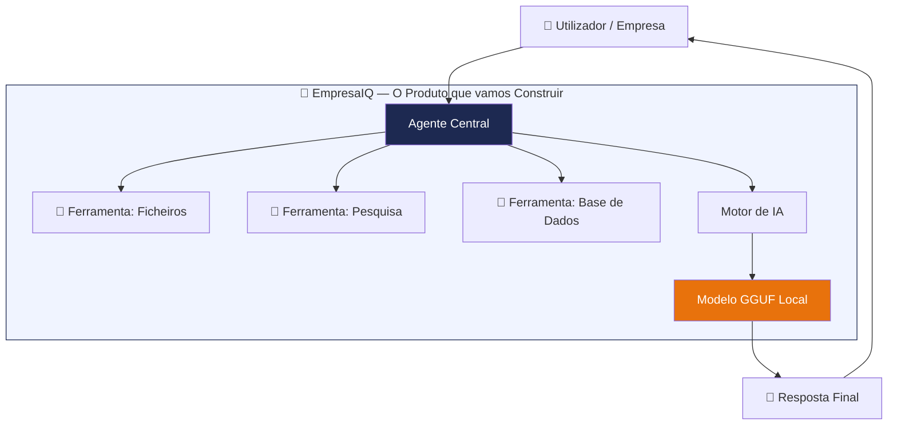

# Introdução

> *"A inteligência artificial mais poderosa não é a que vive na cloud — é a que trabalha para si, no seu computador, sem pedir licença a ninguém."*

---

## Porquê este livro?

Imagine ter um assistente inteligente na sua empresa que responde perguntas, analisa documentos, redige relatórios e executa tarefas automaticamente — **sem enviar um único byte de dados para a internet**, **sem pagar subscrições mensais** e **sem depender de nenhum fornecedor externo**.

Isso é exactamente o que vamos construir juntos neste livro.

Nos últimos anos, ferramentas como o ChatGPT e o Google Gemini tornaram a IA acessível a toda a gente. Mas há um problema: **os seus dados saem do seu computador**. Contratos, propostas, dados de clientes, informação confidencial — tudo vai para servidores de outras empresas, noutros países, sujeitos a políticas que mudam sem aviso.

Existe uma alternativa. Com os avanços recentes em modelos de linguagem *open source* e em ferramentas como o **llama.cpp**, hoje é possível correr um agente de IA genuinamente inteligente num PC normal com apenas 8 GB de RAM — sem GPU, sem cloud, sem custos recorrentes.

**Este livro mostra-lhe como fazer isso**, passo a passo, mesmo que nunca tenha trabalhado com IA antes.

---

## O que é o EmpresaIQ?

Ao longo deste livro, vamos construir um produto chamado **EmpresaIQ** — um sistema de agentes de inteligência artificial local, desenhado para o contexto empresarial português.

O EmpresaIQ não é apenas um exemplo académico. É uma solução real, que pode instalar, personalizar e usar na sua empresa. Cada capítulo adiciona uma nova peça ao sistema, até termos um agente completo e funcional.



O sistema final terá:

| Componente | O que faz | Quando é construído |
|---|---|---|
| **Motor de IA (llama.cpp)** | Corre o modelo de linguagem em CPU | Caps. 8–9 |
| **Modelo Phi-3-mini ou Qwen2.5** | O "cérebro" do agente | Cap. 9 |
| **Ferramentas** | Permitem ao agente agir no mundo real | Cap. 10 |
| **Agente ReAct** | Raciocina e decide que ferramentas usar | Cap. 11 |
| **Interface de Chat** | Conversa em tempo real com o agente | Cap. 13 |
| **Memória Conversacional** | Lembra-se do contexto da conversa | Cap. 18 |
| **Ontologia de Conhecimento** | Estrutura o saber da empresa | Cap. 19 |

---

## Como este livro está organizado

Este livro está dividido em quatro partes. Pode lê-lo do início ao fim, ou saltar para a parte que mais lhe interessa.

### Parte I — Fundamentos (Caps. 1–5)
*"O que é tudo isto e porque faz sentido?"*

Antes de instalar qualquer coisa, vamos perceber os conceitos. O que é um agente de IA? Porque usar IA local em vez da cloud? Que hardware precisamos? Que modelo escolher? Estes capítulos respondem a todas estas perguntas com linguagem simples e sem jargão desnecessário.

### Parte II — Instalação e Configuração (Caps. 6–9)
*"Preparar o terreno para o EmpresaIQ"*

Vamos instalar o Python, configurar o ambiente de desenvolvimento, instalar o llama.cpp (o motor que corre os modelos) e descarregar o modelo de IA. No final desta parte, o motor do EmpresaIQ estará a funcionar.

### Parte III — Construção do Agente (Caps. 10–12)
*"Dar vida ao EmpresaIQ"*

Aqui construímos o coração do sistema: as ferramentas que o agente usa, o agente em si com capacidade de raciocínio, e as optimizações para correr bem em qualquer CPU.

### Parte IV — Produção e Evolução (Caps. 13–20)
*"Tornar o EmpresaIQ robusto e inteligente"*

Interface de chat, automatização por agendamento, segurança e privacidade, melhorias futuras, suporte ao modelo Qwen2.5, memória conversacional, ontologias de conhecimento e, por fim, um olhar sobre o caminho percorrido.

---

## Para quem é este livro

Este livro foi escrito a pensar em pessoas sem experiência prévia em inteligência artificial. Se sabe ligar um computador e já ouviu falar de ChatGPT, tem tudo o que precisa para começar.

Mais especificamente, este livro é para:

- **Empreendedores e gestores** que querem usar IA nas suas empresas sem depender de fornecedores externos
- **Consultores e advogados** que trabalham com informação confidencial e não podem arriscar expô-la
- **Técnicos de TI** que querem perceber e implementar soluções de IA locais
- **Programadores iniciantes** que querem aprender Python e IA ao mesmo tempo, com um projecto real
- **Curiosos** que querem perceber como a IA funciona "por dentro"

:::info Não precisa de ser programador
Os exemplos de código são explicados linha a linha. Mesmo que nunca tenha programado, conseguirá seguir este guia. O mais importante é a curiosidade.
:::

---

## O que precisa para começar

Para construir o EmpresaIQ, vai precisar de:

| Requisito | Mínimo | Recomendado |
|---|---|---|
| **Sistema Operativo** | Windows 10, Ubuntu 20.04, macOS 12 | Windows 11 / Ubuntu 22.04 |
| **RAM** | 8 GB | 16 GB |
| **Espaço em Disco** | 6 GB livres | 10 GB livres |
| **Python** | 3.11 | 3.11 ou 3.12 |
| **Internet** | Apenas para instalação inicial | — |

:::warning GPU não é necessária
Ao contrário do que se pensa, não precisa de uma placa gráfica cara. O EmpresaIQ foi desenhado para correr exclusivamente em CPU, tornando-o acessível a praticamente qualquer computador de escritório.
:::

---

## Convenções usadas neste livro

Ao longo do livro, vai encontrar vários tipos de caixas informativas:

:::tip Dica
Sugestões práticas para melhorar o seu trabalho ou poupar tempo.
:::

:::info Nota
Informação adicional útil, mas não obrigatória para continuar.
:::

:::warning Atenção
Algo importante que pode causar erros se ignorado.
:::

:::danger Cuidado
Situações que podem comprometer a segurança ou os seus dados.
:::

O código é sempre apresentado com o nome do ficheiro indicado:

```python title="exemplo.py"
# Isto é uma linha de código Python
print("EmpresaIQ está a funcionar!")
```

Os comandos para executar no terminal aparecem assim:

```bash
python agente_local.py
```

---

## Antes de começar: uma nota sobre IA

Se nunca trabalhou com inteligência artificial, aqui está a analogia mais simples que existe:

**Um modelo de linguagem é como um funcionário muito bem lido** — leu milhões de livros, artigos e documentos, e consegue responder a quase qualquer pergunta. Mas sozinho, só fala. Um **agente** é esse mesmo funcionário equipado com ferramentas: um telefone, acesso a ficheiros, uma calculadora. Agora já pode *agir*, não apenas falar.

O **EmpresaIQ** é esse agente — inteligente, equipado, e completamente seu.

Vamos começar.

---

*Capítulo seguinte: [2. Porque usar IA Local →](./porque-ia-local)*