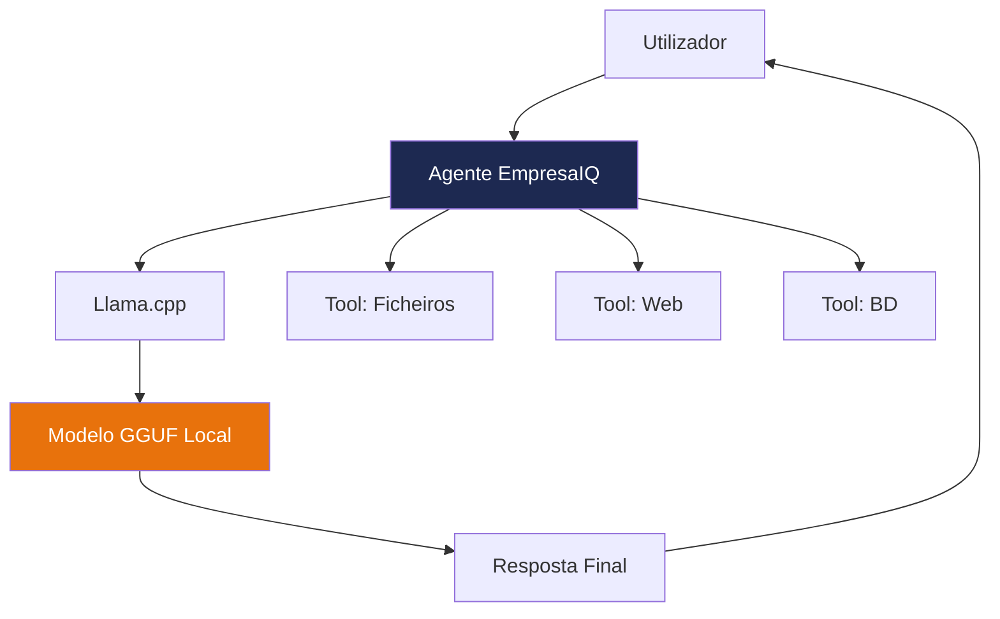

## O que vai aprender

Este guia mostra como criar um agente inteligente local baseado em modelos Open Source utilizando:

| Tecnologia | Função |
|---|---|
| **Phi-3-mini** | Modelo de linguagem compacto e eficiente |
| **Llama.cpp** | Motor de inferência CPU optimizado |
| **LangChain** | Framework de construção de agentes |
| **Python** | Linguagem de programação |
| **GGUF Quantizado** | Formato de modelo comprimido |

Tudo a funcionar diretamente no seu computador, **sem internet**, **sem APIs pagas** e **sem exposição de dados**.

## Para quem é este guia

Este guia é ideal para:

- **Empresas** que precisam de privacidade total
- **Consultores** que trabalham com dados sensíveis
- **Equipas de TI** que querem autonomia tecnológica
- **Programadores** que exploram IA local
- **Qualquer pessoa** com um PC normal e curiosidade

:::info Requisitos mínimos
- Windows 10/11, Linux ou macOS
- 8 GB RAM
- Python 3.11+
- 4 GB de espaço em disco livre
:::

> **EmpresaIQ** — O futuro da IA não pertence apenas à cloud. O futuro também corre localmente.