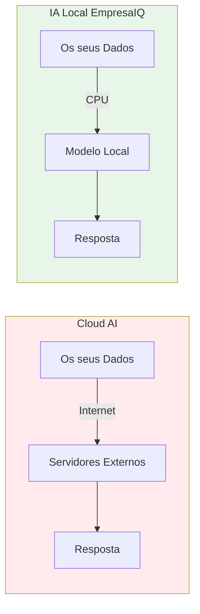

## Privacidade Total

Os dados nunca saem do computador. Nenhum contrato, nenhuma proposta, nenhum dado de cliente é transmitido para servidores externos.

:::danger Riscos das APIs Cloud
Ao usar ChatGPT, Claude ou Gemini via API:
- Os seus dados podem ser usados para treino de modelos
- Está sujeito a mudanças de política de privacidade
- Os dados atravessam múltiplos países e jurisdições
:::

## Sem Custos Mensais

Não existe pagamento de APIs. Compare:

| Solução | Custo Estimado Mensal |
|---|---|
| GPT-4o API (uso moderado) | 50€ – 500€ |
| Claude API (uso moderado) | 40€ – 400€ |
| **IA Local EmpresaIQ** | **0€** |

Após o setup inicial, o custo é **zero**.

## Independência Total

Não depende da OpenAI, Anthropic ou outros fornecedores. Sem riscos de:

- Alterações de preços
- Descontinuação do serviço
- Limites de utilização
- Problemas de compliance

## Velocidade Local

Sem latência de internet. A resposta depende apenas do CPU local — sem filas de espera em servidores remotos.

## Segurança Empresarial

Ideal para sectores regulados:

import Tabs from '@theme/Tabs';
import TabItem from '@theme/TabItem';

<Tabs>
  <TabItem value="juridico" label="Jurídico">
    Contratos, pareceres, documentos confidenciais sem exposição.
  </TabItem>
  <TabItem value="financas" label="Finanças">
    Análises financeiras, relatórios internos, dados de clientes protegidos.
  </TabItem>
  <TabItem value="saude" label="Saúde">
    Dados de pacientes, relatórios médicos — conformidade com RGPD.
  </TabItem>
  <TabItem value="governo" label="Governo">
    Contratos públicos, dados sensíveis — sem saída para cloud.
  </TabItem>
</Tabs>

## Resumo das Vantagens

```
✅ Privacidade 100%
✅ Custo zero após setup
✅ Sem dependência de fornecedores
✅ Funciona offline
✅ Conformidade RGPD nativa
✅ Velocidade consistente
✅ Controlo total dos dados
```