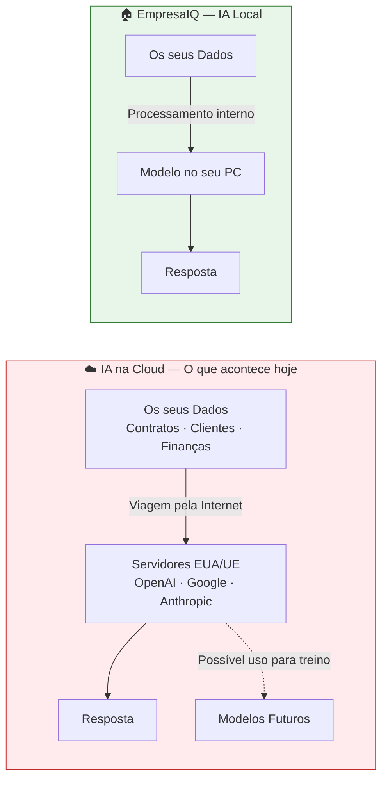

# Porque usar IA Local

> *"Dar os seus dados confidenciais a um serviço de cloud é como contratar um assistente que envia cópias dos seus documentos para o patrão dele."*

---

## O problema que ninguém fala abertamente

Quando usa o ChatGPT, o Claude ou o Google Gemini para analisar um contrato, redigir uma proposta ou responder a uma questão sobre um cliente, **o que acontece com esses dados?**

A resposta honesta: saem do seu computador, viajam pela internet, são processados em servidores de empresas americanas, e ficam sujeitos às políticas de privacidade dessas empresas — políticas que podem mudar a qualquer momento.

Para uso pessoal e criativo, isso pode ser aceitável. Para uma empresa que trabalha com dados sensíveis, **não é**.

---

## Dois mundos completamente diferentes

Á esquerda: o que acontece quando usa IA na cloud. Os seus dados saem do computador.

À direita: o que acontece com o EmpresaIQ. Os seus dados nunca saem.

---

## Razão 1 — Privacidade real, não prometida

Com o EmpresaIQ, os dados **ficam no seu computador**. Sempre. Não há forma técnica de saírem — porque o modelo corre localmente e não há ligação a servidores externos durante a utilização.

Isto não é uma promessa de privacidade. É uma garantia técnica.

:::danger O que arrisca ao usar APIs de cloud com dados empresariais
- Os seus dados podem ser usados para treinar versões futuras dos modelos
- Está sujeito a alterações das políticas de privacidade sem aviso prévio
- Os dados atravessam múltiplos países e jurisdições legais diferentes
- Em caso de fuga de dados no fornecedor, a sua informação pode ser exposta
- Conformidade com o RGPD fica dependente de um terceiro que não controla
:::

Para sectores como o jurídico, financeiro, saúde e administração pública, a IA local não é um luxo — é uma necessidade.

---

## Razão 2 — Custo zero após a instalação

Cada vez que usa uma API de cloud, paga. As APIs cobram por cada pergunta que faz ao modelo — medido em "tokens" (pedaços de texto). O custo acumula depressa.

| Solução | Custo Estimado Mensal | Controlo de Dados |
|---|---|---|
| GPT-4o API (uso moderado) | 50€ – 500€ | ❌ Dados saem |
| Claude API (uso moderado) | 40€ – 400€ | ❌ Dados saem |
| Gemini API (uso moderado) | 30€ – 300€ | ❌ Dados saem |
| **EmpresaIQ — IA Local** | **0€/mês** | **✅ Dados ficam consigo** |

Depois de instalar o EmpresaIQ, pode fazer mil perguntas por dia. O custo não muda: **zero**.

:::tip O único custo real
A electricidade. Um PC moderno a correr um modelo GGUF consome entre 30W e 80W — menos do que uma lâmpada de escritório.
:::

---

## Razão 3 — Independência total dos fornecedores

Empresas de cloud podem:

- **Aumentar preços** sem aviso (já aconteceu com OpenAI e Azure OpenAI)
- **Descontinuar modelos** que está a usar (o GPT-3 foi descontinuado)
- **Impor limites de utilização** que bloqueiam a sua operação
- **Mudar as condições** de privacidade ao actualizar os Termos de Serviço

Com o EmpresaIQ, o modelo está **no seu disco**. Ninguém lho pode tirar, alterar ou tornar mais caro.

---

## Para que sectores faz mais sentido?

O EmpresaIQ é especialmente valioso em contextos onde a confidencialidade é crítica:

| Sector | Dados Sensíveis Típicos | Risco na Cloud |
|---|---|---|
| **Jurídico** | Contratos, pareceres, processos | Muito alto |
| **Financeiro** | Relatórios, dados de clientes, análises | Muito alto |
| **Saúde** | Registos de pacientes, diagnósticos | Crítico (RGPD) |
| **Administração Pública** | Contratos públicos, dados de cidadãos | Crítico |
| **Indústria** | Propriedade intelectual, patentes | Alto |
| **Consultoria** | Estratégias de clientes, due diligence | Alto |

---

## Mas a IA local é tão boa quanto a cloud?

Resposta honesta: **para tarefas empresariais do dia-a-dia, sim**.

Os modelos que vamos usar — Phi-3-mini e Qwen2.5 — foram treinados especificamente para serem eficientes. Não são os maiores modelos do mundo, mas para analisar documentos, responder perguntas, redigir textos e automatizar tarefas repetitivas, **são mais do que suficientes**.

| Tarefa | EmpresaIQ | GPT-4o |
|---|---|---|
| Responder perguntas sobre documentos | ✅ Excelente | ✅ Excelente |
| Redigir emails e relatórios | ✅ Muito bom | ✅ Excelente |
| Análise de contratos simples | ✅ Muito bom | ✅ Excelente |
| Criação de imagens | ❌ Não suporta | ✅ Sim |
| Raciocínio matemático complexo | ⚠️ Limitado | ✅ Bom |
| **Privacidade total** | **✅ Garantida** | **❌ Impossível** |
| **Custo mensal** | **✅ 0€** | **❌ 50€–500€** |

Para a maioria das necessidades empresariais reais, o EmpresaIQ resolve o problema — com privacidade e sem custos.

---

## Resumo

Usamos IA local porque:

1. **Privacidade garantida** — os dados nunca saem do seu computador
2. **Custo zero** — sem subscrições, sem pagamento por uso
3. **Independência** — não depende de ninguém para funcionar
4. **Conformidade RGPD** — nativa, sem configuração adicional
5. **Offline** — funciona mesmo sem internet

No próximo capítulo, vamos perceber o único desafio real da IA local: os limites de hardware — e como o EmpresaIQ os ultrapassa.

---

*Capítulo seguinte: [3. Limitações de Hardware e Estratégia →](./limitacoes-hardware)*