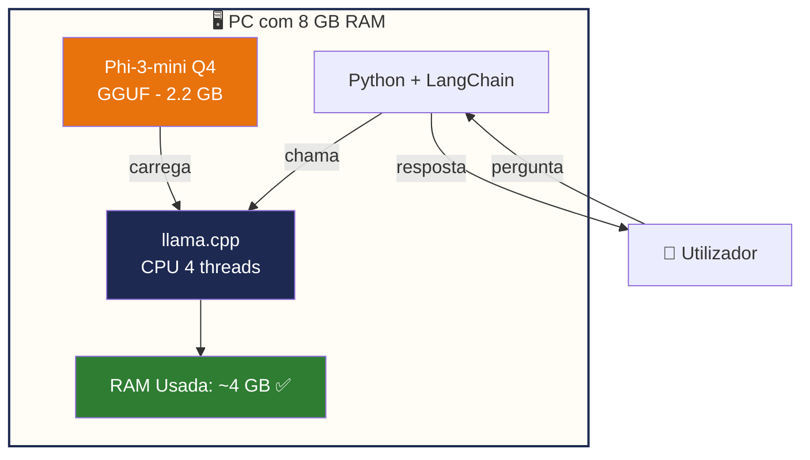

## O Problema dos Modelos Grandes

Modelos populares exigem recursos enormes:

| Modelo | RAM Necessária | GPU |
|---|---|---|
| Llama 3 70B | 128 GB | Obrigatória |
| Mixtral 8x7B | 64 GB | Obrigatória |
| DeepSeek V3 | 32 GB+ | Obrigatória |
| Llama 3 8B (FP16) | 16 GB | Recomendada |

Estes modelos estão **fora de alcance** num PC normal.

## A Estratégia Correta

A solução passa por três pilares:

### 1. Modelos Pequenos

Escolher modelos entre **2B e 4B parâmetros**. São surpreendentemente capazes para tarefas empresariais como:

- Responder perguntas sobre documentos
- Redigir emails e relatórios
- Analisar contratos
- Automatizar tarefas repetitivas

### 2. Quantização

Comprimir o modelo matematicamente para caber em menos RAM:

```
Modelo Original (FP16):  7 GB  ❌ Não cabe
Modelo Q4_K_M:           2.2 GB ✅ Cabe fácilmente
```

### 3. Inferência CPU com llama.cpp

O **llama.cpp** é um motor de inferência escrito em C++ optimizado para CPU. Permite:

- Correr modelos GGUF directamente em CPU
- Utilizar todos os núcleos disponíveis
- Gerir a memória de forma eficiente

## Comparação de Abordagem

```
❌ Abordagem Errada:
   "Quero correr Llama 3 70B no meu PC com 8 GB RAM"
   → Impossível

✅ Abordagem Correta:
   "Vou usar Phi-3-mini Q4 com llama.cpp"
   → Funciona perfeitamente
```

## Arquitectura Final



:::tip Dica de Performance
Feche aplicações desnecessárias antes de correr o agente. Cada GB de RAM livre melhora a velocidade de resposta.
:::