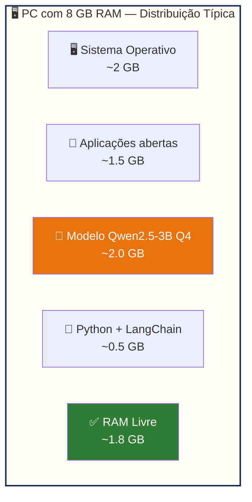
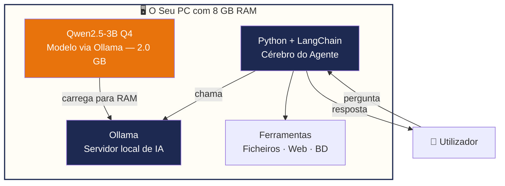

# Limitações de Hardware e Estratégia

> *"A pergunta não é 'tenho hardware suficiente para correr IA?'. A pergunta certa é 'estou a escolher o modelo certo para o meu hardware?'."*

---

## O mito da GPU obrigatória

Quando a maioria das pessoas ouve "inteligência artificial", pensa automaticamente em servidores enormes, GPUs caras e centros de dados. Esta ideia faz sentido para treinar modelos de IA — esse processo é realmente exigente. Mas **correr** um modelo (o que os técnicos chamam de "inferência") é uma história diferente.

Nos últimos dois anos, houve uma revolução silenciosa: surgiram modelos de linguagem compactos e técnicas de compressão que permitem correr IA genuinamente útil num portátil normal. O EmpresaIQ aproveita exactamente esta revolução.

---

## Porquê alguns modelos são impossíveis num PC normal

Para perceber a estratégia do EmpresaIQ, precisamos de entender brevemente porque é que alguns modelos de IA são tão grandes.

Um modelo de linguagem é essencialmente um conjunto gigantesco de números — chamados "parâmetros" — que representam o conhecimento do modelo. Cada parâmetro precisa de espaço em memória.

| Modelo | Parâmetros | RAM Necessária | GPU |
|---|---|---|---|
| Llama 3 70B | 70 mil milhões | 128 GB | Obrigatória |
| Mixtral 8x7B | 56 mil milhões | 64 GB | Obrigatória |
| DeepSeek V3 | 37 mil milhões | 32 GB+ | Obrigatória |
| Llama 3 8B (formato completo) | 8 mil milhões | 16 GB | Recomendada |
| **Qwen2.5-3B Q4 (EmpresaIQ)** | **3 mil milhões** | **2,0 GB** | **❌ Não precisa** |

Estes modelos grandes estão completamente **fora de alcance** para um computador de escritório. Mas os modelos que usamos no EmpresaIQ cabem confortavelmente em 8 GB de RAM.

:::info O que são "parâmetros"?
Pense nos parâmetros como os neurónios de um cérebro artificial. Mais parâmetros = mais capacidade. Mas, tal como um médico especialista nem sempre é melhor que um médico de clínica geral para uma consulta de rotina, um modelo menor pode ser a escolha certa para tarefas do dia-a-dia.
:::

---

## A estratégia em três pilares

O EmpresaIQ resolve o problema do hardware com três decisões inteligentes, usadas em conjunto:

### Pilar 1 — Modelos compactos e especializados

Em vez de tentar correr modelos gigantes, escolhemos modelos entre **2B e 4B parâmetros** que foram especialmente optimizados para raciocínio e seguimento de instruções. O **Qwen2.5-3B** da Alibaba é a nossa escolha principal — excelente compreensão de português, eficiente em CPU, e a base do modelo empresaiq personalizado.

Para as tarefas que o EmpresaIQ precisa de realizar, estes modelos são **mais do que suficientes**:

- ✅ Analisar e resumir documentos
- ✅ Responder perguntas sobre conteúdo
- ✅ Redigir emails, relatórios e propostas
- ✅ Executar ferramentas e automatizar tarefas
- ✅ Manter contexto de conversação

### Pilar 2 — Quantização (compressão do modelo)

A quantização é uma técnica que comprime o modelo sem perder demasiada qualidade. É como comprimir uma fotografia: o ficheiro fica muito mais pequeno, e a imagem continua perfeitamente reconhecível.

Na prática:

```
Qwen2.5-3B formato completo (FP16):  ~6.0 GB  ❌ Não cabe facilmente em 8 GB RAM
Qwen2.5-3B quantizado Q4 (Ollama):  ~2.0 GB  ✅ Cabe, sobra espaço
```

O **Ollama** trata da quantização automaticamente ao descarregar o modelo — não precisa de gerir ficheiros GGUF manualmente. Vamos aprender mais sobre isto no Capítulo 5.

### Pilar 3 — Ollama como servidor local de IA

O **Ollama** é uma ferramenta open source que serve de servidor para correr modelos de IA localmente. Foi desenhado para ser simples de usar, gere a quantização automaticamente, e expoem uma API REST que o Python usa para comunicar com o modelo.

Com o Ollama, correr o modelo empresaiq (Qwen2.5-3B) é tão simples quanto:
```bash
ollama run empresaiq
```

---

## Como fica a memória no EmpresaIQ

Com esta estratégia, num PC com 8 GB de RAM, a distribuição típica é:



O EmpresaIQ usa cerca de 2.5 GB para o modelo e o Python — deixando RAM disponível para o sistema operativo e outras aplicações.

:::tip Maximizar a performance disponível
Antes de correr o EmpresaIQ, feche o browser (especialmente se tiver muitos separadores abertos) e outras aplicações pesadas. Cada GB de RAM livre traduz-se em respostas mais rápidas.
:::

---

## A arquitectura completa do EmpresaIQ

Juntando os três pilares, fica assim:



---

## O que acontece se tiver mais hardware?

O EmpresaIQ foi desenhado para o mínimo — 8 GB RAM, sem GPU. Mas se tiver mais recursos, o sistema fica ainda melhor:

| Hardware | Impacto no EmpresaIQ |
|---|---|
| 16 GB RAM | Pode usar modelos maiores (7B Q4) com mais contexto |
| 32 GB RAM | Modelos 13B sem problema |
| GPU NVIDIA (VRAM ≥ 8 GB) | Velocidade 5–10x superior |
| CPU com mais núcleos | Respostas mais rápidas |

Mas para a maioria das tarefas empresariais, 8 GB RAM é perfeitamente suficiente.

---

## Resumo

Conseguimos correr o EmpresaIQ num PC normal porque combinamos:

1. **Modelos compactos** (Qwen2.5-3B) — capazes, mas eficientes
2. **Quantização Q4** — gerida automaticamente pelo Ollama
3. **Ollama** — servidor de inferência local, simples e eficiente

No próximo capítulo, vamos escolher exactamente qual o modelo certo para o EmpresaIQ.

---

*Capítulo seguinte: [4. Escolha do Modelo Ideal →](./escolha-modelo)*