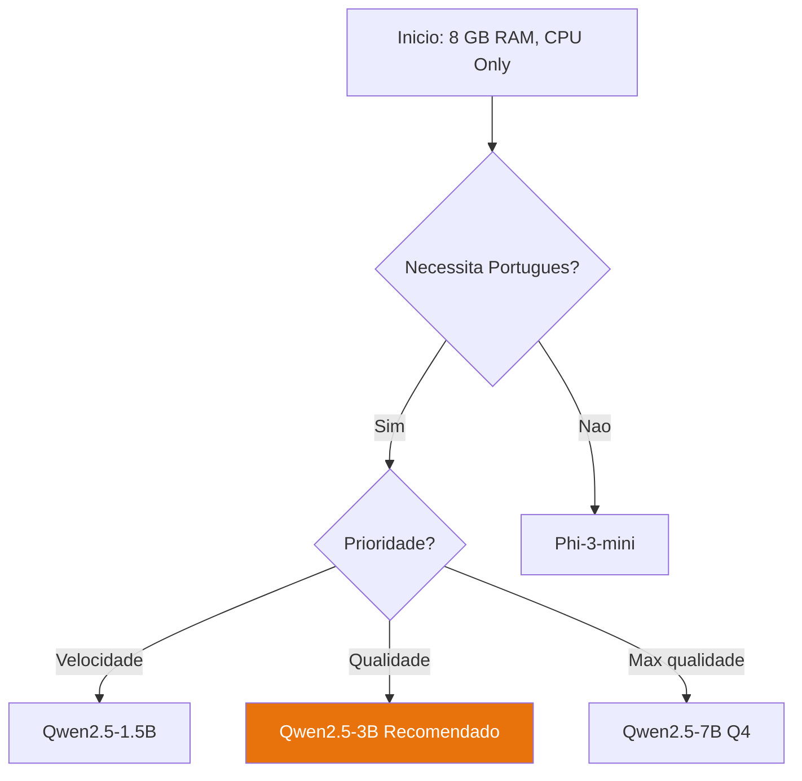

# Escolha do Modelo Ideal


## Melhor Escolha para 8 GB RAM: Phi-3-mini

### O que é o Phi-3-mini?

O **Phi-3-mini-4k-instruct** é um modelo da Microsoft com 3.8B parâmetros. Apesar do tamanho reduzido, rivaliza com modelos muito maiores em tarefas práticas.

Foi treinado com foco em:
- Raciocínio lógico
- Seguimento de instruções
- Qualidade de escrita
- Eficiência computacional

### Porquê Phi-3-mini e não outros?

| Modelo | RAM (Q4) | Português | Velocidade | Raciocínio |
|---|---|---|---|---|
| **Phi-3-mini** | **2.2 GB** | **✅ Excelente** | **⚡ Rápido** | **⭐⭐⭐⭐⭐** |
| TinyLlama 1.1B | 0.8 GB | ⚠️ Fraco | ⚡⚡ Muito rápido | ⭐⭐ |
| Llama 3 8B Q2 | 3.5 GB | ✅ Bom | 🐢 Lento | ⭐⭐⭐⭐ |
| Mistral 7B Q2 | 3 GB | ✅ Bom | 🐢 Lento | ⭐⭐⭐⭐ |
| Gemma 2B | 1.5 GB | ⚠️ Médio | ⚡ Rápido | ⭐⭐⭐ |

**Phi-3-mini é o ponto óptimo** entre qualidade, velocidade e consumo de RAM.

## Estimativas Reais de Consumo

```
Sistema Operativo:          ~2.0 GB RAM
Phi-3-mini Q4_K_M:          ~2.2 GB RAM
Python + LangChain:         ~0.5 GB RAM
─────────────────────────────────────────
Total:                      ~4.7 GB RAM
Sobra para o SO:            ~3.3 GB RAM ✅
```

## Variantes Disponíveis

O Phi-3-mini existe em duas versões de contexto:

| Variante | Contexto | Uso |
|---|---|---|
| `phi-3-mini-4k-instruct` | 4.096 tokens | **Recomendado** — tarefas gerais |
| `phi-3-mini-128k-instruct` | 128.000 tokens | Documentos longos (mais lento) |

:::info Recomendação
Para um agente empresarial com 8 GB RAM, use sempre a versão **4k**. Contexto de 128k exige muito mais memória e é muito mais lento em CPU.
:::

## Como Descarregar

O modelo está disponível no **Hugging Face** em formato GGUF, já quantizado:

```
Repositório: bartowski/Phi-3-mini-4k-instruct-GGUF
Ficheiro:    Phi-3-mini-4k-instruct-Q4_K_M.gguf
Tamanho:     ~2.2 GB
```

Na secção [9. Download do Modelo](./download-modelo) encontra as instruções completas.