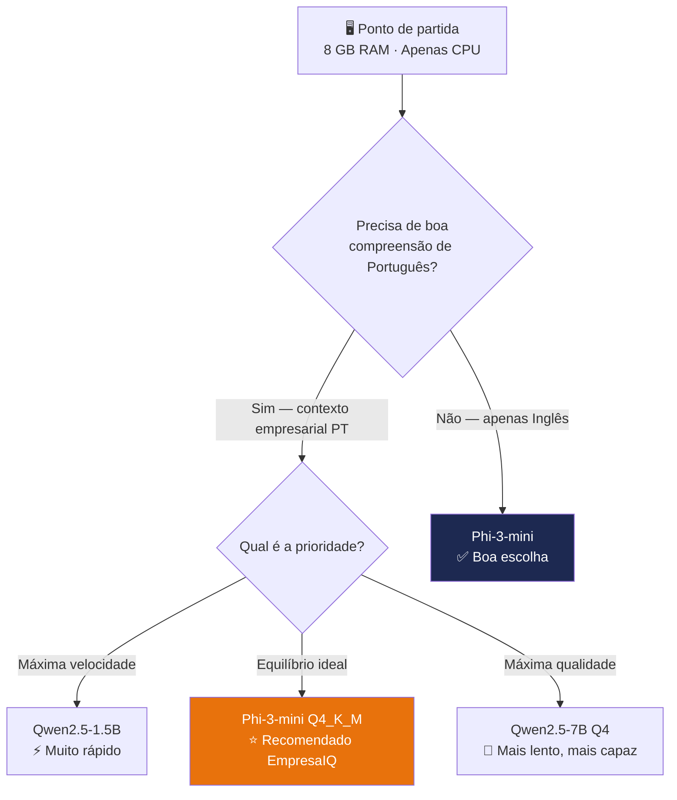

# Escolha do Modelo Ideal

> *"Escolher o modelo certo é como contratar o colaborador certo: não precisa do mais famoso — precisa do que melhor se adapta ao trabalho e ao orçamento disponível."*

---

## A pergunta certa a fazer

Há centenas de modelos de linguagem disponíveis gratuitamente. A maioria das pessoas comete o mesmo erro: tenta usar o maior modelo possível, fica com o computador bloqueado, e desiste.

A pergunta certa não é *"qual é o melhor modelo do mundo?"* — é **"qual é o melhor modelo para o meu hardware e para as tarefas do EmpresaIQ?"**

A resposta, para um PC com 8 GB de RAM sem GPU, leva-nos sempre ao mesmo destino.

---

## O processo de decisão



Para o EmpresaIQ, **o Phi-3-mini Q4_K_M é a escolha principal**. O Qwen2.5 é abordado no Capítulo 17 como alternativa avançada.

---

## O modelo escolhido: Phi-3-mini da Microsoft

O **Phi-3-mini-4k-instruct** é um modelo de linguagem desenvolvido pela Microsoft Research. Tem 3.8 mil milhões de parâmetros — pequeno para os padrões da indústria, mas extraordinariamente capaz para o seu tamanho.

### Porque é que a Microsoft o criou?

A Microsoft investiu deliberadamente em criar modelos pequenos de alta qualidade, ao contrário da tendência de tornar os modelos cada vez maiores. O resultado foi o Phi-3-mini: um modelo que foi treinado com dados de altíssima qualidade (livros de texto, código, raciocínio estruturado) em vez de simplesmente usar mais dados.

### O que o torna especial para o EmpresaIQ?

- **Raciocínio** — segue instruções complexas com precisão
- **Português** — compreende e escreve em português europeu com qualidade
- **Eficiência** — foi desenhado explicitamente para hardware limitado
- **Seguimento de ferramentas** — responde bem ao padrão ReAct que o agente usa (ver Cap. 11)

---

## Comparação com alternativas

| Modelo | RAM (Q4) | Qualidade PT | Velocidade CPU | Raciocínio | Conclusão |
|---|---|---|---|---|---|
| **Phi-3-mini Q4_K_M** | **2.2 GB** | **✅ Excelente** | **⚡ Rápido** | **⭐⭐⭐⭐⭐** | **✅ Escolha EmpresaIQ** |
| TinyLlama 1.1B | 0.8 GB | ⚠️ Fraco | ⚡⚡ Muito rápido | ⭐⭐ | ❌ Demasiado fraco |
| Llama 3 8B Q2 | 3.5 GB | ✅ Bom | 🐢 Lento | ⭐⭐⭐⭐ | ⚠️ Pesado para 8 GB |
| Mistral 7B Q2 | 3.0 GB | ✅ Bom | 🐢 Lento | ⭐⭐⭐⭐ | ⚠️ Lento em CPU |
| Gemma 2B | 1.5 GB | ⚠️ Médio | ⚡ Rápido | ⭐⭐⭐ | ⚠️ Qualidade inferior |
| Qwen2.5-3B | 2.0 GB | ✅ Muito bom | ⚡ Rápido | ⭐⭐⭐⭐ | ✅ Alternativa (Cap. 17) |

O Phi-3-mini é o **ponto óptimo** entre qualidade, velocidade e consumo de memória para o nosso caso de uso.

---

## Quanto RAM vai usar no total?

Com o Phi-3-mini Q4_K_M, a distribuição de memória é confortável:

```
Sistema Operativo (Windows/Linux):   ~2.0 GB
Phi-3-mini Q4_K_M (modelo GGUF):     ~2.2 GB
Python + LangChain + ferramentas:    ~0.5 GB
─────────────────────────────────────────────
Total utilizado:                     ~4.7 GB
Disponível (buffer do SO):           ~3.3 GB  ✅
```

Sobra espaço suficiente para o sistema operativo e outras aplicações continuarem a funcionar normalmente.

---

## Dois sabores do Phi-3-mini

O modelo existe em duas variantes com tamanhos de contexto diferentes. O "contexto" define quantos tokens (pedaços de texto) o modelo consegue processar de uma vez:

| Variante | Contexto máximo | Quando usar |
|---|---|---|
| `phi-3-mini-4k-instruct` | 4.096 tokens (~3.000 palavras) | **Recomendado** — tarefas do dia-a-dia |
| `phi-3-mini-128k-instruct` | 128.000 tokens (~96.000 palavras) | Análise de documentos muito longos |

:::warning Use sempre a versão 4k para começar
A versão 128k precisa de muito mais RAM durante a inferência e é significativamente mais lenta em CPU. Para o EmpresaIQ, comece sempre com a versão **4k**. Pode sempre trocar depois.
:::

---

## Onde está o ficheiro que vamos descarregar?

O modelo está disponível gratuitamente no **Hugging Face** — a maior plataforma de modelos de IA open source do mundo:

```
Repositório : bartowski/Phi-3-mini-4k-instruct-GGUF
Ficheiro    : Phi-3-mini-4k-instruct-Q4_K_M.gguf
Tamanho     : ~2.2 GB
Licença     : MIT (uso comercial permitido)
```

:::tip Uso comercial
O Phi-3-mini tem licença MIT — pode usá-lo livremente em produtos comerciais, incluindo o EmpresaIQ da sua empresa, sem pagar royalties.
:::

As instruções exactas de download estão no Capítulo 9. Mas antes de descarregar qualquer coisa, precisamos de perceber o formato GGUF e a quantização — o próximo capítulo explica isso.

---

## Resumo

- Escolhemos o **Phi-3-mini Q4_K_M** para o EmpresaIQ
- É o melhor equilíbrio entre qualidade, velocidade e consumo de RAM
- Usa apenas 2.2 GB do modelo, deixando RAM suficiente para tudo o resto
- Tem licença MIT — pode ser usado em contexto empresarial
- Uma alternativa (Qwen2.5) é explorada no Capítulo 17

---

*Capítulo seguinte: [5. O que é GGUF e Quantização →](./gguf-quantizacao)*