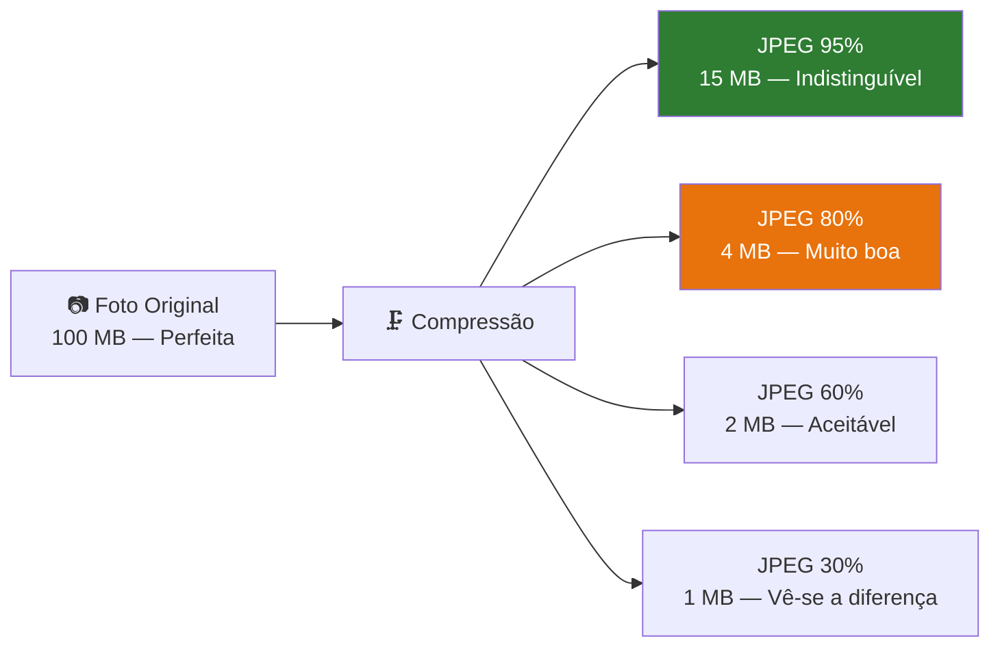

# Como o Ollama Gere os Modelos

> *"A quantização faz para os modelos de IA o que o formato MP3 fez para a música: comprime drasticamente o tamanho, mantendo uma qualidade que, na prática, é indistinguível do original."*

---

## O Ollama como gestor de modelos

O Ollama não é apenas um motor de inferência — é também um **gestor completo de modelos**. Quando executa `ollama pull qwen2.5:3b`, o Ollama:

1. Descarrega o ficheiro do modelo quantizado automaticamente
2. Armazena-o numa localização gerida (`~/.ollama/models/`)
3. Disponibiliza-o através de uma API REST local
4. Gere a quantização e o formato do ficheiro internamente

Não precisa de procurar ficheiros GGUF, escolher níveis de quantização manualmente, nem configurar caminhos no código. O Ollama trata de tudo.

---

## Dois conceitos, uma só ideia

Neste capítulo vamos perceber dois termos que vai encontrar ao trabalhar com modelos:

- **GGUF** — o formato interno de ficheiro que o Ollama usa para guardar os modelos
- **Quantização** — a técnica que torna esses ficheiros suficientemente pequenos para caber no seu PC

Na prática, com o Ollama **não precisa de gerir GGUF directamente**. Mas perceber o conceito ajuda-o a tomar melhores decisões quando escolher modelos.

---

## GGUF — O formato interno dos modelos

Quando o Ollama descarrega um modelo, usa o formato **GGUF** internamente. Pense nele como uma mala de viagem bem organizada que contém tudo o que é necessário para correr o modelo:

```
qwen2.5:3b (internamente um ficheiro GGUF)
├── 📋 Metadados  (nome, versão, arquitectura)
├── 📖 Vocabulário  (lista de todas as palavras que o modelo conhece)
├── 🏗️ Arquitectura  (estrutura interna: número de camadas, dimensões)
└── 🧠 Pesos  (os milhares de milhões de números que "guardam" o conhecimento)
```

O GGUF foi criado em 2023 pela comunidade open source como o formato padrão para modelos locais. O Ollama, o LM Studio e outros servidores locais usam GGUF internamente.

---

## Quantização — Comprimir sem destruir

Um modelo de linguagem é essencialmente um conjunto enorme de números. No formato original (FP32), cada número ocupa 32 bits de memória. Para o Qwen2.5-3B com 3 mil milhões de parâmetros, isso significa:

```
3.000.000.000 parâmetros × 32 bits = ~12 GB
```

Impossível num PC com 8 GB de RAM. É aqui que entra a **quantização**.

### A analogia da fotografia

A quantização é em tudo semelhante a comprimir uma fotografia:



Com modelos de IA, o mesmo princípio aplica-se aos números que compõem os pesos:

| Formato | Bits/Parâmetro | RAM (Qwen2.5-3B) | Qualidade | Velocidade CPU |
|---|---|---|---|---|
| FP32 (original) | 32 bits | ~12 GB | Perfeita | Muito lenta |
| FP16 | 16 bits | ~6 GB | Excelente | Lenta |
| Q8_0 | 8 bits | ~3.1 GB | Muito boa | Moderada |
| **Q4_K_M** | **4 bits** | **~2.0 GB** | **Boa** | **⚡ Rápida** |
| Q3_K_M | 3 bits | ~1.6 GB | Aceitável | ⚡⚡ Muito rápida |
| Q2_K | 2 bits | ~1.1 GB | Limitada | ⚡⚡⚡ Máxima |

O **Q4_K_M** é o nosso ponto óptimo: comprime o modelo para apenas 2.0 GB, mas a qualidade das respostas continua excelente para uso empresarial. O Ollama usa esta quantização por defeito ao descarregar `qwen2.5:3b`.

---

## Descodificar o nome de um modelo Ollama

Quando vê um nome como `qwen2.5:3b`, cada parte tem um significado:

```
qwen2.5  :  3b
  │          │
  │          └── Tamanho: 3 mil milhões de parâmetros
  └─────────── Nome da família de modelos (Qwen 2.5)
```

Pode também encontrar tags mais específicas:

```
qwen2.5:3b          → versão padrão Q4 (recomendada, ~2.0 GB)
qwen2.5:3b-instruct → explicitamente afinada para instruções
qwen2.5:7b          → versão maior, ~4.7 GB, para 16 GB RAM
qwen2.5:1.5b        → versão mínima, ~1.0 GB, para PCs muito limitados
```

---

## Na prática: o que muda na qualidade?

Uma pergunta razoável: *"Mas perco qualidade com a quantização?"*

A resposta honesta: **sim, mas muito pouco a nível Q4**. Em testes práticos com tarefas empresariais (análise de documentos, redacção, resposta a perguntas), a diferença entre Q4 e FP16 é praticamente imperceptível.

```
Pergunta: "Resume este contrato em 3 pontos principais."

Resposta FP16: "1. Prazo de entrega: 30 dias. 2. Valor: 15.000€. 3. Penalizações: 1% por dia."
Resposta Q4:   "1. Prazo de entrega: 30 dias. 2. Valor: 15.000€. 3. Penalizações: 1% por dia."
```

Para tarefas criativas muito complexas ou raciocínio matemático avançado, a diferença pode notar-se mais. Para as tarefas do EmpresaIQ, Q4 é mais do que suficiente.

---

## Comandos Ollama para gerir modelos

```bash
# Descarregar um modelo
ollama pull qwen2.5:3b

# Ver modelos instalados
ollama list

# Ver detalhes de um modelo (inclui quantização usada)
ollama show qwen2.5:3b

# Remover um modelo
ollama rm qwen2.5:3b

# Testar interactivamente
ollama run qwen2.5:3b
```

---

## Resumo

- **GGUF** é o formato interno que o Ollama usa — tudo num único ficheiro com metadados, vocabulário e pesos
- **Quantização** comprime os modelos de 12 GB para 2 GB, mantendo uma qualidade excelente para uso empresarial
- **O Ollama gere tudo automaticamente** — não precisa de descarregar nem gerir ficheiros GGUF manualmente
- Para o EmpresaIQ, o comando `ollama pull qwen2.5:3b` descarrega o modelo correcto na quantização ideal

Com os conceitos estabelecidos, estamos prontos para a Parte II do livro — instalar e configurar tudo o que o EmpresaIQ precisa.

---

*Capítulo seguinte: [6. Instalação do Ambiente →](./instalacao-ambiente)*