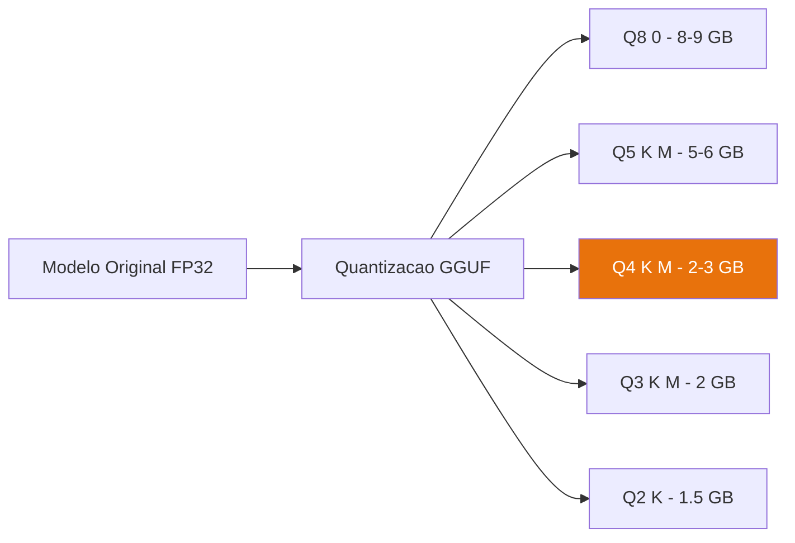

# O que é GGUF e Quantização


## GGUF — O Formato Certo para CPU

**GGUF** (GPT-Generated Unified Format) é o formato padrão para modelos optimizados para CPU. Foi criado pela equipa do llama.cpp e tornou-se o standard da comunidade.

### Vantagens do GGUF

```
✅ Carregamento rápido (mmap — não copia para RAM desnecessariamente)
✅ Suporte a quantização múltipla no mesmo ficheiro
✅ Metadados integrados (tokenizer, arquitectura, etc.)
✅ Compatível com llama.cpp, Ollama, LM Studio, GPT4All
✅ Cross-platform: Windows, Linux, macOS
```

### Estrutura de um ficheiro GGUF

```
modelo.gguf
├── Metadados do modelo
├── Vocabulário (tokenizer)
├── Arquitectura (número de camadas, etc.)
└── Pesos (quantizados)
```

---

## Quantização — Comprimir sem Perder Qualidade

A quantização reduz a precisão matemática dos pesos do modelo para ocupar menos memória.

### Analogia Simples

Imagine uma fotografia:
- **Original (FP32)**: 100 MB — qualidade máxima
- **JPEG 90%**: 15 MB — quase indistinguível
- **JPEG 60%**: 4 MB — boa para uso geral
- **JPEG 30%**: 1 MB — aceitável para miniaturas

Com modelos de IA acontece o mesmo:

| Tipo | Bits/Peso | Qualidade | RAM (Phi-3-mini) | Velocidade |
|---|---|---|---|---|
| FP32 | 32 bits | Perfeita | ~15 GB | Muito lenta |
| FP16 | 16 bits | Excelente | ~7.6 GB | Lenta |
| Q8_0 | 8 bits | Muito boa | ~4 GB | Moderada |
| **Q4_K_M** | **4 bits** | **Boa** | **~2.2 GB** | **⚡ Rápida** |
| Q3_K_M | 3 bits | Aceitável | ~1.8 GB | ⚡⚡ Muito rápida |
| Q2_K | 2 bits | Limitada | ~1.3 GB | ⚡⚡⚡ Máxima |

### A Nomenclatura GGUF

```
Q4_K_M
│ │ │
│ │ └── M = Medium (equilíbrio qualidade/tamanho)
│ └──── K = K-quant (algoritmo de quantização melhorado)
└────── 4 = 4 bits por peso
```

Outras variantes comuns:
- `Q4_K_S` — Small (menor, ligeiramente pior qualidade)
- `Q4_K_L` — Large (melhor qualidade, mais RAM)
- `Q5_K_M` — 5 bits, melhor qualidade que Q4

## Qual Escolher?

```
8 GB RAM disponível:
┌─────────────────────────────────────────────┐
│  Recomendação: Q4_K_M                       │
│                                             │
│  • Qualidade praticamente idêntica ao FP16  │
│  • 2.2 GB para Phi-3-mini                   │
│  • Velocidade boa em CPU                    │
│  • Ponto óptimo qualidade/recursos          │
└─────────────────────────────────────────────┘
```

:::tip
Se tiver 6 GB RAM disponíveis para o modelo, experimente `Q5_K_M` — melhor qualidade com apenas mais 300 MB.
:::

## Onde Encontrar Modelos GGUF

Os melhores repositórios de modelos GGUF quantizados:

- **[bartowski](https://huggingface.co/bartowski)** — Quantizações de alta qualidade
- **[TheBloke](https://huggingface.co/TheBloke)** — Biblioteca enorme de modelos
- **[lmstudio-community](https://huggingface.co/lmstudio-community)** — Optimizados para uso local