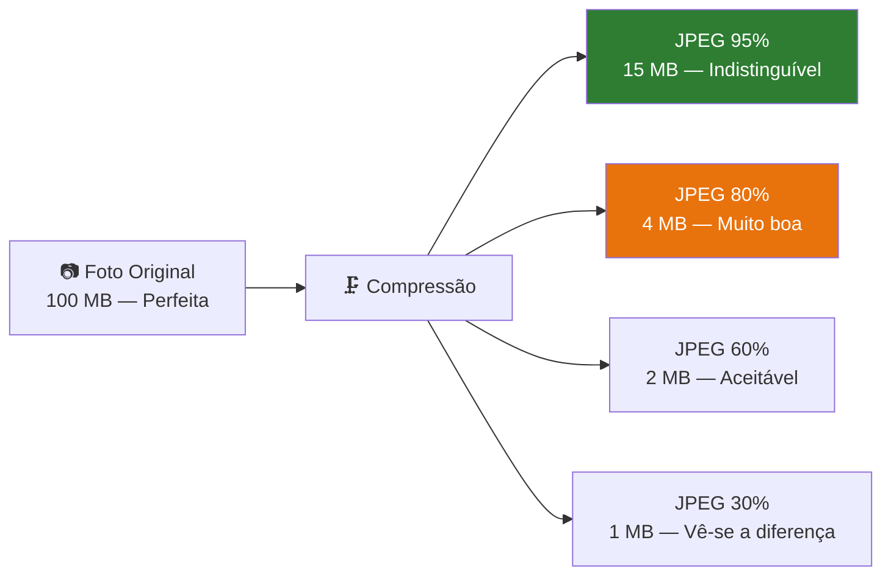

# O que é GGUF e Quantização

> *"A quantização faz para os modelos de IA o que o formato MP3 fez para a música: comprime drasticamente o tamanho, mantendo uma qualidade que, na prática, é indistinguível do original."*

---

## Dois conceitos, uma só ideia

Neste capítulo vamos perceber dois termos que vai encontrar constantemente ao trabalhar com IA local:

- **GGUF** — o formato do ficheiro que guarda o modelo
- **Quantização** — a técnica que torna esse ficheiro suficientemente pequeno para caber no seu PC

Não precisa de ser especialista em qualquer um deles. Mas perceber o básico ajuda-o a tomar melhores decisões quando escolher ou descarregar modelos.

---

## GGUF — O contentor do modelo

Quando descarrega um modelo de IA, está a descarregar um ficheiro com a extensão `.gguf`. Mas o que é exactamente este ficheiro?

Pense nele como uma **mala de viagem bem organizada** que contém tudo o que o llama.cpp precisa para correr o modelo:

```
Phi-3-mini-4k-instruct-Q4_K_M.gguf
├── 📋 Metadados  (nome, versão, arquitectura)
├── 📖 Vocabulário  (lista de todas as palavras que o modelo conhece)
├── 🏗️ Arquitectura  (estrutura interna: número de camadas, dimensões)
└── 🧠 Pesos  (os milhares de milhões de números que "guardam" o conhecimento)
```

### Porquê GGUF e não outros formatos?

O GGUF foi criado pela equipa do **llama.cpp** em 2023, para substituir formatos anteriores mais lentos. As vantagens são práticas:

| Vantagem | O que significa para si |
|---|---|
| **Carregamento rápido** | O modelo fica disponível em segundos, não minutos |
| **Compatibilidade** | Funciona com llama.cpp, Ollama, LM Studio e outros |
| **Cross-platform** | O mesmo ficheiro funciona em Windows, Linux e macOS |
| **Tudo num ficheiro** | Não precisa de instalar configurações separadas |

O GGUF é hoje o standard da comunidade de IA local. Quando procura modelos no Hugging Face, filtre sempre por `.gguf`.

---

## Quantização — Comprimir sem destruir

Um modelo de linguagem é essencialmente um conjunto enorme de números. No formato original (FP32), cada número ocupa 32 bits de memória. Para o Phi-3-mini com 3.8 mil milhões de parâmetros, isso significa:

```
3.800.000.000 parâmetros × 32 bits = ~15 GB
```

Impossível num PC com 8 GB de RAM. É aqui que entra a **quantização**.

### A analogia da fotografia

A quantização é em tudo semelhante a comprimir uma fotografia:



Com modelos de IA, o mesmo princípio aplica-se aos números que compõem os pesos:

| Formato | Bits/Parâmetro | RAM (Phi-3-mini) | Qualidade | Velocidade CPU |
|---|---|---|---|---|
| FP32 (original) | 32 bits | ~15 GB | Perfeita | Muito lenta |
| FP16 | 16 bits | ~7.6 GB | Excelente | Lenta |
| Q8_0 | 8 bits | ~4.0 GB | Muito boa | Moderada |
| **Q4_K_M** | **4 bits** | **~2.2 GB** | **Boa** | **⚡ Rápida** |
| Q3_K_M | 3 bits | ~1.8 GB | Aceitável | ⚡⚡ Muito rápida |
| Q2_K | 2 bits | ~1.3 GB | Limitada | ⚡⚡⚡ Máxima |

O **Q4_K_M** é o nosso ponto óptimo: comprime o modelo para apenas 2.2 GB, mas a qualidade das respostas continua excelente para uso empresarial.

---

## Descodificar o nome do ficheiro

Quando vê um nome como `Phi-3-mini-4k-instruct-Q4_K_M.gguf`, cada parte tem um significado:

```
Phi-3-mini  -  4k  -  instruct  -  Q4_K_M  .gguf
    │           │        │           │         │
    │           │        │           │         └── Formato do ficheiro
    │           │        │           └──────────── Nível de quantização
    │           │        └──────────────────────── "instruct" = seguimento de instruções
    │           └───────────────────────────────── Contexto máximo: 4.096 tokens
    └───────────────────────────────────────────── Nome do modelo base
```

E o sufixo da quantização tem a sua própria lógica:

```
Q 4 _ K _ M
│ │   │   │
│ │   │   └── M = Medium (equilíbrio ideal)
│ │   └────── K = K-quant (algoritmo mais preciso)
│ └────────── 4 = 4 bits por parâmetro
└──────────── Q = Quantized
```

### Variantes comuns que vai encontrar

| Sufixo | Qualidade | Tamanho | Quando usar |
|---|---|---|---|
| `Q2_K` | ⭐⭐ | Mínimo | Apenas se tiver menos de 4 GB livres |
| `Q3_K_M` | ⭐⭐⭐ | Pequeno | PC muito limitado |
| **`Q4_K_M`** | **⭐⭐⭐⭐** | **Médio** | **✅ Recomendado EmpresaIQ** |
| `Q5_K_M` | ⭐⭐⭐⭐½ | Médio-grande | Se tiver 16 GB RAM |
| `Q8_0` | ⭐⭐⭐⭐⭐ | Grande | Se tiver 32 GB RAM |

---

## Na prática: o que muda na qualidade?

Uma pergunta razoável: *"Mas perco qualidade com a quantização?"*

A resposta honesta: **sim, mas muito pouco a nível Q4**. Em testes práticos com tarefas empresariais (análise de documentos, redacção, resposta a perguntas), a diferença entre Q4_K_M e FP16 é praticamente imperceptível.

```
Pergunta: "Resume este contrato em 3 pontos principais."

Resposta FP16:   "1. Prazo de entrega: 30 dias. 2. Valor: 15.000€. 3. Penalizações: 1% por dia."
Resposta Q4_K_M: "1. Prazo de entrega: 30 dias. 2. Valor: 15.000€. 3. Penalizações: 1% por dia."
```

Para tarefas criativas muito complexas ou raciocínio matemático avançado, a diferença pode notar-se mais. Para as tarefas do EmpresaIQ, Q4_K_M é mais do que suficiente.

---

## Onde encontrar modelos GGUF

O principal repositório de modelos de IA do mundo é o **Hugging Face** (huggingface.co). Para modelos GGUF de qualidade, os repositórios mais fiáveis são:

| Repositório | Destaque |
|---|---|
| **bartowski** | Quantizações cuidadosas, actualizado frequentemente |
| **TheBloke** | Biblioteca histórica enorme (muitos modelos mais antigos) |
| **lmstudio-community** | Optimizados para uso local |

No Capítulo 9, vamos descarregar exactamente o ficheiro certo para o EmpresaIQ.

---

## Resumo

- **GGUF** é o formato de ficheiro padrão para modelos de IA local — contém tudo o que é necessário num único ficheiro
- **Quantização** comprime os modelos de 15 GB para 2 GB, mantendo uma qualidade excelente
- **Q4_K_M** é o nível de quantização ideal para 8 GB de RAM
- O ficheiro que vamos usar: `Phi-3-mini-4k-instruct-Q4_K_M.gguf` (~2.2 GB)

Com os conceitos estabelecidos, estamos prontos para a Parte II do livro — instalar e configurar tudo o que o EmpresaIQ precisa.

---

*Capítulo seguinte: [6. Instalação do Ambiente →](./instalacao-ambiente)*