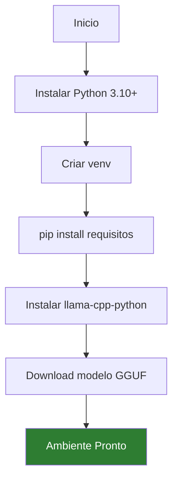

# Instalação do Ambiente


## 1. Instalar Python 3.11

### Windows

1. Aceda a [python.org/downloads](https://www.python.org/downloads/)
2. Descarregue **Python 3.11.x** (não use 3.12+ por compatibilidade com llama-cpp-python)
3. Execute o instalador
4. **IMPORTANTE**: Marque ✅ *"Add Python to PATH"*

Verifique a instalação:

```bash
python --version
# Python 3.11.x
```

### Linux (Ubuntu/Debian)

```bash
sudo apt update
sudo apt install python3.11 python3.11-venv python3.11-pip -y
```

### macOS

```bash
brew install python@3.11
```

---

## 2. Criar a Pasta do Projecto

```bash
mkdir empresaiq-agent
cd empresaiq-agent
```

---

## 3. Criar Ambiente Virtual

Um ambiente virtual isola as dependências do projecto:

```bash
# Windows
python -m venv venv
venv\Scripts\activate

# Linux / macOS
python3.11 -m venv venv
source venv/bin/activate
```

Quando activado, o terminal mostra:
```
(venv) C:\empresaiq-agent>
```

:::warning Importante
**Sempre active o ambiente virtual** antes de instalar pacotes ou executar o agente. Caso contrário, as dependências serão instaladas globalmente.
:::

---

## 4. Estrutura Final do Projecto

Após seguir todos os capítulos, a estrutura será:

```
empresaiq-agent/
│
├── venv/                          ← Ambiente virtual Python
├── agente_local.py                ← Agente principal
├── tools.py                       ← Ferramentas do agente
├── requirements.txt               ← Dependências
└── Phi-3-mini-4k-instruct-Q4_K_M.gguf  ← Modelo IA
```

---

## 5. Verificar Ferramentas Necessárias

```bash
# Verificar Python
python --version

# Verificar pip
pip --version

# Verificar espaço em disco (necessário ~5 GB)
# Windows
Get-PSDrive C

# Linux
df -h /
```

:::tip Dica
Se tiver problemas com permissões no Windows, execute o terminal como **Administrador**.
:::