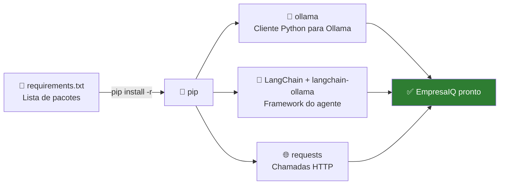
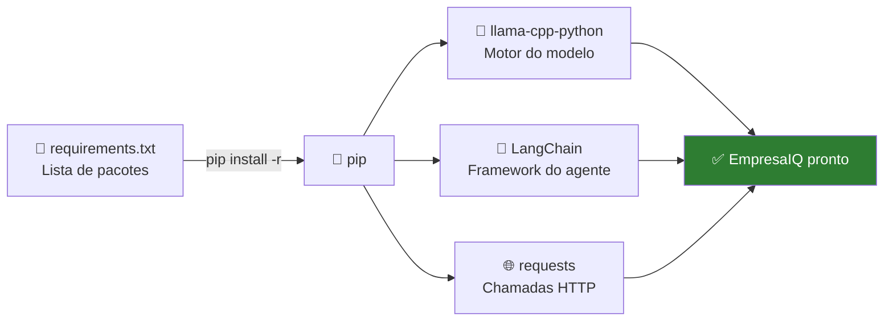

# Configuração do Python

> *"Um carpinteiro não começa a trabalhar sem ferramentas. Neste capítulo, instalamos as ferramentas Python que o EmpresaIQ precisa."*

---

## O que são dependências?

O Python por si só não sabe comunicar com modelos de IA, fazer pedidos web ou construir agentes. Para isso, precisamos de **pacotes** (também chamados bibliotecas ou dependências) — conjuntos de código escritos por outras pessoas que podemos reutilizar.

O gestor de pacotes do Python chama-se **pip**. Com um simples comando, ele descarrega e instala tudo o que precisamos.



---

## Passo 1 — Criar o ficheiro requirements.txt

Na pasta `empresaiq-agent` (com o ambiente virtual activo), crie um ficheiro chamado `requirements.txt` com o seguinte conteúdo:

```txt title="requirements.txt"
ollama>=0.3.0
langchain>=0.2.0
langchain-ollama>=0.1.0
langchain-community>=0.2.0
requests>=2.31.0
```

### O que cada pacote faz

| Pacote | Função no EmpresaIQ |
|---|---|
| **ollama** | Cliente Python oficial para comunicar com o servidor Ollama local. Permite enviar perguntas ao modelo e receber respostas. |
| **langchain** | O framework que fornece a estrutura para construir o agente, definir ferramentas e orquestrar o raciocínio ReAct. |
| **langchain-ollama** | Integração oficial do LangChain com o Ollama — fornece o `OllamaLLM` e o `ChatOllama`. |
| **langchain-community** | Extensões comunitárias do LangChain — ferramentas de memória, vectorstores e outros utilitários. |
| **requests** | Biblioteca para fazer pedidos HTTP — usada pelas ferramentas do agente que acedem à web. |

:::info Versões mínimas em vez de versões fixas
Usamos versões mínimas (`>=`) para manter compatibilidade com actualizações recentes. O `ollama` e o `langchain-ollama` têm evoluído rapidamente com novas funcionalidades.
:::

---

## Passo 2 — Instalar as dependências

Com o ambiente virtual activo, execute:

```bash
pip install -r requirements.txt
```

:::tip Instalação rápida
Ao contrário de bibliotecas que compilam código C++, os pacotes do Ollama são Python puro. A instalação demora menos de um minuto.
:::

---

## Passo 3 — Verificar a instalação

Após a instalação, confirme que tudo funcionou:

```bash
python -c "import ollama; print('ollama: OK')"
python -c "from langchain_ollama import OllamaLLM; print('langchain-ollama: OK')"
python -c "from langchain.agents import tool; print('LangChain: OK')"
python -c "import requests; print('requests: OK')"
```

Se os quatro comandos mostrarem `OK`, está pronto para continuar.

---

## Passo 4 — Testar a ligação ao Ollama

Confirme que o Python consegue comunicar com o servidor Ollama (que deve estar a correr do capítulo anterior):

```python title="testar_ollama.py"
import ollama

# Listar modelos disponíveis
modelos = ollama.list()
print("Modelos instalados:")
for modelo in modelos['models']:
    print(f"  - {modelo['name']}")

# Testar uma pergunta simples
resposta = ollama.chat(
    model='qwen2.5:3b',
    messages=[{'role': 'user', 'content': 'Responde apenas: olá!'}]
)
print(f"\nResposta do modelo: {resposta['message']['content']}")
```

Execute com:
```bash
python testar_ollama.py
```

Se o Ollama não estiver a correr, verá um erro de ligação. Nesse caso, inicie-o primeiro:
```bash
ollama serve
```

---

## Problemas comuns

### ❌ `Connection refused` ao usar `ollama`

O servidor Ollama não está a correr.

**Solução**: Abra outro terminal e execute `ollama serve`. O servidor fica activo enquanto o terminal estiver aberto.

### ❌ `model not found`

O modelo ainda não foi descarregado.

**Solução**: Execute `ollama pull qwen2.5:3b` antes de usar o modelo (ver Cap. 8 e 9).

### ❌ `Python version not supported`

Verifique que está a usar Python 3.11 ou superior:

```bash
python --version
```

---

## Resumo

Neste capítulo:
- Criou o `requirements.txt` com os pacotes `ollama`, `langchain`, `langchain-ollama`, `langchain-community` e `requests`
- Instalou todas as dependências com `pip install -r requirements.txt` (menos de 1 minuto)
- Verificou que a instalação foi bem sucedida
- Testou a ligação Python → Ollama

No próximo capítulo, instalamos o Ollama — o servidor local de IA que o EmpresaIQ precisa.

---

*Capítulo seguinte: [8. Instalação do Ollama →](./instalacao-llamacpp)*

---

## O que são dependências?

O Python por si só não sabe comunicar com modelos de IA, fazer pedidos web ou construir agentes. Para isso, precisamos de **pacotes** (também chamados bibliotecas ou dependências) — conjuntos de código escritos por outras pessoas que podemos reutilizar.

O gestor de pacotes do Python chama-se **pip**. Com um simples comando, ele descarrega e instala tudo o que precisamos.



---

## Passo 1 — Criar o ficheiro requirements.txt

Inside the `empresaiq-agent` folder (com o ambiente virtual activo), crie um ficheiro chamado `requirements.txt` com o seguinte conteúdo:

```txt title="requirements.txt"
llama-cpp-python==0.2.76
langchain==0.1.16
langchain-community==0.0.34
requests==2.31.0
```

### O que cada pacote faz

| Pacote | Função no EmpresaIQ |
|---|---|
| **llama-cpp-python** | É a ponte entre o Python e o motor llama.cpp. Permite ao agente carregar e usar o modelo GGUF. |
| **langchain** | O framework que fornece a estrutura para construir o agente, definir ferramentas e orquestrar o raciocínio ReAct. |
| **langchain-community** | Extensões comunitárias do LangChain — inclui a integração directa com o llama.cpp. |
| **requests** | Biblioteca para fazer pedidos HTTP — usada pelas ferramentas do agente que acedem à web. |

:::info Porquê versões fixas?
Fixamos versões exactas (ex: `langchain==0.1.16`) para garantir que o código deste livro funciona exactamente como escrito. Versões mais novas podem ter APIs ligeiramente diferentes.
:::

---

## Passo 2 — Instalar as dependências

Com o ambiente virtual activo, execute:

```bash
pip install -r requirements.txt
```

:::caution Este passo pode demorar 5 a 15 minutos
O pacote `llama-cpp-python` **compila código C++** durante a instalação. Vai ver muitas linhas de output — é normal. Não feche o terminal.

**Windows**: Se aparecer o erro `Microsoft Visual C++ 14.0 is required`, veja a secção de Problemas Comuns abaixo.

**Linux**: Se houver erros de compilação, instale primeiro:
```bash
sudo apt install build-essential cmake -y
```
:::

---

## Alternativa para Windows — Versão pré-compilada

Se a compilação falhar no Windows, use a versão já compilada:

```bash
# Instalar llama-cpp-python pré-compilado (sem compilar C++)
pip install llama-cpp-python --extra-index-url https://abetlen.github.io/llama-cpp-python/whl/cpu

# Instalar os restantes pacotes normalmente
pip install langchain==0.1.16 langchain-community==0.0.34 requests==2.31.0
```

---

## Passo 3 — Verificar a instalação

Após a instalação, confirme que tudo funcionou:

```bash
python -c "from llama_cpp import Llama; print('llama-cpp-python: OK')"
python -c "from langchain.agents import tool; print('LangChain: OK')"
python -c "import requests; print('requests: OK')"
```

Se os três comandos mostrarem `OK`, está pronto para continuar.

---

## Problemas comuns

### ❌ `Microsoft Visual C++ 14.0 is required`

O Windows precisa de ferramentas de compilação C++ que não vtêm instaladas por defeito.

**Solução**: Descarregue e instale o **Microsoft C++ Build Tools** em `visualstudio.microsoft.com/visual-cpp-build-tools`. Durante a instalação, seleccione **"Desktop development with C++"**.

Alternativamente, use a versão pré-compilada acima.

### ❌ `cmake not found`

```bash
pip install cmake
```

### ❌ `Python version not supported`

Verifique que está a usar Python 3.11:

```bash
python --version
```

Se mostrar 3.12 ou superior, reinstale Python 3.11 e recriar o ambiente virtual (apague a pasta `venv/` e repita o Passo 3 do Capítulo 6).

---

## Resumo

Neste capítulo:
- Criou o `requirements.txt` com os quatro pacotes necessários
- Instalou todas as dependências com `pip install -r requirements.txt`
- Verificou que a instalação foi bem sucedida

No próximo capítulo, vamos perceber melhor o llama.cpp — o motor que faz tudo funcionar.

---

*Capítulo seguinte: [8. Instalação do Llama.cpp →](./instalacao-llamacpp)*