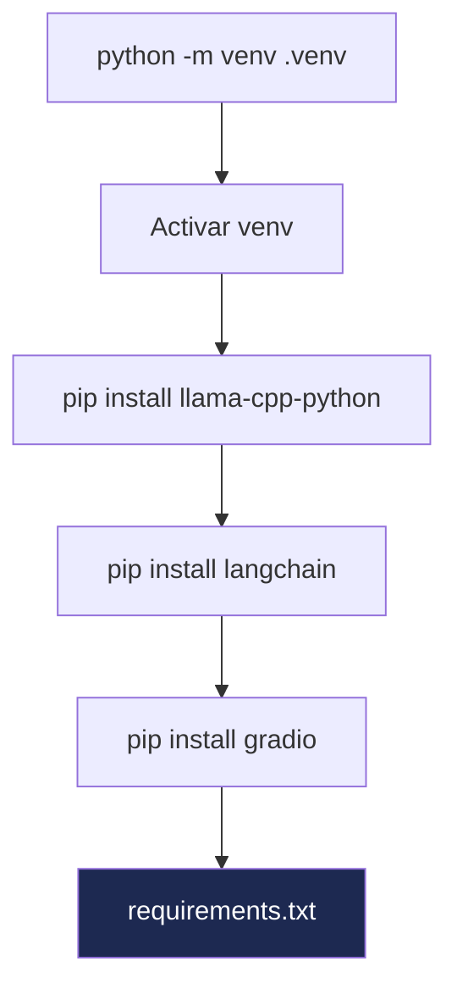

# Configuração do Python


## 1. Criar o ficheiro requirements.txt

Dentro da pasta `empresaiq-agent`, crie o ficheiro `requirements.txt`:

```txt title="requirements.txt"
llama-cpp-python==0.2.76
langchain==0.1.16
langchain-community==0.0.34
requests==2.31.0
```

### O que cada pacote faz

| Pacote | Versão | Função |
|---|---|---|
| `llama-cpp-python` | 0.2.76 | Binding Python para llama.cpp — corre o modelo GGUF |
| `langchain` | 0.1.16 | Framework para construir agentes e chains |
| `langchain-community` | 0.0.34 | Integrações comunitárias (inclui `LlamaCpp` LLM) |
| `requests` | 2.31.0 | Chamadas HTTP para ferramentas externas |

---

## 2. Instalar as Dependências

Com o ambiente virtual activado:

```bash
pip install -r requirements.txt
```

:::caution Instalação do llama-cpp-python
Este pacote **compila código C++** durante a instalação. Pode demorar 5-15 minutos dependendo do CPU.

**Windows**: Precisa de ter o [Microsoft C++ Build Tools](https://visualstudio.microsoft.com/visual-cpp-build-tools/) instalado.

**Linux**: Instale primeiro:
```bash
sudo apt install build-essential cmake -y
```
:::

---

## 3. Instalação Alternativa — Pré-compilado (Windows)

Para evitar a compilação no Windows, use a versão pré-compilada:

```bash
pip install llama-cpp-python --extra-index-url https://abetlen.github.io/llama-cpp-python/whl/cpu
```

Depois instale os restantes:

```bash
pip install langchain==0.1.16 langchain-community==0.0.34 requests==2.31.0
```

---

## 4. Verificar a Instalação

```python
# Teste rápido — corra no terminal Python
python -c "from llama_cpp import Llama; print('llama-cpp-python OK')"
python -c "from langchain.agents import tool; print('LangChain OK')"
```

Se ambos mostrarem `OK`, está pronto para o próximo passo.

---

## 5. Resolução de Problemas Comuns

### Erro: `Microsoft Visual C++ 14.0 is required`

Instale o [Microsoft C++ Build Tools](https://visualstudio.microsoft.com/visual-cpp-build-tools/) e escolha **"Desktop development with C++"**.

### Erro: `cmake not found`

```bash
pip install cmake
```

### Erro de versão Python

```bash
# Verifique que está a usar Python 3.11
python --version
# Se mostrar 3.12+, instale 3.11 e recriar o venv
```