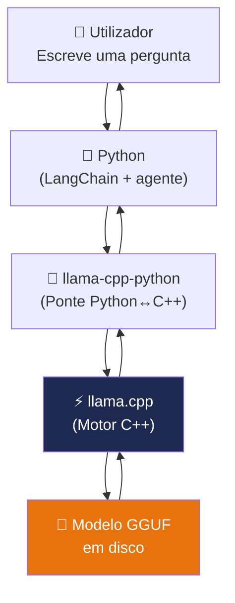

# Instalação do Llama.cpp

> *"O llama.cpp é para os modelos de IA o que um motor é para um carro: você não precisa de perceber como funciona por dentro para conduzir, mas ajuda saber o básico para tirar o máximo partido dele."*

---

## O que é o llama.cpp?

O **llama.cpp** é uma biblioteca open source criada por [Georgi Gerganov](https://github.com/ggerganov/llama.cpp) em 2023. É escrita em C++ — uma linguagem de programação extremamente eficiente — e serve como motor para correr modelos GGUF directamente no CPU.

Sem o llama.cpp, correr um modelo de linguagem localmente seria lento ou simplesmente impossível num PC normal.



A relação entre os componentes:
- **Python + LangChain** — define a lógica do agente
- **llama-cpp-python** — a ponte entre Python e C++
- **llama.cpp** — o motor que realmente executa o modelo
- **Modelo GGUF** — os pesos do modelo em disco

---

## Como foi instalado

Quando executou `pip install llama-cpp-python` no capítulo anterior, aconteceram duas coisas:

1. O llama.cpp (escrito em C++) foi **compilado** para o seu processador
2. A ponte Python (`llama-cpp-python`) foi instalada para comunicar com ele

Essa é a razão pela qual a instalação demora mais do que os outros pacotes.

---

## Activar optimizações AVX2 (opcional mas recomendado)

Os processadores modernos têm um conjunto de instruções matemáticas especiais chamadas **AVX2** que acelerizam operações numéricas em 30 a 50%. O llama.cpp consegue aproveitar estas instruções se for compilado com esta flag.

### Verificar se o seu CPU suporta AVX2

```bash
# Windows (PowerShell)
(Get-WmiObject -Class Win32_Processor).Name
# Processadores Intel Core i3/i5/i7/i9 a partir de 2013 (Haswell)
# e AMD Ryzen todos os modelos suportam AVX2

# Linux
grep -m1 avx2 /proc/cpuinfo
# Se retornar uma linha com texto, tem AVX2
```

### Recompilar com AVX2

Se o seu CPU suportar AVX2 e quiser o desempenho máximo:

```bash
# Windows (PowerShell)
$env:CMAKE_ARGS = "-DLLAMA_AVX2=on"
pip install llama-cpp-python==0.2.76 --force-reinstall --no-cache-dir

# Linux / macOS
CMAKE_ARGS="-DLLAMA_AVX2=on" pip install llama-cpp-python==0.2.76 --force-reinstall
```

:::tip Vale a pena?
Se já instalou sem esta flag e tudo está a funcionar, pode continuar sem recompilar. A melhoria é real mas não é obrigatória para o EmpresaIQ funcionar bem.
:::

---

## Testar o motor

Para confirmar que o llama.cpp está instalado correctamente:

```bash
python -c "from llama_cpp import Llama; print('llama.cpp instalado com sucesso!')"
```

Se aparecer a mensagem `llama.cpp instalado com sucesso!`, está tudo bem.

---

## Como o llama.cpp usa o CPU

Quando o EmpresaIQ gera uma resposta, o llama.cpp usa **múltiplos núcleos do CPU em paralelo**. Mais núcleos = respostas mais rápidas.

No código do agente (que vamos escrever no Capítulo 11), configuramos o número de threads:

```python
llm = LlamaCpp(
    model_path="./Phi-3-mini-4k-instruct-Q4_K_M.gguf",
    n_threads=4,   # Usar 4 núcleos do CPU
    ...            # mais configurações no Cap. 11
)
```

Como regra geral, use o número de núcleos físicos do seu processador:

| CPU | Núcleos físicos | n_threads recomendado |
|---|---|---|
| Intel Core i5 (2 cores) | 2 | 2 |
| Intel Core i5 (4 cores) | 4 | 4 |
| Intel Core i7 (6 cores) | 6 | 6 |
| AMD Ryzen 5 (6 cores) | 6 | 6 |
| AMD Ryzen 7 (8 cores) | 8 | 6-8 |

---

## Resumo

- O llama.cpp é o motor que corre o modelo GGUF no CPU
- Já foi instalado como parte do `llama-cpp-python` no capítulo anterior
- Opcionalmente, pode recompilar com AVX2 para ganhar 30-50% de velocidade
- No Capítulo 11, configuramos o número de threads para o seu CPU

Agora que o motor está pronto, precisamos do combustível: o modelo de IA. É isso que vamos descarregar no próximo capítulo.

---

*Capítulo seguinte: [9. Download do Modelo Phi-3-mini →](./download-modelo)*