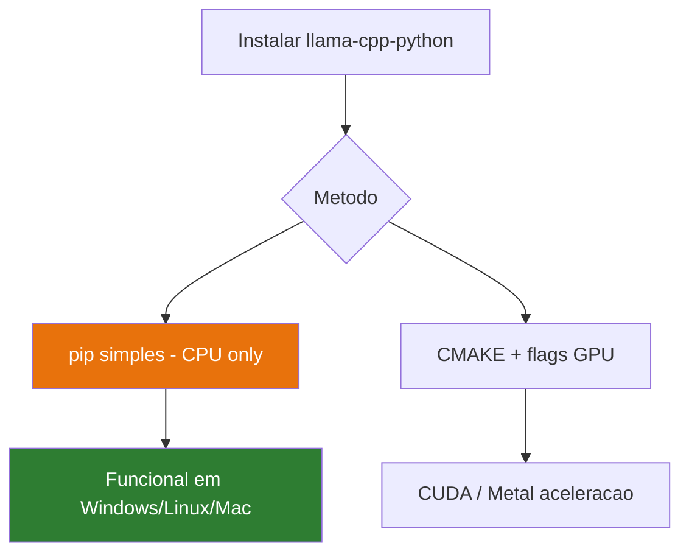

# Instalação do Llama.cpp


## O que é o llama.cpp?

O **llama.cpp** é uma biblioteca escrita em C++ criada por [Georgi Gerganov](https://github.com/ggerganov/llama.cpp). É o coração da inferência local em CPU.

### Características principais

```
✅ Escrito em C++ puro — performance máxima
✅ Suporte a múltiplos threads CPU
✅ Gestão eficiente de memória (mmap)
✅ Compatível com todos os modelos GGUF
✅ Cross-platform: Windows, Linux, macOS
✅ Zero dependências externas
```

---

## Como é Instalado

O `llama-cpp-python` já inclui e compila o motor llama.cpp automaticamente.

```bash
pip install llama-cpp-python==0.2.76
```

Durante a instalação vai ver:

```
Building wheels for collected packages: llama-cpp-python
  Building wheel for llama-cpp-python (pyproject.toml) ...
  running build_ext
  cmake --build ...        ← A compilar llama.cpp
  ...
Successfully built llama-cpp-python
```

---

## Optimizações CPU por Plataforma

### Windows — AVX2 (CPUs modernos Intel/AMD)

```bash
set CMAKE_ARGS="-DLLAMA_AVX2=on"
pip install llama-cpp-python==0.2.76 --force-reinstall
```

### Linux — AVX2

```bash
CMAKE_ARGS="-DLLAMA_AVX2=on" pip install llama-cpp-python==0.2.76
```

### Como verificar suporte AVX2

```bash
# Windows (PowerShell)
Get-WmiObject -Class Win32_Processor | Select-Object -ExpandProperty Name

# Linux
grep -m1 avx2 /proc/cpuinfo
```

:::info Processadores com AVX2
A maioria dos processadores Intel Core a partir de 2013 (Haswell) e AMD Ryzen têm suporte AVX2. Com AVX2 activo, a velocidade de inferência melhora 30-50%.
:::

---

## Testar o Motor

```python
from llama_cpp import Llama

# Teste sem modelo completo — apenas verifica a importação
print("llama.cpp versão:", Llama.__version__ if hasattr(Llama, '__version__') else "OK")
```

---

## Como Funciona Internamente

```
Pergunta do Utilizador
       ↓
  Python (LangChain)
       ↓
  llama-cpp-python (binding)
       ↓
  llama.cpp (C++)
       ↓
  Modelo GGUF em disco
       ↓
  Inferência multi-thread em CPU
       ↓
  Tokens gerados
       ↓
  Resposta em texto
```

O processo de inferência usa **todos os núcleos do CPU** configurados via `n_threads`, maximizando a velocidade disponível no hardware.