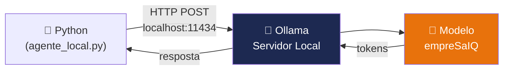
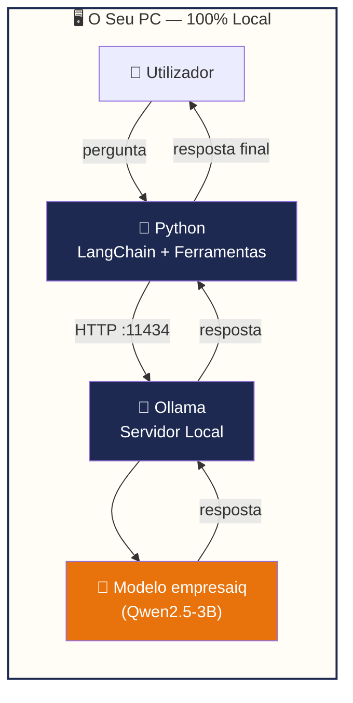

# Instalação do Ollama

> *"O Ollama transforma qualquer PC num servidor de inteligência artificial. Um único comando instala tudo, outro comando inicia tudo."*

---

## O que é o Ollama?

O **Ollama** é uma ferramenta open source que permite correr modelos de linguagem localmente, de forma simples e eficiente. Em vez de gerir ficheiros GGUF, configurar threads e compilar código C++, o Ollama trata de tudo automaticamente.

Do ponto de vista do programador, o Ollama expõe uma **API REST local** (em `localhost:11434`) que o Python chama para gerar respostas. É tão simples como chamar uma API — mas a resposta vem do seu próprio computador.



### Vantagens do Ollama sobre a instalação manual

| Abordagem sem Ollama | Com Ollama |
|---|---|
| Compilar código C++ (10-15 min) | Instalar em 2 minutos |
| Gerir ficheiros GGUF manualmente | `ollama pull modelo` |
| Configurar threads e memória | Automático |
| Windows: Visual C++ Build Tools obrigatório | Não é necessário |
| Actualizar: recompilar tudo | `ollama pull modelo` |

---

## Passo 1 — Instalar o Ollama

### Windows

1. Aceda a **ollama.com**
2. Clique em **"Download for Windows"**
3. Execute o instalador (`OllamaSetup.exe`)
4. O Ollama instala-se e inicia automaticamente em segundo plano

Verificar a instalação:

```powershell
ollama --version
# ollama version 0.x.x
```

### Linux

```bash
curl -fsSL https://ollama.com/install.sh | sh
```

O script instala o Ollama e configura-o como serviço systemd (inicia automaticamente com o sistema).

### macOS

```bash
brew install ollama
```

Ou descarregue a aplicação directamente de **ollama.com/download/mac**.

---

## Passo 2 — Iniciar o servidor Ollama

No Windows e macOS, o Ollama inicia automaticamente após a instalação. No Linux, pode iniciar manualmente:

```bash
# Iniciar o servidor (necessário apenas no Linux se não usar systemd)
ollama serve
```

### Verificar que está a correr

```bash
# Deve responder com a versão e estado
curl http://localhost:11434/api/version
# {"version":"0.x.x"}
```

Ou no PowerShell (Windows):

```powershell
Invoke-WebRequest http://localhost:11434/api/version | Select-Object -ExpandProperty Content
```

:::tip O servidor fica em segundo plano
No Windows e macOS, o Ollama corre em segundo plano como uma aplicação do sistema (aparece na barra de tarefas). Não precisa de manter uma janela de terminal aberta.
:::

---

## Passo 3 — Testar com o primeiro modelo

Vamos verificar que tudo funciona com um teste rápido:

```bash
# Descarregar o Qwen2.5-3B — a base do nosso modelo EmpresaIQ
ollama pull qwen2.5:3b
```

O download demora 3-10 minutos (o modelo tem ~2 GB). Verá uma barra de progresso:

```
pulling manifest
pulling 66a7f5f28264... ████████████████ 100% 2.0 GB
pulling 66e83b3c76af... ████████████████ 100%  11 KB
verifying sha256 digest
writing manifest
success
```

Depois de descarregado, teste interactivamente:

```bash
ollama run qwen2.5:3b
>>> Olá! Podes ajudar-me com tarefas empresariais?
```

Para sair do modo interactivo: `/bye`

---

## Comandos essenciais do Ollama

```bash
# Listar modelos instalados
ollama list

# Descarregar um modelo
ollama pull <modelo>

# Correr um modelo interactivamente
ollama run <modelo>

# Remover um modelo
ollama rm <modelo>

# Ver informações de um modelo
ollama show <modelo>

# Ver logs do servidor
ollama logs
```

---

## Configuração do Ollama

O Ollama pode ser configurado através de variáveis de ambiente. As mais úteis:

| Variável | Valor padrão | Descrição |
|---|---|---|
| `OLLAMA_HOST` | `127.0.0.1:11434` | Endereço do servidor |
| `OLLAMA_MODELS` | `~/.ollama/models` | Pasta onde os modelos são guardados |
| `OLLAMA_NUM_PARALLEL` | `1` | Pedidos simultâneos |
| `OLLAMA_MAX_LOADED_MODELS` | `1` | Modelos carregados em memória |
| `OLLAMA_KEEP_ALIVE` | `5m` | Tempo que o modelo permanece em RAM após o último pedido |

Para definir estas variáveis no Windows:

```powershell
$env:OLLAMA_KEEP_ALIVE = "10m"
ollama serve
```

No Linux/macOS:

```bash
OLLAMA_KEEP_ALIVE=10m ollama serve
```

---

## Arquitectura do EmpresaIQ com Ollama

Com o Ollama instalado, a arquitectura completa do sistema fica:



---

## Problemas comuns

### ❌ `ollama: command not found`

O Ollama não está no PATH. Reinicie o terminal após a instalação, ou no Linux verifique:

```bash
which ollama
# /usr/local/bin/ollama  ← deve estar aqui
```

### ❌ `Error: listen tcp 127.0.0.1:11434: bind: address already in use`

O Ollama já está a correr. Não precisa de iniciar outro processo — use directamente os comandos `ollama pull`, `ollama run`, etc.

### ❌ `Error: model not found`

Precisa de fazer `ollama pull <modelo>` antes de usar o modelo. Veja a lista de modelos disponíveis em **ollama.com/library**.

### ❌ Sem espaço em disco

Os modelos são guardados em `~/.ollama/models`. Para libertar espaço:

```bash
ollama rm <modelo-que-nao-usa>
```

---

## Resumo

Neste capítulo:
- Instalou o **Ollama** no seu sistema operativo
- Iniciou o servidor local e verificou que está acessível em `localhost:11434`
- Descarregou o modelo `qwen2.5:3b` — a base do modelo EmpresaIQ
- Aprendeu os comandos essenciais para gerir modelos

No próximo capítulo, vamos criar o **modelo EmpresaIQ personalizado** usando um Ollama Modelfile — com identidade, instruções e parâmetros definidos para uso empresarial português.

---

*Capítulo seguinte: [9. Criação do Modelo EmpresaIQ →](./download-modelo)*