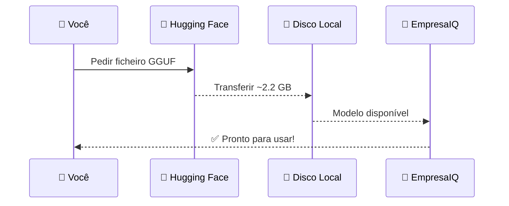

# Download do Modelo Phi-3-mini

> *"Chegou o momento mais concreto até agora: descarregar o cérebro do EmpresaIQ. Um ficheiro de 2.2 GB que contém tudo o que o modelo aprendeu."*

---

## O que vamos descarregar

```
Ficheiro : Phi-3-mini-4k-instruct-Q4_K_M.gguf
Tamanho  : ~2.2 GB
Fonte    : Hugging Face (huggingface.co)
Licença  : MIT (uso comercial permitido)
```

Este único ficheiro contém todo o conhecimento do modelo, pronto a ser usado pelo llama.cpp.



---

## O que é o Hugging Face?

O **Hugging Face** (huggingface.co) é a maior plataforma do mundo para partilha de modelos de IA open source. Funciona como um "GitHub para modelos de IA" — qualquer pessoa pode publicar e descarregar modelos gratuitamente.

Não precisa de criar conta para descarregar modelos públicos como o Phi-3-mini.

---

## Método 1 — Download pelo browser (mais simples)

1. Abra o browser e vá a: `huggingface.co/bartowski/Phi-3-mini-4k-instruct-GGUF`
2. Clique em **"Files and versions"** (separador no centro da página)
3. Procure o ficheiro `Phi-3-mini-4k-instruct-Q4_K_M.gguf` (o ficheiro com ~2.2 GB)
4. Clique no ícone de download ⬇️ à direita do nome do ficheiro
5. Aguarde o download completar
6. Mova o ficheiro descarregado para a pasta `empresaiq-agent/`

:::tip Onde guardar o ficheiro
O ficheiro `.gguf` deve ficar directamente dentro da pasta `empresaiq-agent/`, na mesma localização que os ficheiros Python que vamos criar.
:::

---

## Método 2 — Download por linha de comandos (mais rápido)

Se preferir usar o terminal:

```bash
# Instalar o cliente Hugging Face (uma vez apenas)
pip install huggingface-hub

# Descarregar o modelo directamente para a pasta do projecto
python -c "
from huggingface_hub import hf_hub_download
hf_hub_download(
    repo_id='bartowski/Phi-3-mini-4k-instruct-GGUF',
    filename='Phi-3-mini-4k-instruct-Q4_K_M.gguf',
    local_dir='.'
)
print('Download concluído!')
"
```

---

## Método 3 — wget / PowerShell

```bash
# Linux / macOS
wget -O Phi-3-mini-4k-instruct-Q4_K_M.gguf \
  https://huggingface.co/bartowski/Phi-3-mini-4k-instruct-GGUF/resolve/main/Phi-3-mini-4k-instruct-Q4_K_M.gguf

# Windows (PowerShell)
Invoke-WebRequest `
  -Uri "https://huggingface.co/bartowski/Phi-3-mini-4k-instruct-GGUF/resolve/main/Phi-3-mini-4k-instruct-Q4_K_M.gguf" `
  -OutFile "Phi-3-mini-4k-instruct-Q4_K_M.gguf"
```

---

## Verificar o download

Após o download, confirme que o ficheiro tem o tamanho correcto (~2.2 GB):

```bash
# Windows (PowerShell)
Get-Item "Phi-3-mini-4k-instruct-Q4_K_M.gguf" | Select-Object Name, @{N='Tamanho';E={'{0:N2} GB' -f ($_.Length/1GB)}}

# Linux / macOS
ls -lh Phi-3-mini-4k-instruct-Q4_K_M.gguf
```

Deve mostrar aproximadamente **2.2 GB** (2,200,000,000 bytes).

---

## Teste rápido do modelo

Se quiser confirmar que o modelo funciona antes de avançar, faça um teste rápido:

```python title="teste_modelo.py"
from llama_cpp import Llama

print("A carregar modelo... (pode demorar 10-30 segundos)")
llm = Llama(
    model_path="./Phi-3-mini-4k-instruct-Q4_K_M.gguf",
    n_ctx=512,
    n_threads=4,
    verbose=False
)

resposta = llm("Olá! Apresenta-te em português em uma frase.", max_tokens=100)
print(resposta['choices'][0]['text'])
```

Execute com:

```bash
python teste_modelo.py
```

Se o modelo responder em português, tudo está a funcionar correctamente.

---

## Modelos alternativos

Se por algum motivo não conseguir usar o Phi-3-mini, aqui estão alternativas:

| Modelo | Ficheiro GGUF | RAM | Notas |
|---|---|---|---|
| **Phi-3-mini (recomendado)** | `Phi-3-mini-4k-instruct-Q4_K_M.gguf` | 2.2 GB | ✅ Escolha principal |
| Qwen2.5-3B | `Qwen2.5-3B-Instruct-Q4_K_M.gguf` | 2.0 GB | ✅ Excelente português |
| Gemma 2 2B | `gemma-2-2b-it-Q4_K_M.gguf` | 1.5 GB | Rápido, menos capaz |
| TinyLlama 1.1B | `tinyllama-1.1b-chat-Q4_K_M.gguf` | 0.7 GB | Muito rápido, respostas básicas |

---

## Estrutura actual do projecto

Apenas com o que já fizemos:

```
empresaiq-agent/
│
├── venv/                                       ← ✅ Cap. 6
├── requirements.txt                            ← ✅ Cap. 7
└── Phi-3-mini-4k-instruct-Q4_K_M.gguf         ← ✅ Cap. 9 (agora!)
```

Faltam apenas os ficheiros Python — as ferramentas e o agente em si. É exactamente isso que vamos construir nos próximos capítulos.

---

## Resumo

Neste capítulo descarregámos o cérebro do EmpresaIQ: o ficheiro `Phi-3-mini-4k-instruct-Q4_K_M.gguf`. Com o motor (llama.cpp) e o combustível (modelo GGUF) prontos, podemos começar a construir o próprio agente.

A Parte III do livro começa agora.

---

*Capítulo seguinte: [10. Criação das Ferramentas →](./criacao-ferramentas)*