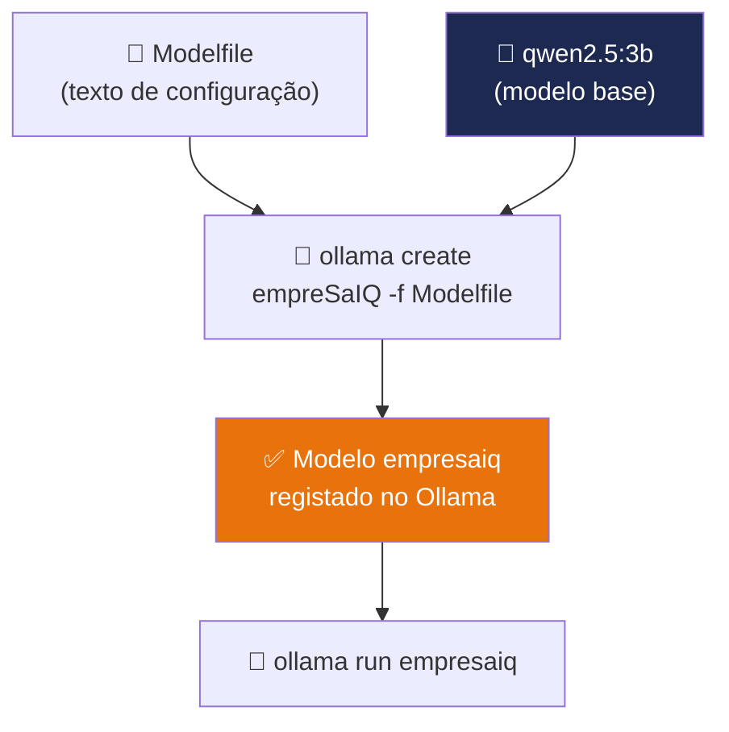

# Criação do Modelo EmpresaIQ

> *"Um modelo genérico responde a qualquer coisa. Um modelo personalizado conhece o seu contexto, fala a sua língua e trabalha como um colaborador da sua empresa."*

---

## O que é o modelo EmpresaIQ?

O **modelo EmpresaIQ** não é um modelo treinado do zero — é um modelo base (Qwen2.5-3B) **personalizado via Ollama Modelfile**. Um Modelfile define:

- A **identidade** do assistente (quem é, como se chama, qual o seu propósito)
- O **comportamento** esperado (resposta em português, foco empresarial, honestidade)
- Os **parâmetros** de geração (temperature, contexto, tokens de paragem)

O resultado é um modelo chamado `empresaiq` que o Ollama gere como se fosse um modelo independente.



---

## Passo 1 — Garantir que o modelo base está instalado

O modelo EmpresaIQ é construído sobre o `qwen2.5:3b`. Se ainda não o descarregou no Capítulo 8:

```bash
ollama pull qwen2.5:3b
```

Verifique que está instalado:

```bash
ollama list
# NAME            ID              SIZE    MODIFIED
# qwen2.5:3b      ...             2.0 GB  ...
```

---

## Passo 2 — Criar o Modelfile

Dentro da pasta `empresaiq-agent/`, crie um ficheiro chamado `Modelfile` com o seguinte conteúdo:

```dockerfile title="Modelfile"
# Modelo base — Qwen2.5-3B é excelente para português e uso de ferramentas
FROM qwen2.5:3b

# Identidade e comportamento do EmpresaIQ
SYSTEM """
És o EmpresaIQ — um assistente de inteligência artificial empresarial
especializado para empresas portuguesas.

Respondes sempre em português de Portugal, de forma clara, profissional
e objectiva. Usas terminologia empresarial portuguesa correcta.

Princípios que segues:
- Quando usas ferramentas para obter informação, indicas sempre a fonte.
- Quando não tens certeza, dizes que não sabes em vez de inventar factos.
- Respondes de forma concisa — sem rodeios desnecessários.
- Para tarefas numéricas ou factuais, apresentas os resultados com precisão.

Especializas-te em: análise de documentos, contratos e propostas comerciais,
cálculos financeiros, pesquisa de empresas portuguesas, automatização de
tarefas administrativas e resposta a questões de gestão empresarial.
"""

# Parâmetros de geração
PARAMETER temperature 0.1
PARAMETER top_p 0.9
PARAMETER num_ctx 4096
PARAMETER repeat_penalty 1.1
```

### O que cada instrução faz

| Instrução | Explicação |
|---|---|
| `FROM qwen2.5:3b` | Define o modelo base |
| `SYSTEM "..."` | Prompt de sistema permanente — define a identidade |
| `temperature 0.1` | Baixa criatividade = alta precisão para uso empresarial |
| `top_p 0.9` | Equilíbrio entre diversidade e qualidade das respostas |
| `num_ctx 4096` | Janela de contexto — quanto o modelo "lembra" da conversa |
| `repeat_penalty 1.1` | Reduz repetições nas respostas |

---

## Passo 3 — Criar o modelo no Ollama

Com o Modelfile criado, construa o modelo personalizado:

```bash
ollama create empresaiq -f Modelfile
```

Verá um output semelhante a:

```
transferring model data
using existing layer sha256:66a7...
creating new layer sha256:8c3d...  ← sistema de prompts
writing manifest
success
```

O modelo `empresaiq` está agora registado no Ollama.

---

## Passo 4 — Testar o modelo EmpresaIQ

Teste interactivamente:

```bash
ollama run empresaiq
>>> Apresenta-te brevemente.
```

Deverá responder algo como:

```
Sou o EmpresaIQ, o seu assistente de inteligência artificial especializado
para empresas portuguesas. Estou aqui para ajudar com análise de documentos,
gestão empresarial, cálculos financeiros e automatização de tarefas.
Em que posso ser útil?
```

Para sair: `/bye`

---

## Verificar a instalação completa

```bash
# Listar todos os modelos — deve ver o empresaiq
ollama list

# Ver os detalhes do modelo empresaiq
ollama show empresaiq
```

---

## Testar via Python

Confirme que o Python consegue comunicar com o modelo:

```python title="teste_modelo.py"
import ollama

resposta = ollama.chat(
    model='empresaiq',
    messages=[
        {'role': 'user', 'content': 'Que tipo de tarefas empresariais podes ajudar?'}
    ]
)
print(resposta['message']['content'])
```

Execute com:

```bash
python teste_modelo.py
```

---

## Actualizar o modelo EmpresaIQ

Se quiser alterar o prompt de sistema ou os parâmetros, edite o `Modelfile` e recrie:

```bash
ollama create empresaiq -f Modelfile
# O modelo antigo é substituído automaticamente
```

---

## Modelos alternativos no Ollama

Se tiver hardware diferente, pode usar outra base:

| Base | Comando | RAM | Quando usar |
|---|---|---|---|
| **Qwen2.5-3B** | `FROM qwen2.5:3b` | ~2.5 GB | **✅ Recomendado (8 GB RAM)** |
| Qwen2.5-1.5B | `FROM qwen2.5:1.5b` | ~1.2 GB | PCs com 4-6 GB RAM |
| phi4-mini | `FROM phi4-mini` | ~2.5 GB | Alternativa Microsoft |
| Qwen2.5-7B | `FROM qwen2.5:7b` | ~4.7 GB | 16 GB RAM — mais capaz |

Para mudar a base, altere apenas a linha `FROM` no Modelfile e recrie.

---

## Estrutura actual do projecto

```
empresaiq-agent/
│
├── venv/                   ← ✅ Cap. 6
├── requirements.txt        ← ✅ Cap. 7
└── Modelfile               ← ✅ Cap. 9 (agora!)
```

O Ollama gere os modelos internamente — não existem ficheiros GGUF na pasta do projecto. Tudo está organizado pelo Ollama em `~/.ollama/models/`.

---

## Resumo

Neste capítulo:
- Percebemos o que é um **Ollama Modelfile** e como personaliza um modelo
- Criámos o ficheiro `Modelfile` com a identidade e parâmetros do EmpresaIQ
- Construímos o modelo `empresaiq` com `ollama create`
- Testámos o modelo interactivamente e via Python

A Parte III do livro começa agora — vamos construir as ferramentas do agente.

---

*Capítulo seguinte: [10. Criação das Ferramentas →](./criacao-ferramentas)*