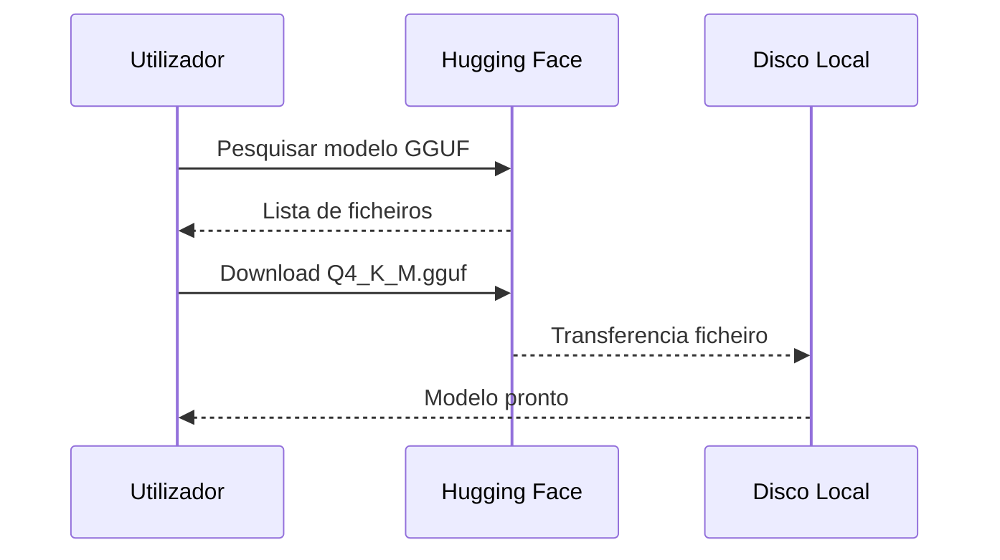

# Download do Modelo Phi-3-mini


## Modelo Recomendado

```
Ficheiro: Phi-3-mini-4k-instruct-Q4_K_M.gguf
Tamanho:  ~2.2 GB
Fonte:    Hugging Face
```

---

## Método 1 — Download Directo (Browser)

1. Aceda a: [huggingface.co/bartowski/Phi-3-mini-4k-instruct-GGUF](https://huggingface.co/bartowski/Phi-3-mini-4k-instruct-GGUF)
2. Clique em **"Files and versions"**
3. Localize `Phi-3-mini-4k-instruct-Q4_K_M.gguf`
4. Clique no ícone de download ⬇️
5. Mova o ficheiro para a pasta `empresaiq-agent/`

---

## Método 2 — Linha de Comandos (huggingface-hub)

```bash
pip install huggingface-hub

python -c "
from huggingface_hub import hf_hub_download
hf_hub_download(
    repo_id='bartowski/Phi-3-mini-4k-instruct-GGUF',
    filename='Phi-3-mini-4k-instruct-Q4_K_M.gguf',
    local_dir='.'
)
print('Download concluído!')
"
```

---

## Método 3 — wget / curl

```bash
# Linux / macOS
wget https://huggingface.co/bartowski/Phi-3-mini-4k-instruct-GGUF/resolve/main/Phi-3-mini-4k-instruct-Q4_K_M.gguf

# Windows PowerShell
Invoke-WebRequest -Uri "https://huggingface.co/bartowski/Phi-3-mini-4k-instruct-GGUF/resolve/main/Phi-3-mini-4k-instruct-Q4_K_M.gguf" -OutFile "Phi-3-mini-4k-instruct-Q4_K_M.gguf"
```

---

## Verificar o Ficheiro

Após o download, verifique:

```bash
# Windows
Get-Item "Phi-3-mini-4k-instruct-Q4_K_M.gguf" | Select-Object Name, Length

# Linux / macOS
ls -lh Phi-3-mini-4k-instruct-Q4_K_M.gguf
```

Deve mostrar aproximadamente **2.2 GB**.

---

## Estrutura Final do Projecto

```
empresaiq-agent/
│
├── venv/
├── agente_local.py          ← (próximo capítulo)
├── tools.py                 ← (próximo capítulo)
├── requirements.txt
└── Phi-3-mini-4k-instruct-Q4_K_M.gguf  ✅ Aqui!
```

---

## Modelos Alternativos

Se preferir explorar outras opções:

| Modelo | Ficheiro GGUF | RAM | Notas |
|---|---|---|---|
| Phi-3-mini (recomendado) | `Phi-3-mini-4k-instruct-Q4_K_M.gguf` | 2.2 GB | ✅ Melhor escolha |
| Gemma 2B | `gemma-2b-it-Q4_K_M.gguf` | 1.5 GB | Mais rápido, menos capaz |
| TinyLlama | `tinyllama-1.1b-chat-Q4_K_M.gguf` | 0.7 GB | Muito rápido, respostas básicas |
| Llama 3 8B | `Meta-Llama-3-8B-Instruct-Q2_K.gguf` | 3.5 GB | Mais capaz, mais lento |

:::warning
Certifique-se de que o ficheiro `.gguf` está na mesma pasta que `agente_local.py`, ou actualize o caminho no código.
:::