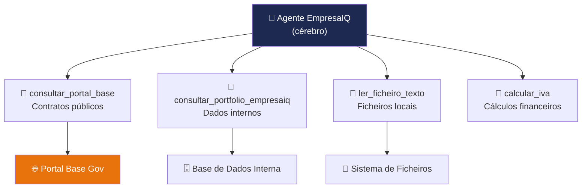

# Criação das Ferramentas

> *"Um modelo de linguagem sozinho sabe falar. Um agente com ferramentas consegue agir. Esta é a diferença entre um consultor que dá opiniões e um consultor que também pesquisa, escreve e executa."*

---

## O que são ferramentas num agente?

Imagine que contrata um assistente muito inteligente, mas que não tem acesso a nada: sem computador, sem internet, sem pasta de ficheiros. Ele pode responder perguntas gerais com base no que sabe, mas não consegue verificar um contrato específico, nem pesquisar preços actuais, nem escrever um ficheiro para si.

As **ferramentas** resolvem exactamente este problema. São funções Python que o agente pode invocar para interagir com o mundo real — ler ficheiros, consultar APIs, fazer cálculos, aceder a bases de dados internas.



---

## Como o agente decide que ferramenta usar?

Esta é uma das partes mais importantes de perceber. O agente **não é programado** para usar uma ferramenta específica para cada pergunta. Em vez disso, o modelo de linguagem **lê a descrição** de cada ferramenta e decide autonomamente qual usar.

```
Pergunta: "Qual o preço da consultoria da EmpresaIQ?"

1. Agente lê as descrições das ferramentas disponíveis
2. Decide: "preciso de consultar_portfolio_empresaiq"
3. Chama a ferramenta com o argumento: "consultoria"
4. Recebe: "Consultoria IA: 120€/hora"
5. Formula a resposta final para o utilizador
```

Esta é a razão pela qual as descrições das ferramentas são tão importantes.

---

## Criar o ficheiro tools.py

Crie um ficheiro chamado `tools.py` na pasta `empresaiq-agent/`:

```python title="tools.py"
import requests
from langchain.agents import tool


@tool
def consultar_portal_base(query_pesquisa: str) -> str:
    """Consulta contratos públicos no Portal Base do governo português.
    Use quando o utilizador pergunta sobre contratos públicos, adjudicações ou dados do portal base.gov.pt"""

    url = f"https://base.gov.pt{query_pesquisa}"

    try:
        response = requests.get(url, timeout=5)

        if response.status_code == 200:
            return str(response.json()[:2])

        return "Portal Base indisponível."

    except Exception as e:
        return f"Erro ao consultar Portal Base: {str(e)}"


@tool
def consultar_portfolio_empresaiq(servico_solicitado: str) -> str:
    """Consulta serviços, preços e portfolio interno da EmpresaIQ.
    Use quando o utilizador pergunta sobre serviços, preços ou oferta da empresa."""

    base_dados_interna = {
        "software": "EmpresaIQ Core: 5.000€/ano — Gestão empresarial completa",
        "consultoria": "Consultoria IA: 120€/hora — Implementação e formação",
        "cibersegurança": "EmpresaIQ Guard: 8.500€ — Auditoria e proteção",
        "formacao": "Workshops IA: 800€/dia — Equipas até 20 pessoas",
        "desenvolvimento": "Desenvolvimento custom: orçamento sob consulta",
    }

    for chave, descricao in base_dados_interna.items():
        if chave in servico_solicitado.lower():
            return descricao

    servicos_disponiveis = ", ".join(base_dados_interna.keys())
    return f"Nenhum serviço encontrado. Serviços disponíveis: {servicos_disponiveis}"


@tool
def ler_ficheiro_texto(caminho_ficheiro: str) -> str:
    """Lê o conteúdo de um ficheiro de texto local.
    Use quando o utilizador pedir para analisar, resumir ou ler um ficheiro."""
    try:
        with open(caminho_ficheiro, 'r', encoding='utf-8') as f:
            conteudo = f.read()
        return conteudo[:3000]  # Limita para caber no contexto
    except FileNotFoundError:
        return f"Ficheiro não encontrado: {caminho_ficheiro}"
    except Exception as e:
        return f"Erro ao ler ficheiro: {str(e)}"


@tool
def calcular_iva(valor_sem_iva: str) -> str:
    """Calcula o valor com IVA a 23% dado um valor sem IVA.
    Use quando o utilizador precisar de calcular IVA sobre um valor."""
    try:
        valor = float(valor_sem_iva.replace(',', '.'))
        com_iva = valor * 1.23
        iva = valor * 0.23
        return f"Valor sem IVA: {valor:.2f}€ | IVA (23%): {iva:.2f}€ | Total com IVA: {com_iva:.2f}€"
    except ValueError:
        return "Erro: forneceça um número válido (ex: '1000' ou '1000,50')"
```

---

## A anatomia de uma ferramenta

Cada ferramenta segue sempre o mesmo padrão:

```python
@tool                                         # ← 1. Regista como ferramenta LangChain
def nome_da_ferramenta(argumento: str) -> str:
    """Descrição clara do que a ferramenta faz.
    O agente lê ESTA descrição para decidir quando usar a ferramenta."""  # ← 2. CRUCIAL

    # 3. Lógica da ferramenta
    resultado = fazer_algo(argumento)

    return str(resultado)                     # ← 4. Sempre retornar string
```

:::warning A descrição (docstring) é o mecanismo de decisão
O modelo de linguagem **não vê o código** da ferramenta. Apenas lê a descrição entre `"""`. Se a descrição for vaga ou incorrecta, o agente vai usar as ferramentas erradas — ou não as usar quando devia.
:::

---

## Criar ferramentas para o seu negócio

O poder do EmpresaIQ está em personalizá-lo para a sua empresa. Aqui ficam mais exemplos de ferramentas que pode criar:

```python title="mais_ferramentas.py (exemplos)"
@tool
def verificar_stock(codigo_produto: str) -> str:
    """Verifica o stock disponível de um produto dado o seu código."""
    # Aqui ligaria à sua base de dados real
    return f"Produto {codigo_produto}: 42 unidades em stock"


@tool
def criar_nota_interna(conteudo: str) -> str:
    """Cria e guarda uma nota interna com o conteúdo fornecido."""
    import datetime
    timestamp = datetime.datetime.now().strftime("%Y%m%d_%H%M%S")
    nome_ficheiro = f"nota_{timestamp}.txt"
    with open(nome_ficheiro, 'w', encoding='utf-8') as f:
        f.write(conteudo)
    return f"Nota guardada em: {nome_ficheiro}"


@tool
def consultar_nif(nif: str) -> str:
    """Valida e consulta informação de um NIF português."""
    # Validação básica
    if len(nif) == 9 and nif.isdigit():
        return f"NIF {nif} tem formato válido."
    return f"NIF {nif} inválido. Deve ter 9 dígitos."
```

:::tip Dica de produtividade
Começe com poucas ferramentas (2-4) e vá adicionando à medida que percebe que padrões de uso são mais frequentes. Muitas ferramentas podem confundir o modelo em hardware limitado.
:::

---

## Verificar as ferramentas

Antes de avançar, confirme que o ficheiro não tem erros:

```bash
python -c "from tools import consultar_portfolio_empresaiq, consultar_portal_base; print('Ferramentas OK!')"
```

---

## Resumo

Neste capítulo:
- Percebemos o que são ferramentas e como o agente as usa
- Criámos o ficheiro `tools.py` com quatro ferramentas
- Aprendemos que a **descrição** (docstring) é o mecanismo que permite ao agente escolher a ferramenta certa

No próximo capítulo, juntamos tudo: modelo + ferramentas = agente EmpresaIQ completo.

---

*Capítulo seguinte: [11. Construção do Agente →](./construcao-agente)*

```python title="tools.py"
import requests
from langchain.agents import tool


@tool
def consultar_portal_base(query_pesquisa: str) -> str:
    """Consulta contratos públicos no Portal Base do governo português."""

    url = f"https://base.gov.pt{query_pesquisa}"

    try:
        response = requests.get(url, timeout=5)

        if response.status_code == 200:
            return str(response.json()[:2])

        return "Portal Base indisponível."

    except Exception as e:
        return f"Erro: {str(e)}"


@tool
def consultar_portfolio_empresaiq(servico_solicitado: str) -> str:
    """Consulta serviços e preços do portfolio interno da EmpresaIQ."""

    base_dados_interna = {
        "software": "EmpresaIQ Core: 5.000€/ano — Gestão empresarial completa",
        "consultoria": "Consultoria IA: 120€/hora — Implementação e formação",
        "cibersegurança": "EmpresaIQ Guard: 8.500€ — Auditoria e protecção",
        "formacao": "Workshops IA: 800€/dia — Equipas até 20 pessoas",
        "desenvolvimento": "Desenvolvimento custom: orçamento sob consulta",
    }

    for chave, descricao in base_dados_interna.items():
        if chave in servico_solicitado.lower():
            return descricao

    return "Nenhum serviço encontrado. Serviços disponíveis: " + ", ".join(base_dados_interna.keys())
```

---

## Como Funcionam as Ferramentas

O decorador `@tool` do LangChain transforma uma função Python numa ferramenta que o agente pode invocar autonomamente.

```
Agente recebe pergunta
       ↓
Analisa quais ferramentas existem
       ↓
Decide qual ferramenta usar
       ↓
Chama a ferramenta com os argumentos certos
       ↓
Recebe resultado da ferramenta
       ↓
Formula resposta final
```

---

## Anatomia de uma Ferramenta

```python
@tool                                    # ← Regista como ferramenta LangChain
def nome_da_ferramenta(argumento: str) -> str:
    """Descrição clara do que a ferramenta faz."""   # ← O agente lê isto!
    
    # Lógica da ferramenta
    resultado = fazer_algo(argumento)
    
    return str(resultado)               # ← Sempre retornar string
```

:::important A docstring é fundamental
O agente usa a **docstring** (texto entre `"""`) para decidir quando e como usar a ferramenta. Escreva descrições claras e precisas.
:::

---

## Adicionar Mais Ferramentas

Pode expandir facilmente com novas capacidades:

```python
@tool
def ler_ficheiro_texto(caminho_ficheiro: str) -> str:
    """Lê o conteúdo de um ficheiro de texto local."""
    try:
        with open(caminho_ficheiro, 'r', encoding='utf-8') as f:
            return f.read()[:2000]  # Limita a 2000 caracteres
    except Exception as e:
        return f"Erro ao ler ficheiro: {str(e)}"


@tool
def calcular_iva(valor_sem_iva: str) -> str:
    """Calcula o valor com IVA a 23% dado um valor sem IVA."""
    try:
        valor = float(valor_sem_iva.replace(',', '.'))
        com_iva = valor * 1.23
        return f"Valor sem IVA: {valor:.2f}€ | IVA (23%): {valor * 0.23:.2f}€ | Total: {com_iva:.2f}€"
    except Exception as e:
        return f"Erro: {str(e)}"
```

---

## Boas Práticas

| Prática | Porquê |
|---|---|
| Sempre retornar `str` | LangChain espera strings das ferramentas |
| Usar `try/except` | Erros de rede/disco não devem crashar o agente |
| Timeout nas chamadas HTTP | Evita o agente ficar bloqueado |
| Docstrings claras | O agente decide qual ferramenta usar com base nelas |
| Nomes descritivos | `consultar_portal_base` é melhor que `tool1` |