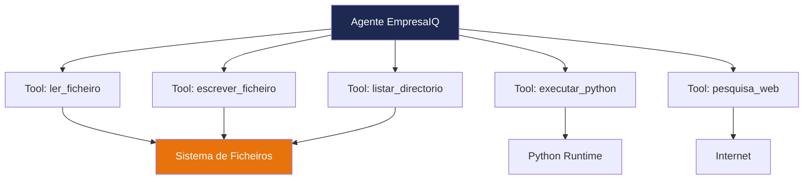

# Criação das Ferramentas Inteligentes

As **ferramentas** são as capacidades que damos ao agente para interagir com o mundo real — APIs, bases de dados, ficheiros, etc.


## O Ficheiro tools.py

Crie o ficheiro `tools.py` na pasta do projecto:

```python title="tools.py"
import requests
from langchain.agents import tool


@tool
def consultar_portal_base(query_pesquisa: str) -> str:
    """Consulta contratos públicos no Portal Base do governo português."""

    url = f"https://base.gov.pt{query_pesquisa}"

    try:
        response = requests.get(url, timeout=5)

        if response.status_code == 200:
            return str(response.json()[:2])

        return "Portal Base indisponível."

    except Exception as e:
        return f"Erro: {str(e)}"


@tool
def consultar_portfolio_empresaiq(servico_solicitado: str) -> str:
    """Consulta serviços e preços do portfolio interno da EmpresaIQ."""

    base_dados_interna = {
        "software": "EmpresaIQ Core: 5.000€/ano — Gestão empresarial completa",
        "consultoria": "Consultoria IA: 120€/hora — Implementação e formação",
        "cibersegurança": "EmpresaIQ Guard: 8.500€ — Auditoria e protecção",
        "formacao": "Workshops IA: 800€/dia — Equipas até 20 pessoas",
        "desenvolvimento": "Desenvolvimento custom: orçamento sob consulta",
    }

    for chave, descricao in base_dados_interna.items():
        if chave in servico_solicitado.lower():
            return descricao

    return "Nenhum serviço encontrado. Serviços disponíveis: " + ", ".join(base_dados_interna.keys())
```

---

## Como Funcionam as Ferramentas

O decorador `@tool` do LangChain transforma uma função Python numa ferramenta que o agente pode invocar autonomamente.

```
Agente recebe pergunta
       ↓
Analisa quais ferramentas existem
       ↓
Decide qual ferramenta usar
       ↓
Chama a ferramenta com os argumentos certos
       ↓
Recebe resultado da ferramenta
       ↓
Formula resposta final
```

---

## Anatomia de uma Ferramenta

```python
@tool                                    # ← Regista como ferramenta LangChain
def nome_da_ferramenta(argumento: str) -> str:
    """Descrição clara do que a ferramenta faz."""   # ← O agente lê isto!
    
    # Lógica da ferramenta
    resultado = fazer_algo(argumento)
    
    return str(resultado)               # ← Sempre retornar string
```

:::important A docstring é fundamental
O agente usa a **docstring** (texto entre `"""`) para decidir quando e como usar a ferramenta. Escreva descrições claras e precisas.
:::

---

## Adicionar Mais Ferramentas

Pode expandir facilmente com novas capacidades:

```python
@tool
def ler_ficheiro_texto(caminho_ficheiro: str) -> str:
    """Lê o conteúdo de um ficheiro de texto local."""
    try:
        with open(caminho_ficheiro, 'r', encoding='utf-8') as f:
            return f.read()[:2000]  # Limita a 2000 caracteres
    except Exception as e:
        return f"Erro ao ler ficheiro: {str(e)}"


@tool
def calcular_iva(valor_sem_iva: str) -> str:
    """Calcula o valor com IVA a 23% dado um valor sem IVA."""
    try:
        valor = float(valor_sem_iva.replace(',', '.'))
        com_iva = valor * 1.23
        return f"Valor sem IVA: {valor:.2f}€ | IVA (23%): {valor * 0.23:.2f}€ | Total: {com_iva:.2f}€"
    except Exception as e:
        return f"Erro: {str(e)}"
```

---

## Boas Práticas

| Prática | Porquê |
|---|---|
| Sempre retornar `str` | LangChain espera strings das ferramentas |
| Usar `try/except` | Erros de rede/disco não devem crashar o agente |
| Timeout nas chamadas HTTP | Evita o agente ficar bloqueado |
| Docstrings claras | O agente decide qual ferramenta usar com base nelas |
| Nomes descritivos | `consultar_portal_base` é melhor que `tool1` |