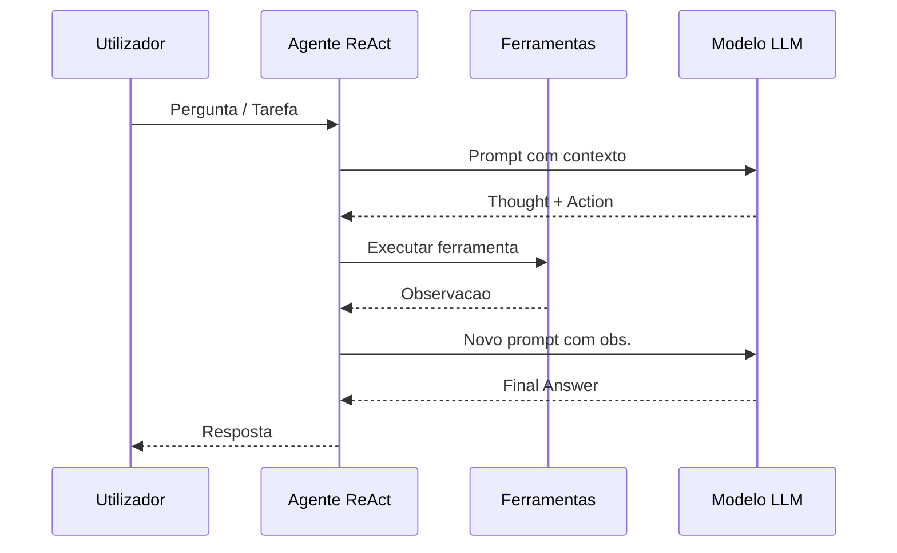

# Construção do Agente EmpresaIQ


## O Ficheiro Principal — agente_local.py

```python title="agente_local.py"
from langchain_community.llms import LlamaCpp
from langchain.agents import AgentExecutor, create_react_agent
from langchain_core.prompts import PromptTemplate

from tools import (
    consultar_portal_base,
    consultar_portfolio_empresaiq
)

# ─── Carregar o Modelo ────────────────────────────────────────────────────────

print("A carregar modelo Phi-3-mini... (pode demorar 10-30 segundos)")

llm = LlamaCpp(
    model_path="./Phi-3-mini-4k-instruct-Q4_K_M.gguf",
    n_ctx=2048,        # Contexto máximo (tokens)
    n_threads=4,       # Número de threads CPU
    temperature=0.1,   # Baixa = mais preciso e determinístico
    verbose=False      # True para ver tokens gerados em tempo real
)

print("Modelo carregado!")

# ─── Definir Ferramentas ──────────────────────────────────────────────────────

tools = [
    consultar_portal_base,
    consultar_portfolio_empresaiq
]

# ─── Prompt do Agente ─────────────────────────────────────────────────────────

template = """
És o Agente EmpresaIQ — um assistente empresarial inteligente e profissional.
Respondes sempre em português de Portugal.
Usa as ferramentas disponíveis quando necessário para responder com precisão.

Ferramentas disponíveis:
{tools}

Nomes das ferramentas: {tool_names}

Pergunta do utilizador: {input}

Thought: {agent_scratchpad}
"""

prompt = PromptTemplate.from_template(template)

# ─── Criar o Agente ───────────────────────────────────────────────────────────

agent = create_react_agent(
    llm=llm,
    tools=tools,
    prompt=prompt
)

agent_executor = AgentExecutor(
    agent=agent,
    tools=tools,
    verbose=True,
    max_iterations=3,
    handle_parsing_errors=True
)

# ─── Interface Principal ──────────────────────────────────────────────────────

if __name__ == "__main__":

    print("\n" + "="*50)
    print("  AGENTE EMPRESAIQ — IA LOCAL")
    print("  Modelo: Phi-3-mini Q4 | CPU Only")
    print("="*50)
    print("Escreva 'sair' para terminar.\n")

    pergunta = input("Pergunta: ")

    resposta = agent_executor.invoke({
        "input": pergunta
    })

    print("\n--- Resposta Final ---")
    print(resposta["output"])
```

---

## Como Executar

```bash
# Activar ambiente virtual primeiro
venv\Scripts\activate  # Windows
source venv/bin/activate  # Linux/macOS

# Correr o agente
python agente_local.py
```

---

## O que Acontece por Dentro

### Fluxo ReAct

O agente usa o padrão **ReAct** (Reasoning + Acting):

```
Pergunta: "Qual o custo da consultoria IA da EmpresaIQ?"

Thought: Preciso de consultar o portfolio da EmpresaIQ
Action: consultar_portfolio_empresaiq
Action Input: "consultoria"
Observation: "Consultoria IA: 120€/hora — Implementação e formação"

Thought: Tenho a informação necessária
Final Answer: A consultoria IA da EmpresaIQ custa 120€/hora...
```

---

## Parâmetros Importantes

| Parâmetro | Valor | Significado |
|---|---|---|
| `n_ctx` | 2048 | Tokens máximos de contexto (pergunta + resposta) |
| `n_threads` | 4 | Threads CPU usados para inferência |
| `temperature` | 0.1 | Próximo de 0 = preciso; próximo de 1 = criativo |
| `max_iterations` | 3 | Máximo de ciclos Thought/Action antes de desistir |
| `handle_parsing_errors` | True | Recupera graciosamente de erros de formato |

---

## Primeiro Teste

Perguntas para testar:

```
"Qual o preço do software EmpresaIQ Core?"
"Que serviços de cibersegurança oferece a EmpresaIQ?"
"Explica o que é quantização de modelos IA."
```

:::tip Primeira execução
Na primeira execução, o modelo demora mais a responder enquanto é carregado em memória. As respostas seguintes serão mais rápidas.
:::