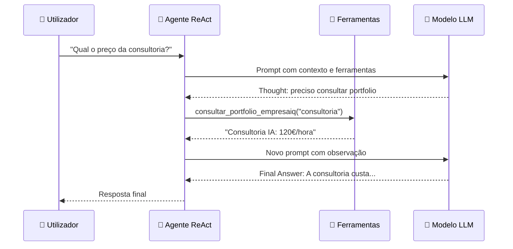

# Construção do Agente EmpresaIQ

> *"Este é o capítulo central do livro. Aqui o EmpresaIQ ganha vida: modelo + ferramentas + raciocínio = agente completo."*

---

## O padrão ReAct — como o agente pensa

O EmpresaIQ usa o padrão **ReAct** (Reasoning + Acting). Em vez de responder directamente, o agente segue um ciclo de raciocínio que alterna entre pensar e agir:



Cada ciclo tem três partes:
- **Thought** — o agente raciocina sobre o que precisa
- **Action** — escolhe e chama uma ferramenta
- **Observation** — recebe o resultado e decide o próximo passo

Este processo repete-se até o agente ter informação suficiente para dar uma **Final Answer**.

---

## O ficheiro principal — agente_local.py

Crie um ficheiro chamado `agente_local.py` na pasta `empresaiq-agent/`:

```python title="agente_local.py"
from langchain_ollama import OllamaLLM
from langchain.agents import AgentExecutor, create_react_agent
from langchain_core.prompts import PromptTemplate

from tools import (
    consultar_portal_base,
    consultar_portfolio_empresaiq,
    ler_ficheiro_texto,
    calcular_iva
)

# ─── 1. Ligar ao Modelo via Ollama ────────────────────────────────────────

print("⏳ A ligar ao EmpresaIQ via Ollama...")

llm = OllamaLLM(
    model="empresaiq",                    # Modelo personalizado criado no Cap. 9
    base_url="http://localhost:11434",    # Endereço padrão do Ollama
    temperature=0.1,                      # Baixa = mais preciso e determinístico
)

print("✅ EmpresaIQ pronto!")

# ─── 2. Definir Ferramentas ─────────────────────────────────────────────────

tools = [
    consultar_portal_base,
    consultar_portfolio_empresaiq,
    ler_ficheiro_texto,
    calcular_iva
]

# ─── 3. Prompt do Agente ──────────────────────────────────────────────────

template = """
Sés o Agente EmpresaIQ — um assistente empresarial inteligente e profissional.
Respondes sempre em português de Portugal.
Usa as ferramentas disponíveis quando necessário para responder com precisão.

Ferramentas disponíveis:
{tools}

Nomes das ferramentas: {tool_names}

Pergunta do utilizador: {input}

Thought: {agent_scratchpad}
"""

prompt = PromptTemplate.from_template(template)

# ─── 4. Criar o Agente ────────────────────────────────────────────────────

agent = create_react_agent(
    llm=llm,
    tools=tools,
    prompt=prompt
)

agent_executor = AgentExecutor(
    agent=agent,
    tools=tools,
    verbose=True,          # Mostra o raciocínio Thought/Action
    max_iterations=3,      # Máximo de ciclos por pergunta
    handle_parsing_errors=True  # Recupera de erros de formato
)

# ─── 5. Interface Principal ────────────────────────────────────────────────

if __name__ == "__main__":

    print("\n" + "="*50)
    print("  AGENTE EMPRESAIQ — IA LOCAL")
    print("  Modelo: empresaiq (Qwen2.5-3B) | Ollama")
    print("="*50)
    print("Escreva 'sair' para terminar.\n")

    pergunta = input("Pergunta: ")

    if pergunta.lower() != 'sair':
        resposta = agent_executor.invoke({"input": pergunta})
        print("\n--- Resposta Final ---")
        print(resposta["output"])
```

---

## Perceber cada parte do código

### 1. O OllamaLLM — ligar ao modelo

```python
llm = OllamaLLM(
    model="empresaiq",                    # Nome do modelo criado com Modelfile
    base_url="http://localhost:11434",    # Ollama corre localmente
    temperature=0.1,  # Próximo de 0 = mais previsível e preciso
)
```

| Parâmetro | Valor Recomendado | O que controla |
|---|---|---|
| `model` | `"empresaiq"` | Nome do modelo no Ollama (ver `ollama list`) |
| `base_url` | `"http://localhost:11434"` | Endereço do servidor Ollama |
| `temperature` | 0.1 | Precisão vs criatividade (0=preciso, 1=criativo) |
| `max_iterations` | 3 | Número máximo de ciclos Thought/Action |

### 2. O prompt — a identidade do agente

O **prompt** é o conjunto de instruções que define quem o agente é e como se comporta. Pode personalizá-lo para a sua empresa:

```python
template = """
Sés o Agente EmpresaIQ — um assistente empresarial inteligente e profissional.
Respondes sempre em português de Portugal.
# Adicione aqui instruções específicas da sua empresa:
# — Sectór: jurídico / financeiro / saúde
# — Tom: formal / informal
# — Restrições: não discutes concorrência, etc.
...
"""
```

---

## Executar o EmpresaIQ pela primeira vez

```bash
# Confirmar que o ambiente virtual está activo
venv\Scripts\activate      # Windows
source venv/bin/activate   # Linux/macOS

# Correr o agente
python agente_local.py
```

A primeira vez, vai ver:

```
⏳ A ligar ao EmpresaIQ via Ollama...
✅ EmpresaIQ pronto!

==================================================
  AGENTE EMPRESAIQ — IA LOCAL
  Modelo: empresaiq (Qwen2.5-3B) | Ollama
==================================================
Escreva 'sair' para terminar.

Pergunta: _
```

---

## Ver o raciocínio em acção

Com `verbose=True` no `AgentExecutor`, consegue ver o processo ReAct completo:

```
Pergunta: "Qual o preço do software EmpresaIQ Core?"

> Entering new AgentExecutor chain...

Thought: Preciso de consultar o portfolio da EmpresaIQ para encontrar o preço do software.
Action: consultar_portfolio_empresaiq
Action Input: software
Observation: EmpresaIQ Core: 5.000€/ano — Gestão empresarial completa

Thought: Tenho a informação necessária.
Final Answer: O software EmpresaIQ Core tem um custo de 5.000€ por ano e inclui gestão empresarial completa.
```

---

## Primeiros testes recomendados

Experimente estas perguntas para confirmar que o agente funciona correctamente:

```
✅ "Qual o preço do software EmpresaIQ Core?"
   (deve usar consultar_portfolio_empresaiq)

✅ "Calcula o IVA sobre 2500 euros"
   (deve usar calcular_iva)

✅ "Lê o ficheiro requirements.txt"
   (deve usar ler_ficheiro_texto)

✅ "O que é quantização em inteligência artificial?"
   (deve responder directamente, sem usar ferramentas)
```

:::tip Primeira execução mais lenta
Na primeira execução após ligar o computador, o modelo demora mais a responder enquanto carrega para memória. As respostas seguintes são mais rápidas.
:::

---

## Resumo

Neste capítulo criou o coracão do EmpresaIQ:
- O `agente_local.py` que junta modelo + ferramentas + raciocínio ReAct
- O agente responde a perguntas e usa ferramentas de forma autónoma
- A primeira versão do EmpresaIQ está funcional!

No próximo capítulo, vamos optimizar o desempenho para tirar o máximo partido do seu hardware.

---

*Capítulo seguinte: [12. Optimizações para CPU →](./optimizacoes-cpu)*
## O Ficheiro Principal — agente_local.py

```python title="agente_local.py"
from langchain_community.llms import LlamaCpp
from langchain.agents import AgentExecutor, create_react_agent
from langchain_core.prompts import PromptTemplate

from tools import (
    consultar_portal_base,
    consultar_portfolio_empresaiq
)

# ─── Carregar o Modelo ────────────────────────────────────────────────────────

print("A carregar modelo Phi-3-mini... (pode demorar 10-30 segundos)")

llm = LlamaCpp(
    model_path="./Phi-3-mini-4k-instruct-Q4_K_M.gguf",
    n_ctx=2048,        # Contexto máximo (tokens)
    n_threads=4,       # Número de threads CPU
    temperature=0.1,   # Baixa = mais preciso e determinístico
    verbose=False      # True para ver tokens gerados em tempo real
)

print("Modelo carregado!")

# ─── Definir Ferramentas ──────────────────────────────────────────────────────

tools = [
    consultar_portal_base,
    consultar_portfolio_empresaiq
]

# ─── Prompt do Agente ─────────────────────────────────────────────────────────

template = """
És o Agente EmpresaIQ — um assistente empresarial inteligente e profissional.
Respondes sempre em português de Portugal.
Usa as ferramentas disponíveis quando necessário para responder com precisão.

Ferramentas disponíveis:
{tools}

Nomes das ferramentas: {tool_names}

Pergunta do utilizador: {input}

Thought: {agent_scratchpad}
"""

prompt = PromptTemplate.from_template(template)

# ─── Criar o Agente ───────────────────────────────────────────────────────────

agent = create_react_agent(
    llm=llm,
    tools=tools,
    prompt=prompt
)

agent_executor = AgentExecutor(
    agent=agent,
    tools=tools,
    verbose=True,
    max_iterations=3,
    handle_parsing_errors=True
)

# ─── Interface Principal ──────────────────────────────────────────────────────

if __name__ == "__main__":

    print("\n" + "="*50)
    print("  AGENTE EMPRESAIQ — IA LOCAL")
    print("  Modelo: Phi-3-mini Q4 | CPU Only")
    print("="*50)
    print("Escreva 'sair' para terminar.\n")

    pergunta = input("Pergunta: ")

    resposta = agent_executor.invoke({
        "input": pergunta
    })

    print("\n--- Resposta Final ---")
    print(resposta["output"])
```

---

## Como Executar

```bash
# Activar ambiente virtual primeiro
venv\Scripts\activate  # Windows
source venv/bin/activate  # Linux/macOS

# Correr o agente
python agente_local.py
```

---

## O que Acontece por Dentro

### Fluxo ReAct

O agente usa o padrão **ReAct** (Reasoning + Acting):

```
Pergunta: "Qual o custo da consultoria IA da EmpresaIQ?"

Thought: Preciso de consultar o portfolio da EmpresaIQ
Action: consultar_portfolio_empresaiq
Action Input: "consultoria"
Observation: "Consultoria IA: 120€/hora — Implementação e formação"

Thought: Tenho a informação necessária
Final Answer: A consultoria IA da EmpresaIQ custa 120€/hora...
```

---

## Parâmetros Importantes

| Parâmetro | Valor | Significado |
|---|---|---|
| `n_ctx` | 2048 | Tokens máximos de contexto (pergunta + resposta) |
| `n_threads` | 4 | Threads CPU usados para inferência |
| `temperature` | 0.1 | Próximo de 0 = preciso; próximo de 1 = criativo |
| `max_iterations` | 3 | Máximo de ciclos Thought/Action antes de desistir |
| `handle_parsing_errors` | True | Recupera graciosamente de erros de formato |

---

## Primeiro Teste

Perguntas para testar:

```
"Qual o preço do software EmpresaIQ Core?"
"Que serviços de cibersegurança oferece a EmpresaIQ?"
"Explica o que é quantização de modelos IA."
```

:::tip Primeira execução
Na primeira execução, o modelo demora mais a responder enquanto é carregado em memória. As respostas seguintes serão mais rápidas.
:::