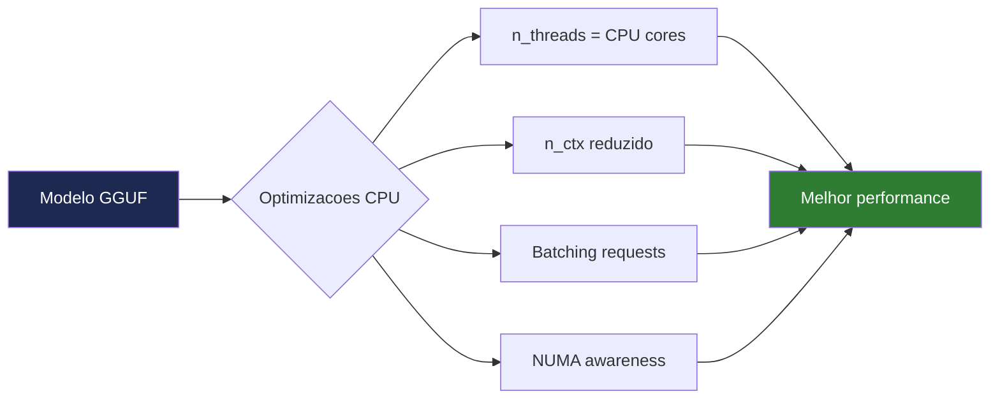

# Optimizações Críticas para CPU


## 1. Ajustar Threads ao CPU

A configuração mais impactante é o número de threads:

```python
llm = LlamaCpp(
    model_path="./modelo.gguf",
    n_threads=4,    # ← Ajuste aqui
    ...
)
```

| CPU | n_threads recomendado |
|---|---|
| Dual-core (2C/4T) | `2` |
| Quad-core (4C/8T) | `4` |
| Hexa-core (6C/12T) | `6` |
| Octa-core (8C/16T) | `8` |

### Como saber quantos núcleos tem

```bash
# Windows PowerShell
(Get-WmiObject Win32_Processor).NumberOfLogicalProcessors

# Linux
nproc

# macOS
sysctl -n hw.logicalcpu
```

:::tip
Não use **todos** os threads disponíveis — deixe 1-2 para o sistema operativo funcionar sem lentidão.
:::

---

## 2. Limitar o Contexto

O contexto (n_ctx) afecta directamente a RAM e velocidade:

```python
n_ctx=2048   # ✅ Recomendado para 8 GB RAM — rápido
n_ctx=4096   # ⚠️ Aceitável — mais lento
n_ctx=8192   # ❌ Evitar — muito lento e consome RAM
```

Regra prática: **use o contexto mínimo** necessário para a tarefa.

---

## 3. Temperature Baixa para Agentes

```python
temperature=0.1   # ✅ Precisão máxima — ideal para agentes
temperature=0.5   # Criatividade moderada
temperature=0.9   # Alta criatividade — respostas variadas
```

Para agentes empresariais, **temperature baixa** é sempre melhor:
- Respostas mais previsíveis e consistentes
- Seguimento de instruções mais rigoroso
- Menos "alucinações"

---

## 4. Fechar Aplicações que Consomem RAM

Antes de executar o agente:

```
❌ Fechar:
   - Chrome / Edge com muitos separadores
   - Discord / Teams / Slack
   - Docker Desktop
   - Adobe Creative Suite
   - Jogos

✅ Manter aberto:
   - Terminal / PowerShell
   - VS Code (se necessário)
```

### Ver consumo de RAM actual

```bash
# Windows PowerShell
Get-Process | Sort-Object WorkingSet -Descending | Select-Object -First 10 Name, @{N='RAM(MB)';E={[math]::Round($_.WorkingSet/1MB,0)}}

# Linux
ps aux --sort=-%mem | head -10
```

---

## 5. Activar AVX2 (CPU moderno)

Se o seu CPU suporta AVX2 (Intel desde 2013, AMD Ryzen), recompile o llama-cpp-python com esta optimização:

```bash
# Windows
set CMAKE_ARGS="-DLLAMA_AVX2=on -DLLAMA_AVX=on"
pip install llama-cpp-python==0.2.76 --force-reinstall --no-cache-dir

# Linux / macOS
CMAKE_ARGS="-DLLAMA_AVX2=on -DLLAMA_AVX=on" \
pip install llama-cpp-python==0.2.76 --force-reinstall --no-cache-dir
```

**Melhoria esperada: 30-50% mais rápido.**

---

## 6. Configuração Completa Optimizada

```python title="llm optimizado"
llm = LlamaCpp(
    model_path="./Phi-3-mini-4k-instruct-Q4_K_M.gguf",
    n_ctx=2048,
    n_threads=4,         # Ajuste ao seu CPU
    n_batch=512,         # Tamanho do batch de processamento
    temperature=0.1,
    repeat_penalty=1.1,  # Evita repetições nas respostas
    top_p=0.9,
    verbose=False,
    use_mmap=True,       # Memory-mapped file — carregamento mais rápido
    use_mlock=False,     # Não bloqueia RAM — deixa OS gerir
)
```

---

## Comparação de Velocidade

Com as optimizações aplicadas num PC típico (Intel i5, 8 GB RAM):

| Configuração | Tokens/segundo |
|---|---|
| Base (sem optimizações) | ~5-8 tok/s |
| + n_threads correcto | ~10-15 tok/s |
| + AVX2 compilado | ~15-25 tok/s |
| + n_ctx reduzido | ~20-30 tok/s |

Para uma resposta de 100 tokens:
- Sem optimizações: **~15 segundos**
- Com optimizações: **~4-5 segundos**