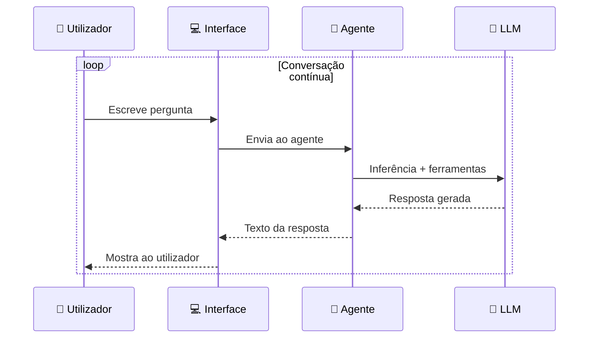

# Interface de Chat Local

> *"Um agente que só responde a uma pergunta de cada vez e depois termina é como um funcionário que sai do escritório depois de cada e-mail. Neste capítulo, damos ao EmpresaIQ uma interface de conversação contínua."*

---

## O que vamos construir

Até aqui, o agente responde a uma pergunta e termina. Neste capítulo, vamos criar:

1. **Chat em loop no terminal** — a forma mais simples de conversar continuamente
2. **Chat com histórico de sessão** — o agente lembra-se do contexto da conversa
3. **Interface web com Flask** — uma página no browser para conversar com o agente



---

## Opção 1 — Chat em loop no terminal

A forma mais simples: substitua o bloco `if __name__ == "__main__":` no `agente_local.py` por este loop:

```python title="agente_local.py (substitua o bloco main)"
if __name__ == "__main__":

    print("\n" + "="*50)
    print("  AGENTE EMPRESAIQ — IA LOCAL")
    print("  Modelo: empresaiq (Qwen2.5-3B) | Ollama")
    print("="*50)
    print("Escreva 'sair' para terminar.\n")

    while True:
        try:
            pergunta = input("Você: ").strip()

            if not pergunta:
                continue

            if pergunta.lower() in ("sair", "exit", "quit"):
                print("Até logo!")
                break

            print("Agente a processar...")

            resposta = agent_executor.invoke({"input": pergunta})
            print(f"\nAgente: {resposta['output']}\n")
            print("-" * 40)

        except KeyboardInterrupt:
            print("\nInterrompido. Até logo!")
            break
        except Exception as e:
            print(f"Erro: {e}")
            continue
```

Agora o agente fica activo até escrever `sair`.

---

## Opção 2 — Chat com histórico de sessão

O agente base não se lembra das mensagens anteriores — cada pergunta é tratada de forma independente. Para adicionar memória de curto prazo:

```python title="agente_com_memoria.py"
from langchain_ollama import OllamaLLM
from langchain.agents import AgentExecutor, create_react_agent
from langchain_core.prompts import PromptTemplate
from langchain.memory import ConversationBufferWindowMemory

from tools import consultar_portfolio_empresaiq, consultar_portal_base, calcular_iva

# Ligar ao modelo via Ollama
llm = OllamaLLM(
    model="empresaiq",
    base_url="http://localhost:11434",
    temperature=0.1
)

# Memória das últimas 3 trocas (mais aumenta o consumo de contexto)
memory = ConversationBufferWindowMemory(
    k=3,
    memory_key="chat_history",
    return_messages=False  # False = texto, True = objectos
)

tools = [consultar_portfolio_empresaiq, consultar_portal_base, calcular_iva]

# Prompt actualizado com histórico
template = """
Sés o Agente EmpresaIQ — assistente empresarial em português de Portugal.

Histórico da conversa:
{chat_history}

Ferramentas disponíveis: {tools}
Nomes: {tool_names}

Pergunta actual: {input}
Thought: {agent_scratchpad}
"""

agent = create_react_agent(llm, tools, PromptTemplate.from_template(template))

executor = AgentExecutor(
    agent=agent, tools=tools, memory=memory,
    verbose=False, max_iterations=3, handle_parsing_errors=True
)

# Loop de chat
print("EmpresaIQ com memória (lembra as últimas 3 trocas). Escreva 'sair' para terminar.\n")

while True:
    pergunta = input("Você: ").strip()
    if pergunta.lower() in ("sair", "exit"):
        break
    if not pergunta:
        continue
    resposta = executor.invoke({"input": pergunta})
    print(f"\nAgente: {resposta['output']}\n" + "-"*40)
```

:::caution Memória e RAM em 8 GB
Cada mensagem guardada ocupa tokens de contexto. Com `k=3` (3 trocas = 6 mensagens), já pode consumir 500-800 tokens extra. Se o agente ficar mais lento, reduza para `k=2`.
:::

---

## Opção 3 — Interface web com Flask

Para uma interface mais agradavel, acessível pelo browser:

```bash
# Instalar Flask
pip install flask
```

```python title="web_chat.py"
from flask import Flask, request, jsonify, render_template_string
from agente_local import agent_executor

app = Flask(__name__)

HTML = """
<!DOCTYPE html>
<html lang="pt">
<head>
    <meta charset="UTF-8">
    <title>EmpresaIQ — Agente Local</title>
    <style>
        body { font-family: Segoe UI, Arial, sans-serif; max-width: 750px; margin: 40px auto; padding: 20px; background: #f5f5f5; }
        h2 { color: #1D2951; }
        #chat { background: white; border: 1px solid #ddd; border-radius: 8px; height: 400px; overflow-y: auto; padding: 15px; margin-bottom: 10px; }
        .user { color: #0078d4; margin: 8px 0; }
        .agent { color: #107c10; margin: 8px 0; background: #f0fff0; padding: 8px; border-radius: 4px; }
        .input-row { display: flex; gap: 8px; }
        input { flex: 1; padding: 10px; border: 1px solid #ddd; border-radius: 4px; font-size: 14px; }
        button { padding: 10px 20px; background: #1D2951; color: white; border: none; border-radius: 4px; cursor: pointer; }
        button:hover { background: #E8720C; }
    </style>
</head>
<body>
    <h2>🤖 Agente EmpresaIQ — IA Local</h2>
    <div id="chat"><p style="color:#999">Olá! Sou o agente EmpresaIQ. Como posso ajudar?</p></div>
    <div class="input-row">
        <input id="input" type="text" placeholder="Escreva a sua pergunta..." autofocus>
        <button onclick="enviar()">Enviar</button>
    </div>
    <script>
        async function enviar() {
            const input = document.getElementById('input');
            const chat = document.getElementById('chat');
            const pergunta = input.value.trim();
            if (!pergunta) return;
            chat.innerHTML += `<p class="user"><b>Você:</b> ${pergunta}</p>`;
            input.value = '';
            chat.innerHTML += `<p class="agent" id="a"><em>A processar...</em></p>`;
            const r = await fetch('/chat', {method:'POST', headers:{'Content-Type':'application/json'}, body: JSON.stringify({pergunta})});
            const data = await r.json();
            document.getElementById('a').outerHTML = `<p class="agent"><b>Agente:</b> ${data.resposta}</p>`;
            chat.scrollTop = chat.scrollHeight;
        }
        document.getElementById('input').addEventListener('keypress', e => { if(e.key==='Enter') enviar(); });
    </script>
</body>
</html>
"""

@app.route('/')
def index():
    return render_template_string(HTML)

@app.route('/chat', methods=['POST'])
def chat():
    dados = request.get_json()
    pergunta = dados.get('pergunta', '')
    if not pergunta:
        return jsonify({"resposta": "Pergunta vazia."})
    resultado = agent_executor.invoke({"input": pergunta})
    return jsonify({"resposta": resultado["output"]})

if __name__ == '__main__':
    print("Interface web disponível em: http://localhost:5000")
    app.run(host='127.0.0.1', port=5000, debug=False)
```

Inicie com:

```bash
python web_chat.py
```

Abra o browser em **http://localhost:5000** e comece a conversar.

:::info Apenas para uso local
O servidor Flask está configurado em `127.0.0.1` — só acessível no próprio computador. Para partilhar na rede interna da empresa, use `host='0.0.0.0'` e adicione autenticação antes de o fazer.
:::

---

## Comparar as três opções

| Opção | Facilidade | Aspecto | Memória | Recomendado para |
|---|---|---|---|---|
| Loop no terminal | ⭐⭐⭐⭐⭐ | Terminal | Sem histórico | Testes rápidos |
| Terminal com memória | ⭐⭐⭐⭐ | Terminal | ✅ Histórico curto | Uso diário pessoal |
| Interface web Flask | ⭐⭐⭐ | Browser | Configurável | Demonstrações e equipa |

---

## Resumo

Neste capítulo:
- Criou um loop de conversação contínua no terminal
- Adicionou histórico de sessão com `ConversationBufferWindowMemory`
- Construiu uma interface web simples com Flask

O EmpresaIQ está agora conversável de várias formas. No próximo capítulo, vamos fazê-lo trabalhar **automaticamente**, sem necessitar de intervenção humana.

---

*Capítulo seguinte: [14. Automatização por Hora →](./automatizacao)*

```python title="interface de chat — adicionar ao agente_local.py"
if __name__ == "__main__":

    print("\n" + "="*50)
    print("  AGENTE EMPRESAIQ — IA LOCAL")
    print("  Modelo: empresaiq (Qwen2.5-3B) | Ollama")
    print("="*50)
    print("Escreva 'sair' para terminar.\n")

    while True:
        try:
            pergunta = input("Você: ").strip()

            if not pergunta:
                continue

            if pergunta.lower() in ("sair", "exit", "quit"):
                print("Até logo!")
                break

            print("Agente a processar...")

            resposta = agent_executor.invoke({
                "input": pergunta
            })

            print(f"\nAgente: {resposta['output']}\n")
            print("-" * 40)

        except KeyboardInterrupt:
            print("\nInterrompido pelo utilizador.")
            break
        except Exception as e:
            print(f"Erro: {e}")
            continue
```

---

## Chat com Histórico de Conversação

Para o agente "lembrar" as mensagens anteriores da sessão:

```python title="chat com memória de sessão"
from langchain.memory import ConversationBufferWindowMemory

# Memória das últimas 5 trocas
memory = ConversationBufferWindowMemory(
    k=5,
    memory_key="chat_history",
    return_messages=True
)

# Prompt actualizado com histórico
template_com_memoria = """
És o Agente EmpresaIQ.

Histórico da conversa:
{chat_history}

Ferramentas: {tools}
Nomes: {tool_names}

Pergunta actual: {input}
Thought: {agent_scratchpad}
"""

prompt_memoria = PromptTemplate.from_template(template_com_memoria)

agent_com_memoria = create_react_agent(llm, tools, prompt_memoria)

executor_com_memoria = AgentExecutor(
    agent=agent_com_memoria,
    tools=tools,
    memory=memory,
    verbose=False,
    max_iterations=3,
    handle_parsing_errors=True
)
```

:::caution Memória e RAM
Cada mensagem guardada na memória ocupa tokens de contexto. Com `k=5` (5 trocas), o contexto pode crescer rapidamente. Em hardware limitado, use `k=3` ou `k=2`.
:::

---

## Interface Web Simples com Flask

Para uma interface web básica:

```bash
pip install flask
```

```python title="web_chat.py"
from flask import Flask, request, jsonify, render_template_string

app = Flask(__name__)

HTML = """
<!DOCTYPE html>
<html>
<head>
    <title>EmpresaIQ Agent</title>
    <style>
        body { font-family: Arial, sans-serif; max-width: 700px; margin: 40px auto; padding: 20px; }
        #chat { border: 1px solid #ddd; height: 400px; overflow-y: auto; padding: 15px; margin-bottom: 10px; }
        input { width: 80%; padding: 8px; }
        button { padding: 8px 16px; background: #0078d4; color: white; border: none; cursor: pointer; }
        .user { color: #0078d4; }
        .agent { color: #107c10; }
    </style>
</head>
<body>
    <h2>🤖 Agente EmpresaIQ</h2>
    <div id="chat"></div>
    <input id="input" type="text" placeholder="Escreva a sua pergunta...">
    <button onclick="enviar()">Enviar</button>
    <script>
        async function enviar() {
            const input = document.getElementById('input');
            const chat = document.getElementById('chat');
            const pergunta = input.value.trim();
            if (!pergunta) return;
            chat.innerHTML += `<p class="user"><b>Você:</b> ${pergunta}</p>`;
            input.value = '';
            const r = await fetch('/chat', {method:'POST', headers:{'Content-Type':'application/json'}, body: JSON.stringify({pergunta})});
            const data = await r.json();
            chat.innerHTML += `<p class="agent"><b>Agente:</b> ${data.resposta}</p>`;
            chat.scrollTop = chat.scrollHeight;
        }
        document.getElementById('input').addEventListener('keypress', e => { if(e.key==='Enter') enviar(); });
    </script>
</body>
</html>
"""

@app.route('/')
def index():
    return render_template_string(HTML)

@app.route('/chat', methods=['POST'])
def chat():
    data = request.get_json()
    pergunta = data.get('pergunta', '')
    resposta = agent_executor.invoke({"input": pergunta})
    return jsonify({"resposta": resposta["output"]})

if __name__ == '__main__':
    app.run(host='127.0.0.1', port=5000, debug=False)
```

Aceda em: **http://localhost:5000**

:::info Segurança
O servidor Flask está configurado apenas para `127.0.0.1` (localhost). Nunca exponha o agente diretamente à internet sem autenticação.
:::