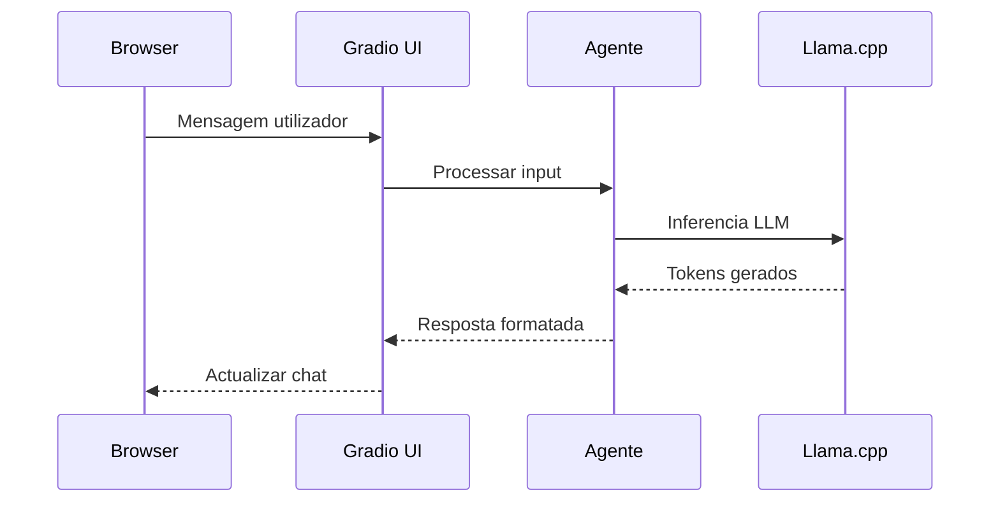

# Interface de Chat Local


## Chat Simples em Terminal

Adicione um loop de conversação ao `agente_local.py`:

```python title="interface de chat — adicionar ao agente_local.py"
if __name__ == "__main__":

    print("\n" + "="*50)
    print("  AGENTE EMPRESAIQ — IA LOCAL")
    print("  Modelo: Phi-3-mini Q4 | CPU Only")
    print("="*50)
    print("Escreva 'sair' para terminar.\n")

    while True:
        try:
            pergunta = input("Você: ").strip()

            if not pergunta:
                continue

            if pergunta.lower() in ("sair", "exit", "quit"):
                print("Até logo!")
                break

            print("Agente a processar...")

            resposta = agent_executor.invoke({
                "input": pergunta
            })

            print(f"\nAgente: {resposta['output']}\n")
            print("-" * 40)

        except KeyboardInterrupt:
            print("\nInterrompido pelo utilizador.")
            break
        except Exception as e:
            print(f"Erro: {e}")
            continue
```

---

## Chat com Histórico de Conversação

Para o agente "lembrar" as mensagens anteriores da sessão:

```python title="chat com memória de sessão"
from langchain.memory import ConversationBufferWindowMemory

# Memória das últimas 5 trocas
memory = ConversationBufferWindowMemory(
    k=5,
    memory_key="chat_history",
    return_messages=True
)

# Prompt actualizado com histórico
template_com_memoria = """
És o Agente EmpresaIQ.

Histórico da conversa:
{chat_history}

Ferramentas: {tools}
Nomes: {tool_names}

Pergunta actual: {input}
Thought: {agent_scratchpad}
"""

prompt_memoria = PromptTemplate.from_template(template_com_memoria)

agent_com_memoria = create_react_agent(llm, tools, prompt_memoria)

executor_com_memoria = AgentExecutor(
    agent=agent_com_memoria,
    tools=tools,
    memory=memory,
    verbose=False,
    max_iterations=3,
    handle_parsing_errors=True
)
```

:::caution Memória e RAM
Cada mensagem guardada na memória ocupa tokens de contexto. Com `k=5` (5 trocas), o contexto pode crescer rapidamente. Em hardware limitado, use `k=3` ou `k=2`.
:::

---

## Interface Web Simples com Flask

Para uma interface web básica:

```bash
pip install flask
```

```python title="web_chat.py"
from flask import Flask, request, jsonify, render_template_string

app = Flask(__name__)

HTML = """
<!DOCTYPE html>
<html>
<head>
    <title>EmpresaIQ Agent</title>
    <style>
        body { font-family: Arial, sans-serif; max-width: 700px; margin: 40px auto; padding: 20px; }
        #chat { border: 1px solid #ddd; height: 400px; overflow-y: auto; padding: 15px; margin-bottom: 10px; }
        input { width: 80%; padding: 8px; }
        button { padding: 8px 16px; background: #0078d4; color: white; border: none; cursor: pointer; }
        .user { color: #0078d4; }
        .agent { color: #107c10; }
    </style>
</head>
<body>
    <h2>🤖 Agente EmpresaIQ</h2>
    <div id="chat"></div>
    <input id="input" type="text" placeholder="Escreva a sua pergunta...">
    <button onclick="enviar()">Enviar</button>
    <script>
        async function enviar() {
            const input = document.getElementById('input');
            const chat = document.getElementById('chat');
            const pergunta = input.value.trim();
            if (!pergunta) return;
            chat.innerHTML += `<p class="user"><b>Você:</b> ${pergunta}</p>`;
            input.value = '';
            const r = await fetch('/chat', {method:'POST', headers:{'Content-Type':'application/json'}, body: JSON.stringify({pergunta})});
            const data = await r.json();
            chat.innerHTML += `<p class="agent"><b>Agente:</b> ${data.resposta}</p>`;
            chat.scrollTop = chat.scrollHeight;
        }
        document.getElementById('input').addEventListener('keypress', e => { if(e.key==='Enter') enviar(); });
    </script>
</body>
</html>
"""

@app.route('/')
def index():
    return render_template_string(HTML)

@app.route('/chat', methods=['POST'])
def chat():
    data = request.get_json()
    pergunta = data.get('pergunta', '')
    resposta = agent_executor.invoke({"input": pergunta})
    return jsonify({"resposta": resposta["output"]})

if __name__ == '__main__':
    app.run(host='127.0.0.1', port=5000, debug=False)
```

Aceda em: **http://localhost:5000**

:::info Segurança
O servidor Flask está configurado apenas para `127.0.0.1` (localhost). Nunca exponha o agente diretamente à internet sem autenticação.
:::