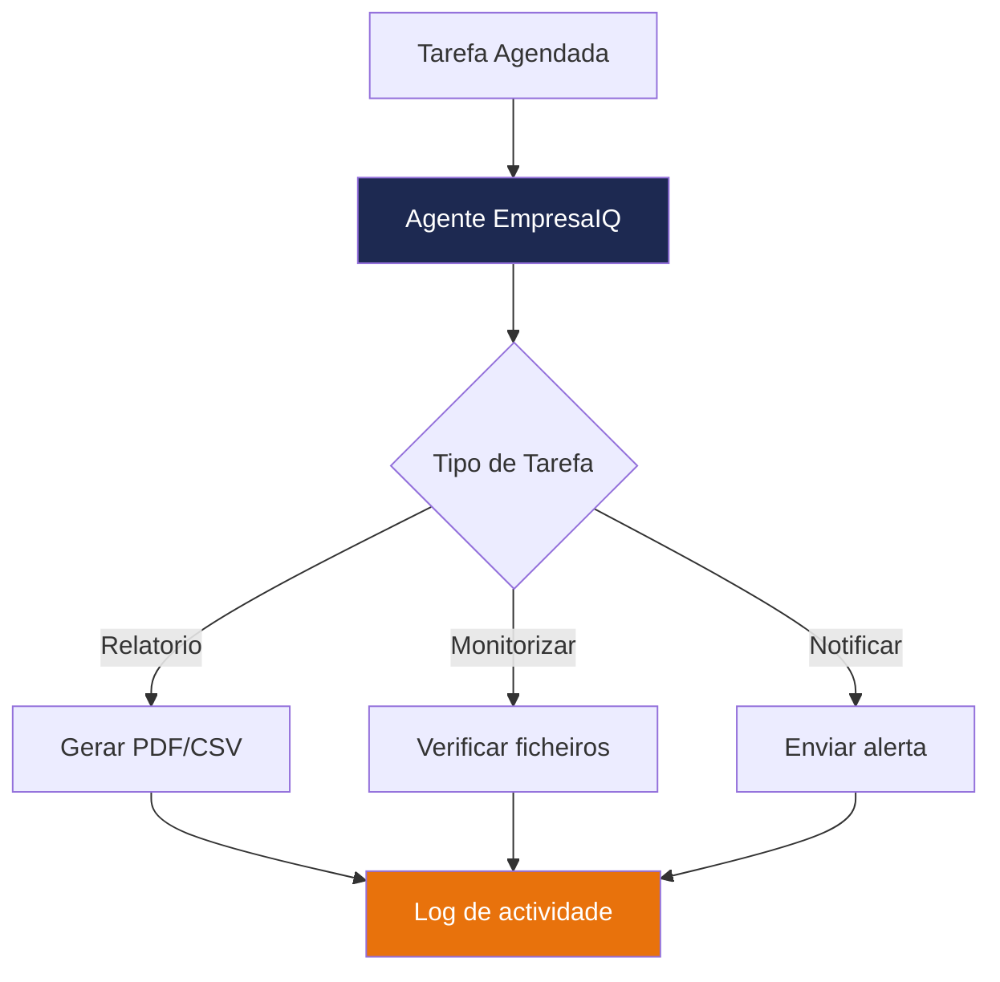

# Automatização Invisível por Hora

O agente pode correr automaticamente em segundo plano, sem intervenção humana — gerando relatórios, verificando dados, enviando alertas.


## Criar um Script Automatizável

Primeiro, transforme o agente num script não-interactivo:

```python title="agente_automatico.py"
import sys
from agente_local import agent_executor
from datetime import datetime
import json

def executar_tarefa(pergunta: str, ficheiro_output: str = None):
    """Executa uma tarefa no agente e guarda o resultado."""
    
    print(f"[{datetime.now().strftime('%Y-%m-%d %H:%M')}] A processar: {pergunta}")
    
    resultado = agent_executor.invoke({"input": pergunta})
    resposta = resultado["output"]
    
    print(f"Resposta: {resposta}")
    
    if ficheiro_output:
        with open(ficheiro_output, 'a', encoding='utf-8') as f:
            entrada = {
                "timestamp": datetime.now().isoformat(),
                "pergunta": pergunta,
                "resposta": resposta
            }
            f.write(json.dumps(entrada, ensure_ascii=False) + "\n")
    
    return resposta


if __name__ == "__main__":
    # Tarefa padrão ou argumento da linha de comandos
    tarefa = sys.argv[1] if len(sys.argv) > 1 else "Resume os serviços disponíveis da EmpresaIQ"
    executar_tarefa(tarefa, ficheiro_output="log_agente.jsonl")
```

---

## Linux — Cron

```bash
# Abrir editor de cron
crontab -e
```

### Exemplos de agendamento

```cron
# Correr a cada hora
0 * * * * cd /home/user/empresaiq-agent && source venv/bin/activate && python agente_automatico.py >> /var/log/agente.log 2>&1

# Correr todos os dias às 08:00
0 8 * * * cd /home/user/empresaiq-agent && source venv/bin/activate && python agente_automatico.py "Gera relatório diário de serviços" >> /var/log/agente.log 2>&1

# Correr às 2ª feira às 09:00
0 9 * * 1 cd /home/user/empresaiq-agent && source venv/bin/activate && python agente_automatico.py "Resumo semanal do portfolio" >> /var/log/agente.log 2>&1
```

### Sintaxe Cron

```
┌───────────── minuto (0-59)
│ ┌───────────── hora (0-23)
│ │ ┌───────────── dia do mês (1-31)
│ │ │ ┌───────────── mês (1-12)
│ │ │ │ ┌───────────── dia da semana (0-7, 0 e 7 = Domingo)
│ │ │ │ │
* * * * * comando
```

---

## Windows — Agendador de Tarefas

### Via PowerShell (linha de comandos)

```powershell
# Criar tarefa agendada para correr de hora a hora
$Action = New-ScheduledTaskAction `
    -Execute "python" `
    -Argument "C:\empresaiq-agent\agente_automatico.py" `
    -WorkingDirectory "C:\empresaiq-agent"

$Trigger = New-ScheduledTaskTrigger -RepetitionInterval (New-TimeSpan -Hours 1) -Once -At (Get-Date)

Register-ScheduledTask `
    -TaskName "EmpresaIQ-Agente-Automatico" `
    -Action $Action `
    -Trigger $Trigger `
    -Description "Agente IA EmpresaIQ — execução automática"
```

### Via Interface Gráfica

1. Abra **Agendador de Tarefas** (Task Scheduler)
2. Clique em **Criar Tarefa Básica...**
3. Nome: `EmpresaIQ Agente`
4. Trigger: **Diariamente** ou **Quando o computador iniciar**
5. Acção: **Iniciar um programa**
   - Programa: `C:\empresaiq-agent\venv\Scripts\python.exe`
   - Argumentos: `agente_automatico.py "Tarefa a executar"`
   - Iniciar em: `C:\empresaiq-agent`

---

## Casos de Uso Automáticos

| Tarefa | Agendamento | Benefício |
|---|---|---|
| Relatório diário de portfolio | Todos os dias 08:00 | Preparação para reuniões |
| Verificação de contratos públicos | De 2 em 2 horas | Monitorização contínua |
| Resumo semanal | Segunda às 09:00 | Visão geral da semana |
| Alerta de novos concursos | Cada 30 minutos | Oportunidades em tempo real |

:::tip
Guarde os resultados em ficheiros `.jsonl` (JSON Lines) — são fáceis de analisar com Python ou importar para Excel/Power BI.
:::