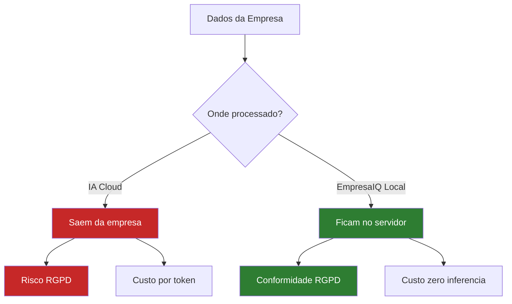

# Segurança e Privacidade


## A Vantagem Fundamental

Com IA local, a segurança está garantida por arquitectura — não por política ou contrato.

```
Cloud AI:
  Dados → Internet → Servidores externos → Resposta
  ⚠️ Dados viajam fora do seu controlo

IA Local EmpresaIQ:
  Dados → CPU local → Resposta
  ✅ Dados nunca saem do seu computador
```

---

## Conformidade RGPD

O Regulamento Geral de Protecção de Dados (RGPD) exige que:

| Requisito RGPD | IA Local | APIs Cloud |
|---|---|---|
| Dados não saem da UE | ✅ Sempre | ⚠️ Depende do contrato |
| Controlo total dos dados | ✅ Sim | ❌ Limitado |
| Direito ao esquecimento | ✅ Delete local | ⚠️ Complexo |
| Minimização de dados | ✅ Controlo total | ⚠️ Logs nos servidores |
| Avaliação de impacto (DPIA) | ✅ Simples | ❌ Complexa |

---

## Sectores que Beneficiam Mais

### Advocacia / Notariado

**Porquê IA local é essencial:**
- Sigilo profissional obrigatório
- Contratos e testamentos são confidenciais
- Dados de clientes protegidos por lei

**Uso prático:**
- Análise de contratos internamente
- Redacção de pareceres
- Pesquisa jurídica

### Contabilidade / Finanças

**Porquê IA local é essencial:**
- Dados fiscais e financeiros altamente sensíveis
- Sigilo bancário e fiscal
- Risco de compliance se dados saírem para fora

**Uso prático:**
- Análise de balanços
- Detecção de irregularidades
- Relatórios financeiros automáticos

### Saúde

**Porquê IA local é essencial:**
- Dados de saúde são categoria especial no RGPD
- Obrigação legal de confidencialidade
- Multas enormes por violação

**Uso prático:**
- Triagem de sintomas
- Análise de relatórios médicos
- Apoio a diagnóstico

### Sector Público

**Porquê IA local é essencial:**
- Dados classificados e sensíveis
- Obrigação de soberania digital
- Impossibilidade de usar cloud estrangeira para dados sensíveis

**Uso prático:**
- Análise de candidaturas
- Processamento de documentos internos
- Automatização de processos

---

## Boas Práticas de Segurança

### 1. Isolar o Ambiente

```bash
# Usar sempre ambiente virtual isolado
python -m venv venv
```

### 2. Não Expor o Agente à Rede

```python
# CORRECTO — apenas localhost
app.run(host='127.0.0.1', port=5000)

# ERRADO — expõe a toda a rede
app.run(host='0.0.0.0', port=5000)  # ❌ Nunca sem autenticação
```

### 3. Limpar Logs Automaticamente

```python
import os
import glob
from datetime import datetime, timedelta

def limpar_logs_antigos(pasta=".", dias=30):
    """Remove logs com mais de X dias."""
    limite = datetime.now() - timedelta(days=dias)
    for ficheiro in glob.glob(f"{pasta}/*.log"):
        if os.path.getmtime(ficheiro) < limite.timestamp():
            os.remove(ficheiro)
```

### 4. Encriptar Logs Sensíveis

```bash
# Instalar
pip install cryptography

# Exemplo simples de encriptação de ficheiro de log
```

```python
from cryptography.fernet import Fernet

# Gerar chave (guardar em local seguro!)
chave = Fernet.generate_key()
cifra = Fernet(chave)

# Encriptar
with open('log_agente.jsonl', 'rb') as f:
    dados = f.read()
dados_cifrados = cifra.encrypt(dados)

with open('log_agente.enc', 'wb') as f:
    f.write(dados_cifrados)
```

---

## Auditoria de Acessos

Registe sempre quem perguntou o quê:

```python
import logging

logging.basicConfig(
    filename='auditoria.log',
    level=logging.INFO,
    format='%(asctime)s — %(message)s'
)

def registar_acesso(utilizador: str, pergunta: str):
    logging.info(f"Utilizador: {utilizador} | Pergunta: {pergunta[:100]}")
```

---

## Lista de Verificação de Segurança

```
✅ Ambiente virtual isolado
✅ Servidor apenas em localhost
✅ Logs com rotação e limpeza automática
✅ Sem credenciais hardcoded no código
✅ Modelo GGUF verificado (hash SHA256)
✅ Actualizações regulares de dependências
✅ Acesso físico ao computador controlado
```