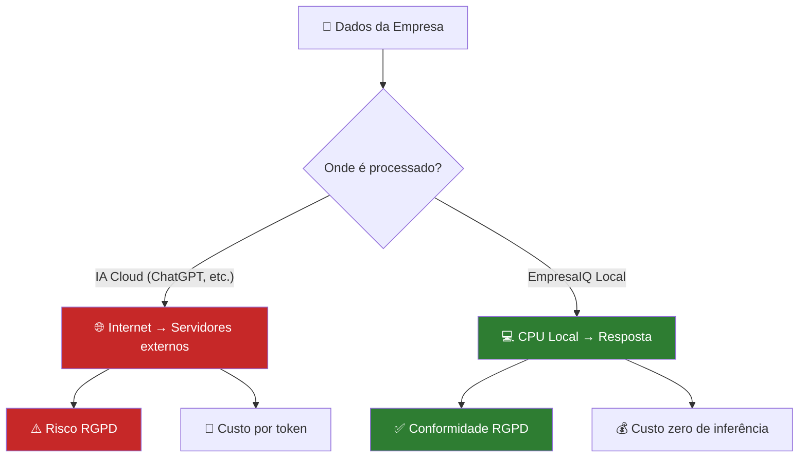

# Segurança e Privacidade

> *"Com IA local, a privacidade não é uma promessa nem uma política. É uma garantia arquitectural: os dados nunca saem do seu computador."*

---

## A vantagem fundamental da IA local

Quando usa uma API de IA na cloud (ChatGPT, Gemini, Claude), cada pergunta que faz — incluindo qualquer dado de clientes ou informação confidencial que cole no prompt — **viaja pela internet e é processada em servidores externos**.

Com o EmpresaIQ local, isto não acontece:



---

## Conformidade RGPD

O Regulamento Geral de Proteção de Dados (RGPD) exige várias garantias. Veja como o EmpresaIQ se posiciona:

| Requisito RGPD | EmpresaIQ Local | APIs Cloud |
|---|---|---|
| Dados não saem da UE | ✅ Sempre | ⚠️ Depende do contrato |
| Controlo total dos dados | ✅ Total | ❌ Limitado |
| Direito ao esquecimento | ✅ Delete local simples | ⚠️ Processo complexo |
| Minimização de dados | ✅ Só usa o que precisa | ⚠️ Logs nos servidores deles |
| Avaliação de impacto (DPIA) | ✅ Simples | ❌ Muito complexa |
| Auditoria de acessos | ✅ Controlo total | ❌ Visível apenas parcialmente |

---

## Sectores que beneficiam mais

### Advocacia e Notariado

O sigilo profissional é obrigatório. Contratos, testamentos e dados de clientes são protegidos por lei. Com o EmpresaIQ:
- Análise de contratos sem expor conteúdo a terceiros
- Redação de pareceres com IA confidencial
- Pesquisa jurídica em documentos internos

### Contabilidade e Finanças

Dados fiscais e financeiros são altamente sensíveis. O sigilo bancário e fiscal não admite excepções:
- Análise de balanços sem enviar números para servidores externos
- Detecção de irregularidades em dados internos
- Relatórios financeiros gerados localmente

### Saúde

Dados de saúde são **categoria especial** no RGPD — obrigam a protecção reforçada e as multas por violação podem ser enormes:
- Apoio a triagem e documentação clínica
- Análise de relatórios médicos internos
- Sem partilha de dados com entidades externas

### Sector Público

Dados classificados e obrigação de soberania digital impedem o uso de cloud estrangeira para dados sensíveis:
- Processamento de documentos internos classificados
- Automatização de processos com auditabilidade total

---

## Boas práticas de segurança

### 1. Usar sempre ambiente virtual isolado

```bash
# Isola as dependências do projecto do resto do sistema
python -m venv venv
```

Nunca instale as dependências directamente no Python do sistema.

### 2. Nunca expor o agente sem autenticação

```python
# CORRECTO — apenas localhost
app.run(host='127.0.0.1', port=5000)

# ERRADO — expõe toda a rede sem proteção
app.run(host='0.0.0.0', port=5000)  # Nunca sem autenticação!
```

Se precisar de expor o agente na rede interna, adicione primeiro autenticação básica:

```python
from flask import Flask, request, jsonify
from functools import wraps

# Token simples — num ambiente real use JWT ou OAuth
TOKEN_VALIDO = "empresaiq-token-secreto-aqui"

def requer_token(f):
    @wraps(f)
    def decorada(*args, **kwargs):
        token = request.headers.get('Authorization')
        if token != f"Bearer {TOKEN_VALIDO}":
            return jsonify({"erro": "Acesso negado"}), 401
        return f(*args, **kwargs)
    return decorada

@app.route('/chat', methods=['POST'])
@requer_token
def chat():
    ...
```

### 3. Limpar logs antigos automaticamente

Não guarde logs indefinidamente. Aplique uma política de retenção:

```python title="limpar_logs.py"
import os
import glob
from datetime import datetime, timedelta

def limpar_logs_antigos(pasta=".", dias=30):
    """Remove ficheiros de log com mais de X dias."""
    limite = datetime.now() - timedelta(days=dias)
    removidos = 0
    for ficheiro in glob.glob(f"{pasta}/*.jsonl") + glob.glob(f"{pasta}/*.log"):
        if os.path.getmtime(ficheiro) < limite.timestamp():
            os.remove(ficheiro)
            removidos += 1
    print(f"{removidos} ficheiros de log removidos.")

# Executar mensalmente via cron:
# 0 3 1 * * python /path/to/limpar_logs.py
```

### 4. Encriptar logs com dados sensíveis

Se os logs contiverem dados de clientes, encripte-os:

```bash
pip install cryptography
```

```python title="encriptar_log.py"
from cryptography.fernet import Fernet

# AVISO: Guarde a chave em local seguro (não no mesmo ficheiro nem no git!)
chave = Fernet.generate_key()   # Gera uma vez e guarda
cifra = Fernet(chave)

def encriptar_ficheiro(caminho: str):
    with open(caminho, 'rb') as f:
        dados = f.read()
    with open(caminho + '.enc', 'wb') as f:
        f.write(cifra.encrypt(dados))
    os.remove(caminho)  # Remove o original
    print(f"Ficheiro encriptado: {caminho}.enc")
```

:::danger Não inclua a chave no repositório
A chave de encriptação nunca deve estar no código nem no git. Use variáveis de ambiente ou um gestor de segredos (Azure Key Vault, HashiCorp Vault).
:::

---

## Checklist de segurança

Antes de usar o EmpresaIQ com dados reais de clientes, confirme:

- [ ] Ambiente virtual isolado criado e activo
- [ ] Ficheiro `.gitignore` inclui `*.log`, `*.jsonl`, `*.enc`, `chave_*`
- [ ] Interface web só acessível em `127.0.0.1` (ou com autenticação)
- [ ] Política de retenção de logs definida (máx. 30 dias recomendado)
- [ ] Logs com dados sensíveis encriptados
- [ ] Ninguém com acesso não autorizado ao servidor

---

## Resumo

Neste capítulo:
- Percebemos porque a IA local oferece garantias de privacidade superiores à cloud
- Viémos como o EmpresaIQ se enquadra no RGPD
- Aplicámos quatro boas práticas de segurança essenciais

Nas próximas versões do EmpresaIQ, há muito mais para explorar. O próximo capítulo apresenta o roteiro de melhorias futuras.

---

*Capítulo seguinte: [16. Melhorias Futuras →](./melhorias-futuras)*
## A Vantagem Fundamental

Com IA local, a segurança está garantida por arquitectura — não por política ou contrato.

```
Cloud AI:
  Dados → Internet → Servidores externos → Resposta
  ⚠️ Dados viajam fora do seu controlo

IA Local EmpresaIQ:
  Dados → CPU local → Resposta
  ✅ Dados nunca saem do seu computador
```

---

## Conformidade RGPD

O Regulamento Geral de Protecção de Dados (RGPD) exige que:

| Requisito RGPD | IA Local | APIs Cloud |
|---|---|---|
| Dados não saem da UE | ✅ Sempre | ⚠️ Depende do contrato |
| Controlo total dos dados | ✅ Sim | ❌ Limitado |
| Direito ao esquecimento | ✅ Delete local | ⚠️ Complexo |
| Minimização de dados | ✅ Controlo total | ⚠️ Logs nos servidores |
| Avaliação de impacto (DPIA) | ✅ Simples | ❌ Complexa |

---

## Sectores que Beneficiam Mais

### Advocacia / Notariado

**Porquê IA local é essencial:**
- Sigilo profissional obrigatório
- Contratos e testamentos são confidenciais
- Dados de clientes protegidos por lei

**Uso prático:**
- Análise de contratos internamente
- Redacção de pareceres
- Pesquisa jurídica

### Contabilidade / Finanças

**Porquê IA local é essencial:**
- Dados fiscais e financeiros altamente sensíveis
- Sigilo bancário e fiscal
- Risco de compliance se dados saírem para fora

**Uso prático:**
- Análise de balanços
- Detecção de irregularidades
- Relatórios financeiros automáticos

### Saúde

**Porquê IA local é essencial:**
- Dados de saúde são categoria especial no RGPD
- Obrigação legal de confidencialidade
- Multas enormes por violação

**Uso prático:**
- Triagem de sintomas
- Análise de relatórios médicos
- Apoio a diagnóstico

### Sector Público

**Porquê IA local é essencial:**
- Dados classificados e sensíveis
- Obrigação de soberania digital
- Impossibilidade de usar cloud estrangeira para dados sensíveis

**Uso prático:**
- Análise de candidaturas
- Processamento de documentos internos
- Automatização de processos

---

## Boas Práticas de Segurança

### 1. Isolar o Ambiente

```bash
# Usar sempre ambiente virtual isolado
python -m venv venv
```

### 2. Não Expor o Agente à Rede

```python
# CORRECTO — apenas localhost
app.run(host='127.0.0.1', port=5000)

# ERRADO — expõe a toda a rede
app.run(host='0.0.0.0', port=5000)  # ❌ Nunca sem autenticação
```

### 3. Limpar Logs Automaticamente

```python
import os
import glob
from datetime import datetime, timedelta

def limpar_logs_antigos(pasta=".", dias=30):
    """Remove logs com mais de X dias."""
    limite = datetime.now() - timedelta(days=dias)
    for ficheiro in glob.glob(f"{pasta}/*.log"):
        if os.path.getmtime(ficheiro) < limite.timestamp():
            os.remove(ficheiro)
```

### 4. Encriptar Logs Sensíveis

```bash
# Instalar
pip install cryptography

# Exemplo simples de encriptação de ficheiro de log
```

```python
from cryptography.fernet import Fernet

# Gerar chave (guardar em local seguro!)
chave = Fernet.generate_key()
cifra = Fernet(chave)

# Encriptar
with open('log_agente.jsonl', 'rb') as f:
    dados = f.read()
dados_cifrados = cifra.encrypt(dados)

with open('log_agente.enc', 'wb') as f:
    f.write(dados_cifrados)
```

---

## Auditoria de Acessos

Registe sempre quem perguntou o quê:

```python
import logging

logging.basicConfig(
    filename='auditoria.log',
    level=logging.INFO,
    format='%(asctime)s — %(message)s'
)

def registar_acesso(utilizador: str, pergunta: str):
    logging.info(f"Utilizador: {utilizador} | Pergunta: {pergunta[:100]}")
```

---

## Lista de Verificação de Segurança

```
✅ Ambiente virtual isolado
✅ Servidor apenas em localhost
✅ Logs com rotação e limpeza automática
✅ Sem credenciais hardcoded no código
✅ Modelo GGUF verificado (hash SHA256)
✅ Actualizações regulares de dependências
✅ Acesso físico ao computador controlado
```