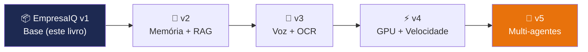

# Melhorias Futuras

> *"O EmpresaIQ que construiu neste livro é a versão 1.0 — funcional e já útil. As próximas versões são o que o torna verdadeiramente poderoso."*

---

## O roteiro do EmpresaIQ



Cada versão acrescenta capacidades reais, sem substituir as anteriores. Pode implementar cada melhoria independentemente, conforme as necessidades da sua empresa.

---

## Melhoria 1 — Memória vectorial com ChromaDB

A maior limitação do EmpresaIQ v1 é não se lembrar de documentos entre sessões. Com ChromaDB, o agente pode guardar e pesquisar documentos por **similaridade semântica** — mesmo sem ter visto exactamente as palavras usadas na pergunta.

```bash
pip install chromadb sentence-transformers
```

```python title="memoria_vetorial.py"
import chromadb
from chromadb.utils import embedding_functions

# Base de dados vectorial local (persiste no disco)
cliente = chromadb.PersistentClient(path="./db_vetorial")

# Modelo de embeddings local (~80 MB, corre em CPU)
embeddings = embedding_functions.SentenceTransformerEmbeddingFunction(
    model_name="all-MiniLM-L6-v2"
)

colecao = cliente.get_or_create_collection(
    name="documentos_empresaiq",
    embedding_function=embeddings
)

# Adicionar documento à memória
colecao.add(
    documents=["Contrato de prestação de serviços EmpresaIQ..."],
    ids=["contrato_001"],
    metadatas=[{"tipo": "contrato", "data": "2026-01-15"}]
)

# Pesquisar por similaridade
resultados = colecao.query(
    query_texts=["qual é o prazo do contrato?"],
    n_results=3
)
print(resultados["documents"])
```

**Capacidades desbloqueadas:**
- Responder perguntas sobre documentos internos (RAG)
- Memória persistente entre sessões
- Pesquisa em bases de conhecimento com centenas de documentos

---

## Melhoria 2 — Interface web completa com FastAPI

Evolua da interface Flask do capítulo 13 para uma API REST moderna:

```bash
pip install fastapi uvicorn
```

```python title="api_empresaiq.py"
from fastapi import FastAPI, HTTPException
from pydantic import BaseModel
from agente_local import agent_executor

app = FastAPI(title="EmpresaIQ Agent API", version="2.0")

class Pedido(BaseModel):
    pergunta: str

@app.post("/chat")
async def chat(pedido: Pedido):
    if not pedido.pergunta.strip():
        raise HTTPException(status_code=400, detail="Pergunta vazia")
    resultado = agent_executor.invoke({"input": pedido.pergunta})
    return {"resposta": resultado["output"]}

@app.get("/saude")
async def saude():
    return {"estado": "operacional", "modelo": "Phi-3-mini Q4"}

# Iniciar: uvicorn api_empresaiq:app --host 127.0.0.1 --port 8000
# Documentação automática: http://localhost:8000/docs
```

---

## Melhoria 3 — OCR para analisar PDFs

Permita ao agente ler e analisar documentos PDF digitalizados:

```bash
pip install pytesseract pillow pdf2image
# Instalar também: Tesseract OCR (https://github.com/UB-Mannheim/tesseract/wiki)
```

```python
from langchain.agents import tool
import pytesseract
from pdf2image import convert_from_path

@tool
def analisar_pdf(caminho_pdf: str) -> str:
    """Extrai e retorna o texto de um ficheiro PDF. Usa OCR se necessário."""
    imagens = convert_from_path(caminho_pdf)
    texto = ""
    for imagem in imagens:
        texto += pytesseract.image_to_string(imagem, lang='por')
    return texto[:3000]  # Limita ao contexto disponível
```

---

## Melhoria 4 — Reconhecimento de voz com Whisper

[OpenAI Whisper](https://github.com/openai/whisper) é um modelo de transcrever voz que corre **completamente offline**:

```bash
pip install openai-whisper
```

```python title="voz.py"
import whisper

modelo_whisper = whisper.load_model("small")  # ~244 MB, bom equilíbrio qualidade/velocidade

def transcrever_audio(caminho_audio: str) -> str:
    """Transcreve um ficheiro de áudio para texto em português."""
    resultado = modelo_whisper.transcribe(caminho_audio, language="pt")
    return resultado["text"]

# Integrar no loop de chat do cap. 13:
# pergunta = transcrever_audio("gravacao.wav")
# resposta = agent_executor.invoke({"input": pergunta})
```

---

## Melhoria 5 — Aceleração GPU (se tiver placa dedicada)

Se o servidor evoluir para ter uma GPU NVIDIA, a velocidade pode aumentar 10x-50x:

```bash
# Recompilar llama-cpp-python com suporte CUDA
$env:CMAKE_ARGS = "-DLLAMA_CUDA=on"
pip install llama-cpp-python --force-reinstall --no-cache-dir
```

```python
# Activar offloading de camadas para GPU
llm = LlamaCpp(
    model_path="./modelo.gguf",
    n_gpu_layers=35,  # Quantas camadas delegar à GPU (teste vários valores)
    n_threads=4,
    ...
)
```

| Hardware | Velocidade aproximada |
|---|---|
| CPU i5 (baseline) | ~3 tokens/seg |
| CPU i7 com AVX2 | ~6 tokens/seg |
| NVIDIA RTX 3060 | ~40 tokens/seg |
| NVIDIA RTX 4090 | ~200 tokens/seg |

---

## Melhoria 6 — Dashboard de monitorização com Streamlit

Visualize o histórico de uso do EmpresaIQ:

```bash
pip install streamlit pandas
```

```python title="dashboard.py"
import streamlit as st
import pandas as pd
import json

st.title("🤖 EmpresaIQ — Painel de Monitorização")

# Carregar logs
tentativas = []
with open('log_agente.jsonl') as f:
    for linha in f:
        tentativas.append(json.loads(linha))

df = pd.DataFrame(tentativas)
df['timestamp'] = pd.to_datetime(df['timestamp'])

st.metric("Total de perguntas", len(df))
st.line_chart(df.set_index('timestamp').resample('H').size())
st.dataframe(df.tail(10))

# Executar: streamlit run dashboard.py
```

---

## Resumo do roteiro

| Versão | Melhoria | Esforço | Impacto |
|---|---|---|---|
| v1.1 | Memória vectorial (ChromaDB) | Médio | Muito alto |
| v1.2 | API REST com FastAPI | Fácil | Alto |
| v1.3 | OCR para PDFs | Fácil | Alto |
| v2.0 | Reconhecimento de voz | Médio | Alto |
| v2.1 | GPU acceleration | Médio | Muito alto |
| v3.0 | Dashboard Streamlit | Fácil | Médio |

---

*Capítulo seguinte: [17. Qwen2.5 no Agente EmpresaIQ →](./qwen-agente)*
## 1. Memória Vetorial com ChromaDB

Permita que o agente "lembre" de documentos e pesquise por similaridade semântica:

```bash
pip install chromadb sentence-transformers
```

```python title="memoria_vetorial.py"
import chromadb
from chromadb.utils import embedding_functions

# Criar base de dados vectorial local
cliente = chromadb.PersistentClient(path="./db_vetorial")

# Usar modelo de embeddings local (sem internet)
embeddings = embedding_functions.SentenceTransformerEmbeddingFunction(
    model_name="all-MiniLM-L6-v2"  # ~80 MB, corre em CPU
)

colecao = cliente.get_or_create_collection(
    name="documentos_empresaiq",
    embedding_function=embeddings
)

# Adicionar documento
colecao.add(
    documents=["Contrato de prestação de serviços EmpresaIQ..."],
    ids=["contrato_001"],
    metadatas=[{"tipo": "contrato", "data": "2026-05-29"}]
)

# Pesquisar por similaridade
resultados = colecao.query(
    query_texts=["qual é o prazo do contrato?"],
    n_results=3
)
```

**Capacidades desbloqueadas:**
- Responder perguntas sobre documentos internos
- Pesquisa semântica em bases de conhecimento
- "Memória" persistente entre sessões

---

## 2. Interface Web Completa com FastAPI + React

```bash
pip install fastapi uvicorn
```

```python title="api.py"
from fastapi import FastAPI
from pydantic import BaseModel

app = FastAPI(title="EmpresaIQ Agent API")

class Pergunta(BaseModel):
    texto: str

@app.post("/chat")
async def chat(pergunta: Pergunta):
    resposta = agent_executor.invoke({"input": pergunta.texto})
    return {"resposta": resposta["output"]}

# Iniciar: uvicorn api:app --host 127.0.0.1 --port 8000
```

---

## 3. OCR para Analisar Documentos PDF

```bash
pip install pytesseract pillow pdf2image
# Instalar Tesseract: https://github.com/UB-Mannheim/tesseract/wiki
```

```python
@tool
def analisar_pdf(caminho_pdf: str) -> str:
    """Extrai e analisa o texto de um ficheiro PDF."""
    import pytesseract
    from pdf2image import convert_from_path
    
    imagens = convert_from_path(caminho_pdf)
    texto_completo = ""
    
    for imagem in imagens:
        texto_completo += pytesseract.image_to_string(imagem, lang='por')
    
    return texto_completo[:3000]  # Limita ao contexto disponível
```

---

## 4. Reconhecimento de Voz com Whisper

```bash
pip install openai-whisper
```

```python
import whisper

modelo_whisper = whisper.load_model("small")  # ~244 MB

def transcrever_audio(caminho_audio: str) -> str:
    resultado = modelo_whisper.transcribe(caminho_audio, language="pt")
    return resultado["text"]

# Integrar no loop de chat
import sounddevice as sd
import numpy as np
import scipy.io.wavfile as wav

def gravar_voz(segundos=5):
    """Grava áudio do microfone."""
    audio = sd.rec(int(segundos * 16000), samplerate=16000, channels=1)
    sd.wait()
    wav.write("temp_audio.wav", 16000, audio)
    return transcrever_audio("temp_audio.wav")
```

---

## 5. Síntese de Voz com Piper TTS

[Piper](https://github.com/rhasspy/piper) é um sistema TTS local extremamente leve e com suporte a português:

```bash
pip install piper-tts
```

```python
import subprocess

def falar(texto: str):
    """Converte texto em fala usando Piper TTS."""
    subprocess.run([
        "piper",
        "--model", "pt_PT-tugao-medium.onnx",
        "--output_file", "resposta.wav"
    ], input=texto.encode(), check=True)
    
    # Reproduzir o áudio
    subprocess.run(["aplay", "resposta.wav"])  # Linux
    # subprocess.run(["start", "resposta.wav"], shell=True)  # Windows
```

---

## 6. Dashboard de Monitorização

Visualize métricas do agente com Streamlit:

```bash
pip install streamlit pandas
```

```python title="dashboard.py"
import streamlit as st
import pandas as pd
import json

st.title("EmpresaIQ — Dashboard do Agente IA")

# Carregar logs
logs = []
try:
    with open("log_agente.jsonl") as f:
        for linha in f:
            logs.append(json.loads(linha))
except FileNotFoundError:
    st.warning("Sem logs registados ainda.")

if logs:
    df = pd.DataFrame(logs)
    st.metric("Total de perguntas", len(df))
    st.dataframe(df[["timestamp", "pergunta", "resposta"]])

# Iniciar: streamlit run dashboard.py
```

---

## Roadmap Sugerido

```
Fase 1 (Semana 1-2): ✅ Agente base funcional
Fase 2 (Semana 3-4):    Memória vetorial com ChromaDB
Fase 3 (Mês 2):         Interface web FastAPI
Fase 4 (Mês 3):         OCR e análise de PDFs
Fase 5 (Mês 4):         Voz (Whisper + Piper)
Fase 6 (Mês 5-6):       Dashboard e monitorização
```