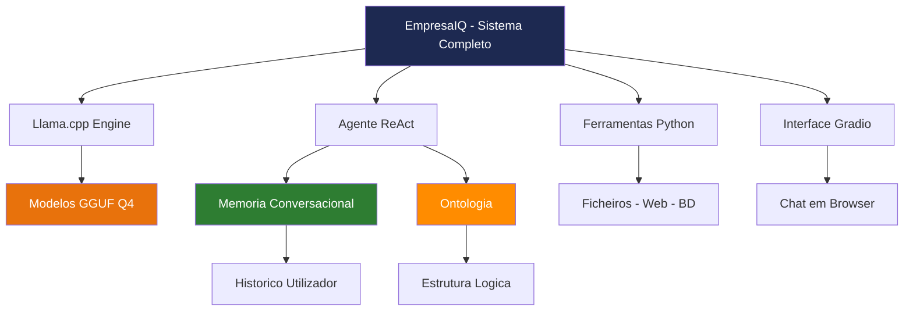

# 20. Conclusão


## O que Construímos

Ao longo deste guia, construiu um agente inteligente completo que corre **100% localmente** num PC normal com apenas 8 GB de RAM.

### Arquitectura Final

```
┌─────────────────────────────────────────────────────┐
│              AGENTE EMPRESAIQ LOCAL                 │
│                                                     │
│  ┌──────────────┐    ┌────────────────────────────┐ │
│  │  Interface   │    │     Ferramentas            │ │
│  │  Terminal/   │    │  • Portal Base Gov         │ │
│  │  Web/Voz     │    │  • Portfolio EmpresaIQ     │ │
│  └──────┬───────┘    │  • [as suas ferramentas]   │ │
│         │            └────────────┬───────────────┘ │
│         ▼                         ▼                 │
│  ┌─────────────────────────────────────────────┐    │
│  │          LangChain (ReAct Agent)            │    │
│  └────────────────────┬────────────────────────┘    │
│                       ▼                             │
│  ┌─────────────────────────────────────────────┐    │
│  │    Phi-3-mini Q4_K_M (2.2 GB GGUF)         │    │
│  │    via llama.cpp + Python                   │    │
│  └─────────────────────────────────────────────┘    │
│                                                     │
│  Hardware: 8 GB RAM | CPU | Sem GPU | Sem Cloud     │
└─────────────────────────────────────────────────────┘
```

---

## O que Aprendeu

| Capítulo | Conhecimento |
|---|---|
| 1-2 | Porque a IA local é estratégica |
| 3-4 | Como escolher modelos para hardware limitado |
| 5 | GGUF e quantização — a base técnica |
| 6-9 | Setup completo do ambiente |
| 10-11 | Construção de ferramentas e agentes |
| 12 | Optimizações para CPU máxima |
| 13-14 | Interfaces e automatização |
| 15 | Segurança e conformidade RGPD |
| 16 | Caminhos de evolução futura |
| 17 | Qwen2.5 como modelo alternativo no agente |
| 18 | Memória conversacional — histórico e contexto |
| 19 | Ontologias — estrutura de conhecimento empresarial |

---

## O Segredo do Sucesso

A IA local eficiente assenta em 4 pilares:

```
1. MODELO CERTO        → Phi-3-mini (3.8B parâmetros)
2. FORMATO CERTO       → GGUF Q4_K_M
3. MOTOR CERTO         → llama.cpp
4. OPTIMIZAÇÃO CERTA   → n_threads + n_ctx + temperature
```

---

## O que Pode Fazer a Seguir

- **Adicionar ferramentas** específicas ao seu negócio
- **Integrar documentos** com ChromaDB
- **Criar uma interface web** profissional
- **Automatizar tarefas** repetitivas da sua empresa
- **Expandir para voz** com Whisper + Piper
- **Evoluir a memória** para bases de dados persistentes (Redis, SQLite)
- **Expandir a ontologia** para um Knowledge Graph com Neo4j
- **Combinar Memória + RAG + Ontologia** num sistema cognitivo completo

---

## Mensagem Final

> **O futuro da IA não pertence apenas à cloud.**
>
> Pertence a quem tem controlo, privacidade e autonomia.
>
> Com este guia, a sua empresa tem agora as ferramentas para competir com soluções de IA de grandes corporações — **sem depender de ninguém**, **sem pagar APIs** e **sem expor os seus dados**.
>
> O futuro também corre localmente.
>
> — **EmpresaIQ**, Inteligência Empresarial & IA

---

## Recursos Úteis

- [llama.cpp no GitHub](https://github.com/ggerganov/llama.cpp)
- [LangChain Documentação](https://python.langchain.com/)
- [Phi-3-mini no Hugging Face](https://huggingface.co/microsoft/Phi-3-mini-4k-instruct)
- [Modelos GGUF — bartowski](https://huggingface.co/bartowski)
- [ChromaDB](https://www.trychroma.com/)
- [Piper TTS](https://github.com/rhasspy/piper)
- [Whisper OpenAI](https://github.com/openai/whisper)

---

*Guia produzido pela **EmpresaIQ** — Inteligência Empresarial & IA*  
*Versão 1.0 — Maio 2026*