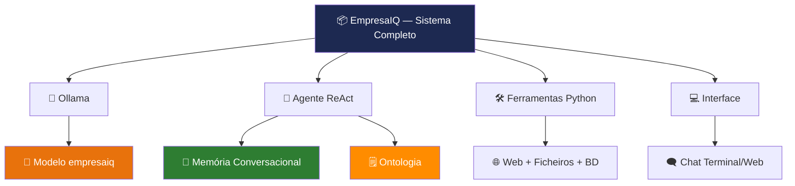
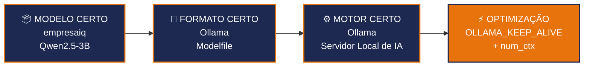
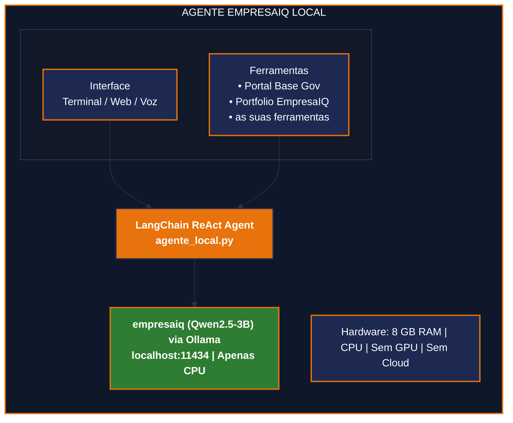

# Conclusão

> *"O futuro da IA não pertence apenas à cloud. Pertence a quem tem controlo, privacidade e autonomia."*

---

## O que construiu

Ao longo deste livro, construiu um agente de inteligência artificial completo que corre **100% localmente** num PC normal com apenas 8 GB de RAM. Sem subscripções, sem enviar dados para servidores externos, sem dependência de internet.

---

## O que aprendeu — mapa completo

| Parte | Capítulos | Conhecimento adquirido |
|---|---|---|
| **Fundamentos** | 1–2 | Porquê IA local é estratégica para empresas portuguesas |
| **Hardware** | 3–4 | Como escolher modelos para hardware limitado, sem GPU |
| **Técnica** | 5 | GGUF e quantização — o que acontece dentro do ficheiro |
| **Setup** | 6–9 | Instalação completa: Python, Ollama, modelo EmpresaIQ |
| **Construção** | 10–12 | Ferramentas, agente ReAct, optimizações CPU |
| **Produção** | 13–16 | Interface, automatização, segurança, melhorias |
| **Avançado** | 17–20 | Qwen2.5, memória, ontologias, OpenCLAW |

---

## Os quatro pilares do EmpresaIQ

---

## Arquitectura final do EmpresaIQ

---

## O que pode fazer a seguir

**Próximos passos concretos para o EmpresaIQ:**

- **Adicionar ferramentas** específicas ao seu negócio (ERP, CRM, base de dados interna)
- **Integrar documentos** com ChromaDB ou FAISS para RAG
- **Criar uma interface web** profissional com autentificação
- **Automatizar tarefas** repetitiáveis com cron / Task Scheduler
- **Expandir para voz** com Whisper (entrada) + Piper TTS (saída)
- **Evoluir a ontologia** para um Knowledge Graph com Neo4j
- **Combinar Memória + RAG + Ontologia** num sistema cognitivo empresarial completo

---

## Mensagem final

Quando começou este livro, talvez IA local parecesse algo para grandes empresas com servidores dedicados. Agora sabe que não é verdade.

Com um PC de escritório, Python, e os modelos e ferramentas certos, qualquer empresa — do advogado independente ao retalhista local — pode ter um agente inteligente a funcionar **hoje**, **sem custos de subscrição**, **sem expor dados a terceiros**.

:::tip O EmpresaIQ que construiu é seu
O código, os dados, o modelo — estão todos no seu computador. Não há termos de serviço que mudam, não há preços que sobem, não há API que deixa de funcionar. A inteligência é sua.
:::

---

## Recursos úteis

| Recurso | Link |
|---|---|
| Ollama | [ollama.com](https://ollama.com) |
| LangChain | [python.langchain.com](https://python.langchain.com/) |
| Qwen2.5 (Alibaba) | [huggingface.co/Qwen](https://huggingface.co/Qwen) |
| LangChain Ollama | [github.com/langchain-ai/langchain](https://github.com/langchain-ai/langchain) |
| ChromaDB | [trychroma.com](https://www.trychroma.com/) |
| Whisper | [github.com/openai/whisper](https://github.com/openai/whisper) |
| Piper TTS | [github.com/rhasspy/piper](https://github.com/rhasspy/piper) |

---

*Guia produzido pela **EmpresaIQ** — Inteligência Empresarial & IA*  
*Versão 2.0 — 2026*