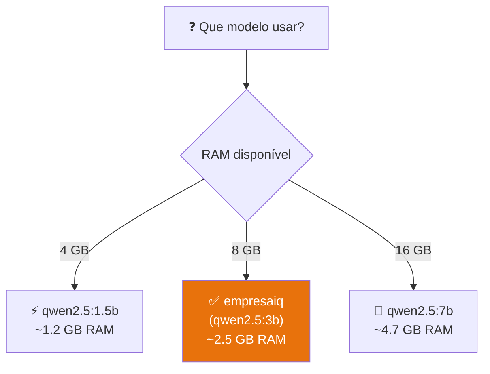

# Modelos Alternativos via Ollama

> *"Modelos diferentes têm personalidades diferentes. Com o Ollama, mudar de modelo é tão simples como mudar uma linha no Modelfile — todo o resto permanece igual."*

---

## O que é o Qwen2.5?

O Qwen2.5 é uma família de modelos Open Source desenvolvida pela Alibaba Cloud. Nos benchmarks de seguimento de instruções e uso de ferramentas (tool calling), o Qwen2.5 destaca-se como uma das melhores opções para hardware limitado.

O EmpresaIQ usa o Qwen2.5-3B como base por defeito (Cap. 9). Mas o Ollama tem um catálogo completo de modelos — pode experimentar qualquer um com um único comando.



---

## Modelos disponíveis no Ollama

| Modelo | Comando pull | RAM usada | Pontos fortes |
|---|---|---|---|
| **empresaiq** (padrão) | *(criado no Cap. 9)* | ~2.5 GB | Personalizado para PT empresarial |
| `qwen2.5:1.5b` | `ollama pull qwen2.5:1.5b` | ~1.2 GB | Ultra-rápido, 4 GB RAM |
| `qwen2.5:3b` | `ollama pull qwen2.5:3b` | ~2.5 GB | ✅ Base do EmpresaIQ |
| `qwen2.5:7b` | `ollama pull qwen2.5:7b` | ~4.7 GB | Mais capaz, 16 GB RAM |
| `phi4-mini` | `ollama pull phi4-mini` | ~2.5 GB | Alternativa Microsoft |
| `llama3.2:3b` | `ollama pull llama3.2:3b` | ~2.0 GB | Meta, rápido |
| `mistral:7b` | `ollama pull mistral:7b` | ~4.1 GB | Europeu, forte em PT |

---

## Usar o Qwen2.5-7B para mais qualidade

Se tiver 16 GB de RAM e quiser respostas de maior qualidade:

```bash
# Descarregar o modelo maior
ollama pull qwen2.5:7b
```

### Criar um Modelfile para a versão 7B

```dockerfile title="Modelfile-7b"
FROM qwen2.5:7b

SYSTEM """
És o EmpresaIQ Pro — um assistente de inteligência artificial empresarial
especializado para empresas portuguesas.

Respondes sempre em português de Portugal, com alta precisão e detalhe.
...
"""

PARAMETER temperature 0.1
PARAMETER top_p 0.9
PARAMETER num_ctx 8192
PARAMETER repeat_penalty 1.1
```

Criar o modelo:

```bash
ollama create empresaiq-pro -f Modelfile-7b
ollama run empresaiq-pro
```

---

## Mudar o modelo no agente Python

A mudança no `agente_local.py` é uma única linha:

```python title="agente_local.py (apenas esta linha muda)"
# ANTES — modelo base EmpresaIQ (Qwen2.5-3B)
llm = OllamaLLM(
    model="empresaiq",
    base_url="http://localhost:11434",
    temperature=0.1,
)

# DEPOIS — modelo Pro (Qwen2.5-7B)
llm = OllamaLLM(
    model="empresaiq-pro",       # ← só esta linha muda
    base_url="http://localhost:11434",
    temperature=0.1,
)
```

Todo o resto do código — ferramentas, prompt, executor — não muda.

---

## Comparar modelos para o contexto empresarial PT

| Característica | qwen2.5:3b | qwen2.5:7b | phi4-mini |
|---|---|---|---|
| Velocidade CPU | ⚡⚡⚡ Bom | ⚡⚡ Moderado | ⚡⚡⚡ Bom |
| Seguimento de instruções | ★★★★★ | ★★★★★ | ★★★★ |
| Uso de ferramentas (ReAct) | ★★★★★ | ★★★★★ | ★★★★ |
| Multilíngue (PT/EN/ES) | ★★★★★ | ★★★★★ | ★★★★ |
| Taxa de alucinação | Baixa | Muito baixa | Baixa |
| RAM necessária | ~2.5 GB | ~4.7 GB | ~2.5 GB |
| Licença | Apache 2.0 | Apache 2.0 | MIT |

Para a maioria dos casos de uso empresarial, o `qwen2.5:3b` (base do EmpresaIQ) é mais do que suficiente. O `qwen2.5:7b` justifica-se quando a precisão é crítica e tem RAM disponível.

---

## Experimento: testar rapidamente um novo modelo

Para testar um modelo sem criar um Modelfile completo:

```bash
# Testar directamente via Ollama
ollama run phi4-mini
>>> Olá! Responde em português. Qual a diferença entre IVA e IRC?
```

Ou via Python:

```python
import ollama

# Testar modelo alternativo rapidamente
resposta = ollama.chat(
    model='phi4-mini',
    messages=[{
        'role': 'user',
        'content': 'Que tipo de tarefas empresariais podes ajudar?'
    }]
)
print(resposta['message']['content'])
```

---

## Gerir o espaço em disco

Os modelos ocupam espaço em disco. Para gerir:

```bash
# Ver todos os modelos e tamanhos
ollama list

# Remover um modelo que não usa
ollama rm qwen2.5:7b
```

---

## Resumo

Neste capítulo:
- Explorámos o catálogo de modelos disponíveis no Ollama
- Criámos um Modelfile para o Qwen2.5-7B (versão Pro)
- Vimos que mudar de modelo é apenas uma linha de código
- Comparámos modelos para o contexto empresarial português

Com o Ollama, experimentar novos modelos é simples e reversível. O modelo base do EmpresaIQ (`qwen2.5:3b`) continua a ser a escolha certa para a maioria dos casos de uso.

No próximo capítulo, adicionamos memória conversacional ao EmpresaIQ — para o agente se lembrar do contexto entre perguntas.

---

*Capítulo seguinte: [18. Memória Conversacional →](./memoria-conversacional)*