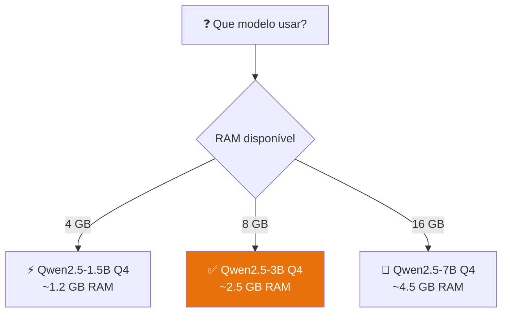

# Qwen2.5 no Agente EmpresaIQ

> *"Modelos diferentes têm personalidades diferentes. O Phi-3-mini é rápido e eficiente. O Qwen2.5 é mais rigoroso com instruções estruturadas. Para um agente empresarial com ferramentas, esta diferença é significativa."*

---

## O que é o Qwen2.5?

O Qwen2.5 é uma família de modelos Open Source desenvolvida pela Alibaba Cloud. Nos benchmarks de seguimento de instruções e uso de ferramentas (tool calling), o Qwen2.5 destaca-se como uma das melhores opções para hardware limitado.

Para o EmpresaIQ, a mudança de modelo é simples: apenas uma linha de código muda. Todo o resto — ferramentas, agente ReAct, interface — fica exactamente igual.



---

## Vantagens do Qwen2.5 para o EmpresaIQ

| Característica | Phi-3-mini | Qwen2.5-3B |
|---|---|---|
| Velocidade CPU | ⚡⚡⚡⚡ Rápido | ⚡⚡⚡ Bom |
| Seguimento de instruções | ★★★★ | ★★★★★ |
| Uso de ferramentas (ReAct) | ★★★ | ★★★★★ |
| Multilíngue (PT/EN/ES) | ★★★★ | ★★★★★ |
| Taxa de alucinação | Baixa | Muito baixa |
| Licença | MIT | Apache 2.0 |

Para o agente EmpresaIQ especificamente, o Qwen2.5 é mais consistente a escolher a ferramenta certa e a formatar as respostas no padrão ReAct.

---

## Passo 1 — Descarregar o modelo

O modelo recomendado para 8 GB RAM é o **Qwen2.5-3B-Instruct Q4_K_M**:

```bash
# Via Hugging Face Hub (método recomendado)
pip install huggingface-hub

python -c "
from huggingface_hub import hf_hub_download
hf_hub_download(
    repo_id='Qwen/Qwen2.5-3B-Instruct-GGUF',
    filename='qwen2.5-3b-instruct-q4_k_m.gguf',
    local_dir='.'
)
print('Download concluído!')
"
```

Tamanho: ~2.0 GB. Demora 5-15 minutos conforme a ligação.

---

## Passo 2 — Substituir o modelo no agente

A mudança no `agente_local.py` é minimal:

```python title="agente_local.py (apenas esta linha muda)"
# ANTES (Phi-3-mini)
llm = LlamaCpp(
    model_path="./Phi-3-mini-4k-instruct-Q4_K_M.gguf",
    n_ctx=2048, n_threads=4, temperature=0.1, verbose=False
)

# DEPOIS (Qwen2.5-3B)
llm = LlamaCpp(
    model_path="./qwen2.5-3b-instruct-q4_k_m.gguf",
    n_ctx=4096,    # Qwen suporta contexto maior
    n_threads=4,
    n_batch=256,
    temperature=0.2,   # Ligeiramente mais alto para respostas mais naturais
    verbose=False
)
```

Todo o resto do código — ferramentas, prompt, executor — não muda.

---

## Passo 3 — Ajustar o prompt para Qwen

O Qwen responde melhor a prompts directos e estruturados. Aqui fica um template optimizado:

```python title="agente_local.py (template optimizado para Qwen)"
template = """
Sés o Agente EmpresaIQ — assistente empresarial profissional.
Respondes sempre em português de Portugal.
Se precisares de usar ferramentas, segue exactamente este formato:

Thought: [raciocínio sobre o que fazer]
Action: [nome_da_ferramenta]
Action Input: [argumento para a ferramenta]
Observation: [resultado da ferramenta]

... (repete Thought/Action/Observation se necessário)

Final Answer: [resposta final ao utilizador]

Ferramentas disponíveis:
{tools}

Nomes das ferramentas: {tool_names}

Pergunta: {input}

Thought: {agent_scratchpad}
"""
```

:::tip Prompt estruturado = Qwen mais preciso
O Qwen2.5 é treinado para seguir formato estruturado. Quanto mais explícito o formato no prompt, mais consistente será o comportamento do agente.
:::

---

## Configuração por quantidade de RAM

| Modelo | Ficheiro GGUF | RAM usada | Recomendado para |
|---|---|---|---|
| Qwen2.5-1.5B Q4 | `...1.5b...q4_k_m.gguf` | ~1.2 GB | PCs com 4-6 GB RAM |
| **Qwen2.5-3B Q4** | `...3b...q4_k_m.gguf` | ~2.5 GB | **PCs com 8 GB RAM** |
| Qwen2.5-7B Q4 | `...7b...q4_k_m.gguf` | ~4.5 GB | PCs com 12-16 GB RAM |

---

## Impacto prático no EmpresaIQ

Com Qwen2.5, o agente EmpresaIQ:

- Usa as ferramentas de forma mais consistente (menos erros de formato)
- Produz respostas mais precisas em português
- Tem menor taxa de "alucinação" (inventar factos)
- Segue melhor instruções complexas no prompt

---

## Resumo

Neste capítulo:
- Percebemos as diferenças entre Phi-3-mini e Qwen2.5
- Descarregámos o modelo Qwen2.5-3B-Instruct Q4_K_M
- Fizemos a substituição com uma única linha de código
- Ajustámos o prompt para aproveitar os pontos fortes do Qwen

No próximo capítulo, adicionamos memória conversacional ao EmpresaIQ — para o agente se lembrar do contexto entre perguntas.

---

*Capítulo seguinte: [18. Memória Conversacional →](./memoria-conversacional)*
## 17.1 Introdução ao Qwen

O Qwen2.5 é uma família de modelos de linguagem Open Source desenvolvida para desempenho elevado em tarefas de raciocínio, seguimento de instruções e utilização de ferramentas (tool use).

Em cenários de hardware limitado, como máquinas com 8 GB de RAM e execução apenas em CPU, o Qwen destaca-se como uma das melhores alternativas disponíveis atualmente.

Este modelo foi desenhado para ser eficiente, consistente e especialmente forte em tarefas estruturadas — tornando-o ideal para agentes inteligentes empresariais como o EmpresaIQ.

---

## 17.2 Vantagens do Qwen para Agentes Locais

Ao contrário de modelos mais antigos ou menos otimizados, o Qwen2.5 apresenta várias vantagens críticas:

- Excelente compreensão de instruções complexas
- Elevada estabilidade em fluxos ReAct (Reason + Act)
- Melhor consistência em respostas estruturadas (JSON e tool calling)
- Forte desempenho multilingue (Português, Inglês e Espanhol)
- Menor taxa de alucinação em tarefas com ferramentas externas

Estas características tornam-no particularmente adequado para sistemas de automação empresarial e agentes de decisão.

---

## 17.3 Versão Recomendada para 8 GB RAM

Para sistemas com recursos limitados, a versão ideal é:

**Qwen2.5-3B-Instruct (GGUF Q4\_K\_M)**

### Consumo estimado

| Recurso | Valor |
|---|---|
| RAM utilizada | ~2.5 GB a 3.5 GB |
| CPU | Moderado |
| Performance | Fluida em tempo real (dependendo do processador) |

### Alternativas

| Modelo | Velocidade | Inteligência | Indicado para |
|---|---|---|---|
| Qwen2.5-1.5B | ⚡ Muito rápido | ⭐⭐ | Hardware muito limitado |
| Qwen2.5-3B Q4\_K\_M | ⚡ Rápido | ⭐⭐⭐ | **Recomendado** |
| Qwen2.5-7B Q4 | 🐢 Moderado | ⭐⭐⭐⭐ | Próximo do limite de RAM |

---

## 17.4 Integração com Llama.cpp

O Qwen pode ser facilmente executado através da biblioteca `llama-cpp-python`, mantendo compatibilidade total com arquiteturas de agentes baseadas em LangChain.

A substituição do modelo é direta:

```python
model_path = "./qwen2.5-3b-instruct-q4_k_m.gguf"
```

O restante pipeline permanece inalterado, incluindo ferramentas e agente ReAct.

### Exemplo completo de carregamento

```python
from llama_cpp import Llama

llm = Llama(
    model_path="./qwen2.5-3b-instruct-q4_k_m.gguf",
    n_ctx=4096,
    n_threads=4,
    n_batch=256,
    verbose=False,
)
```

---

## 17.5 Ajustes Recomendados para Melhor Performance

Para garantir estabilidade e rapidez no CPU, recomenda-se:

- Definir contexto (`n_ctx`) entre 2048 e 4096
- Ajustar threads ao número de núcleos físicos do CPU
- Utilizar `temperature` entre 0.1 e 0.3
- Limitar iterações do agente (max 3 a 4 loops)
- Reduzir o tamanho das respostas das ferramentas

### Configuração otimizada recomendada

```python
llm = Llama(
    model_path="./qwen2.5-3b-instruct-q4_k_m.gguf",
    n_ctx=4096,
    n_threads=4,      # Ajustar ao número de núcleos físicos
    n_batch=256,
    temperature=0.2,
    verbose=False,
)
```

---

## 17.6 Melhorias no Prompt para Qwen

O Qwen responde melhor a prompts diretos e estruturados.

Ao contrário de outros modelos, não necessita de prompts excessivamente longos.

### Boas práticas

- Linguagem simples e directa
- Estrutura clara de Thought / Action / Observation
- Indicação explícita de resposta final em português

### Exemplo de prompt eficaz

```
Você é um assistente empresarial. Responda sempre em português de Portugal.
Quando usar ferramentas, siga exactamente o formato:
Thought: [raciocínio]
Action: [nome_ferramenta]
Action Input: [parâmetro]
Observation: [resultado]
Final Answer: [resposta ao utilizador]
```

---

## 17.7 Impacto no Agente EmpresaIQ

A adoção do Qwen2.5 no agente EmpresaIQ resulta em:

- Maior precisão em decisões automatizadas
- Melhor integração com ferramentas externas (APIs e bases de dados)
- Redução de erros de interpretação
- Melhor experiência conversacional
- Maior robustez em ambientes de produção locais

---

## 17.8 Conclusão

O Qwen2.5 representa um salto significativo na construção de agentes inteligentes leves.

Quando combinado com Llama.cpp e uma arquitetura de ferramentas bem definida, permite criar sistemas de IA locais altamente eficientes mesmo em hardware modesto.

Para o EmpresaIQ, isto significa:

- Independência total de cloud
- Custos reduzidos
- Controlo total dos dados
- Capacidade de escalar automação empresarial localmente

Este modelo torna possível aproximar agentes inteligentes de nível empresarial a qualquer computador pessoal moderno.