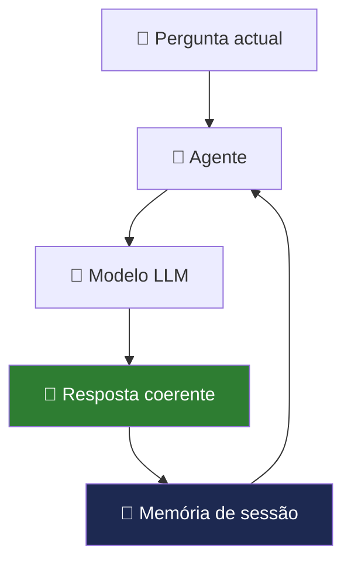

# Memória Conversacional

> *"A diferença entre um chatbot e um assistente inteligente é a memória. Um chatbot esquece cada frase que disse. Um assistente lembra-se de tudo o que importa."*

---

## O problema: cada pergunta começa do zero

Por defeito, o EmpresaIQ trata cada pergunta de forma independente. Imagine esta conversa:

```
Você:   "Tenho 10 contratos activos este mês."
Agente: "Percebido. Como posso ajudar?"

Você:   "Quantos são de software?"
Agente: ??? ← Não sabe de que contratos está a falar
```

Sem memória, o agente não consegue referenciar mensagens anteriores. É como falar com alguém que perde a memória a cada frase.



---

## Tipos de memória

| Tipo | O que guarda | Persiste entre sessões? |
|---|---|---|
| Janela de contexto | Tokens actuais no prompt | Não (reset ao reiniciar) |
| Buffer Memory | Últimas N mensagens | Não (apenas na sessão) |
| Summary Memory | Resumo comprimido do histórico | Não (só na sessão) |
| Vector Memory (FAISS) | Embeddings de conversas passadas | **Sim** (persiste no disco) |

Para o EmpresaIQ em hardware limitado, recomenda-se começar com **Buffer Window Memory** e evoluir para memória vectorial conforme a necessidade.

---

## Opção 1 — Buffer Window Memory (recomendada para 8 GB RAM)

Guarda as últimas `k` trocas (pergunta + resposta), descartando as mais antigas:

```python title="agente_com_memoria.py"
from langchain.memory import ConversationBufferWindowMemory
from langchain_ollama import OllamaLLM
from langchain.agents import AgentExecutor, create_react_agent
from langchain_core.prompts import PromptTemplate
from tools import consultar_portfolio_empresaiq, calcular_iva

llm = OllamaLLM(
    model="empresaiq",
    base_url="http://localhost:11434",
    temperature=0.1
)

# Guarda as últimas 3 trocas (6 mensagens)
memory = ConversationBufferWindowMemory(
    k=3,
    memory_key="chat_history",
    return_messages=False  # False = texto simples (menos tokens)
)

tools = [consultar_portfolio_empresaiq, calcular_iva]

template = """
Sés o Agente EmpresaIQ. Respondes em português de Portugal.

Histórico recente:
{chat_history}

Ferramentas: {tools}
Nomes: {tool_names}

Pergunta: {input}
Thought: {agent_scratchpad}
"""

agent = create_react_agent(llm, tools, PromptTemplate.from_template(template))

executor = AgentExecutor(
    agent=agent, tools=tools, memory=memory,
    verbose=False, max_iterations=3, handle_parsing_errors=True
)

# Testar a memória
perguntas = [
    "Tenho 10 contratos activos este mês.",
    "Quantos desses são de software?",
    "E qual é o preço do software da EmpresaIQ?"
]

for p in perguntas:
    print(f"\nVocê: {p}")
    r = executor.invoke({"input": p})
    print(f"Agente: {r['output']}")
```

:::caution Memória e consumo de contexto
Cada mensagem no histórico ocupa tokens. Com `k=3` e mensagens médias, pode usar 400-800 tokens extra de contexto. Se o agente ficar mais lento, reduza `k=2`.
:::

---

## Opção 2 — Summary Memory (para conversas longas)

Em vez de guardar todas as mensagens na íntegra, o modelo resume automaticamente:

```python
from langchain.memory import ConversationSummaryMemory

memory_resumo = ConversationSummaryMemory(
    llm=llm,           # Usa o mesmo modelo para resumir
    memory_key="chat_history"
)
```

**Vantagem:** Contém muito mais informação em menos tokens.  
**Desvantagem:** Cada mensagem nova é resumida pelo modelo (mais lento).

---

## Opção 3 — Memória vectorial com FAISS (persiste entre sessões)

Para o EmpresaIQ guardar memória mesmo depois de reiniciar o computador:

```bash
pip install faiss-cpu sentence-transformers
```

```python title="memoria_persistente.py"
from langchain_community.vectorstores import FAISS
from langchain_community.embeddings import HuggingFaceEmbeddings
from datetime import datetime
import os

# Modelo de embeddings local (~80 MB)
embeddings = HuggingFaceEmbeddings(
    model_name="sentence-transformers/all-MiniLM-L6-v2"
)

DB_PATH = "./memoria_empresaiq"

def guardar_na_memoria(pergunta: str, resposta: str):
    """Guarda uma troca na memória persistente."""
    texto = f"[{datetime.now().strftime('%Y-%m-%d')}] Utilizador: {pergunta} | Agente: {resposta}"

    if os.path.exists(DB_PATH):
        db = FAISS.load_local(DB_PATH, embeddings, allow_dangerous_deserialization=True)
        db.add_texts([texto])
    else:
        db = FAISS.from_texts([texto], embeddings)

    db.save_local(DB_PATH)

def pesquisar_na_memoria(pergunta: str, k: int = 3) -> str:
    """Recupera memórias relevantes para a pergunta actual."""
    if not os.path.exists(DB_PATH):
        return ""
    db = FAISS.load_local(DB_PATH, embeddings, allow_dangerous_deserialization=True)
    resultados = db.similarity_search(pergunta, k=k)
    return "\n".join([r.page_content for r in resultados])
```

---

## Arquitectura recomendada para o EmpresaIQ

Para a maioria das empresas, a combinação ideal é:

```
Sessão actual:
   ConversationBufferWindowMemory (k=3)
   → Rápido, zero configuração extra

Entre sessões (opcional):
   FAISS com embeddings locais
   → O agente "lembra" de conversações anteriores
```

---

## Boas práticas

| Prática | Porquê |
|---|---|
| Limite `k` a 3-5 | Evita sobrecarga de RAM e contexto |
| Use `return_messages=False` | Menos tokens, mais eficiente |
| Separe memória por utilizador | Essencial para sistemas multi-utilizador |
| Não guarde dados sensíveis | Ou encripte o ficheiro FAISS |

---

## Resumo

Neste capítulo:
- Percebemos porque a memória transforma o EmpresaIQ num assistente verdadeiramente útil
- Implementamos `ConversationBufferWindowMemory` para contexto de sessão
- Exploramós FAISS para memória persistente entre sessões

No capítulo seguinte, vamos além da memória e adicionamos **estrutura de conhecimento** ao EmpresaIQ com ontologias.

---

*Capítulo seguinte: [19. Ontologias e Estrutura de Conhecimento →](./ontologias)*

