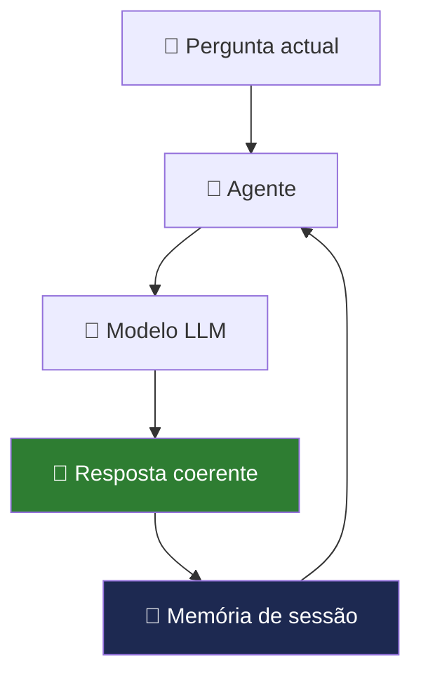

# Memória Conversacional

> *"A diferença entre um chatbot e um assistente inteligente é a memória. Um chatbot esquece cada frase que disse. Um assistente lembra-se de tudo o que importa."*

---

## O problema: cada pergunta começa do zero

Por defeito, o EmpresaIQ trata cada pergunta de forma independente. Imagine esta conversa:

```
Você:   "Tenho 10 contratos activos este mês."
Agente: "Percebido. Como posso ajudar?"

Você:   "Quantos são de software?"
Agente: ??? ← Não sabe de que contratos está a falar
```

Sem memória, o agente não consegue referenciar mensagens anteriores. É como falar com alguém que perde a memória a cada frase.



---

## Tipos de memória

| Tipo | O que guarda | Persiste entre sessões? |
|---|---|---|
| Janela de contexto | Tokens actuais no prompt | Não (reset ao reiniciar) |
| Buffer Memory | Últimas N mensagens | Não (apenas na sessão) |
| Summary Memory | Resumo comprimido do histórico | Não (só na sessão) |
| Vector Memory (FAISS) | Embeddings de conversas passadas | **Sim** (persiste no disco) |

Para o EmpresaIQ em hardware limitado, recomenda-se começar com **Buffer Window Memory** e evoluir para memória vectorial conforme a necessidade.

---

## Opção 1 — Buffer Window Memory (recomendada para 8 GB RAM)

Guarda as últimas `k` trocas (pergunta + resposta), descartando as mais antigas:

```python title="agente_com_memoria.py"
from langchain.memory import ConversationBufferWindowMemory
from langchain_community.llms import LlamaCpp
from langchain.agents import AgentExecutor, create_react_agent
from langchain_core.prompts import PromptTemplate
from tools import consultar_portfolio_empresaiq, calcular_iva

llm = LlamaCpp(
    model_path="./Phi-3-mini-4k-instruct-Q4_K_M.gguf",
    n_ctx=2048, n_threads=4, temperature=0.1, verbose=False
)

# Guarda as últimas 3 trocas (6 mensagens)
memory = ConversationBufferWindowMemory(
    k=3,
    memory_key="chat_history",
    return_messages=False  # False = texto simples (menos tokens)
)

tools = [consultar_portfolio_empresaiq, calcular_iva]

template = """
Sés o Agente EmpresaIQ. Respondes em português de Portugal.

Histórico recente:
{chat_history}

Ferramentas: {tools}
Nomes: {tool_names}

Pergunta: {input}
Thought: {agent_scratchpad}
"""

agent = create_react_agent(llm, tools, PromptTemplate.from_template(template))

executor = AgentExecutor(
    agent=agent, tools=tools, memory=memory,
    verbose=False, max_iterations=3, handle_parsing_errors=True
)

# Testar a memória
perguntas = [
    "Tenho 10 contratos activos este mês.",
    "Quantos desses são de software?",
    "E qual é o preço do software da EmpresaIQ?"
]

for p in perguntas:
    print(f"\nVocê: {p}")
    r = executor.invoke({"input": p})
    print(f"Agente: {r['output']}")
```

:::caution Memória e consumo de contexto
Cada mensagem no histórico ocupa tokens. Com `k=3` e mensagens médias, pode usar 400-800 tokens extra de contexto. Se o agente ficar mais lento, reduza `k=2`.
:::

---

## Opção 2 — Summary Memory (para conversas longas)

Em vez de guardar todas as mensagens na íntegra, o modelo resume automaticamente:

```python
from langchain.memory import ConversationSummaryMemory

memory_resumo = ConversationSummaryMemory(
    llm=llm,           # Usa o mesmo modelo para resumir
    memory_key="chat_history"
)
```

**Vantagem:** Contém muito mais informação em menos tokens.  
**Desvantagem:** Cada mensagem nova é resumida pelo modelo (mais lento).

---

## Opção 3 — Memória vectorial com FAISS (persiste entre sessões)

Para o EmpresaIQ guardar memória mesmo depois de reiniciar o computador:

```bash
pip install faiss-cpu sentence-transformers
```

```python title="memoria_persistente.py"
from langchain_community.vectorstores import FAISS
from langchain_community.embeddings import HuggingFaceEmbeddings
from datetime import datetime
import os

# Modelo de embeddings local (~80 MB)
embeddings = HuggingFaceEmbeddings(
    model_name="sentence-transformers/all-MiniLM-L6-v2"
)

DB_PATH = "./memoria_empresaiq"

def guardar_na_memoria(pergunta: str, resposta: str):
    """Guarda uma troca na memória persistente."""
    texto = f"[{datetime.now().strftime('%Y-%m-%d')}] Utilizador: {pergunta} | Agente: {resposta}"

    if os.path.exists(DB_PATH):
        db = FAISS.load_local(DB_PATH, embeddings, allow_dangerous_deserialization=True)
        db.add_texts([texto])
    else:
        db = FAISS.from_texts([texto], embeddings)

    db.save_local(DB_PATH)

def pesquisar_na_memoria(pergunta: str, k: int = 3) -> str:
    """Recupera memórias relevantes para a pergunta actual."""
    if not os.path.exists(DB_PATH):
        return ""
    db = FAISS.load_local(DB_PATH, embeddings, allow_dangerous_deserialization=True)
    resultados = db.similarity_search(pergunta, k=k)
    return "\n".join([r.page_content for r in resultados])
```

---

## Arquitectura recomendada para o EmpresaIQ

Para a maioria das empresas, a combinação ideal é:

```
Sessão actual:
   ConversationBufferWindowMemory (k=3)
   → Rápido, zero configuração extra

Entre sessões (opcional):
   FAISS com embeddings locais
   → O agente "lembra" de conversações anteriores
```

---

## Boas práticas

| Prática | Porquê |
|---|---|
| Limite `k` a 3-5 | Evita sobrecarga de RAM e contexto |
| Use `return_messages=False` | Menos tokens, mais eficiente |
| Separe memória por utilizador | Essencial para sistemas multi-utilizador |
| Não guarde dados sensíveis | Ou encripte o ficheiro FAISS |

---

## Resumo

Neste capítulo:
- Percebemos porque a memória transforma o EmpresaIQ num assistente verdadeiramente útil
- Implementamos `ConversationBufferWindowMemory` para contexto de sessão
- Exploramós FAISS para memória persistente entre sessões

No capítulo seguinte, vamos além da memória e adicionamos **estrutura de conhecimento** ao EmpresaIQ com ontologias.

---

*Capítulo seguinte: [19. Ontologias e Estrutura de Conhecimento →](./ontologias)*
## 18.1 Introdução

Um agente inteligente moderno não deve responder apenas com base numa pergunta isolada. Ele deve ser capaz de:

- Lembrar interações anteriores
- Manter contexto da conversa
- Evoluir decisões ao longo do tempo
- Personalizar respostas ao utilizador

Este conceito é conhecido como **Memória Conversacional (Conversation Memory)**.

No contexto do EmpresaIQ, isto é crítico para criar um assistente empresarial contínuo, e não apenas um chatbot stateless.

---

## 18.2 Problema dos Agentes Tradicionais

Por defeito, modelos como Qwen ou Phi-3:

- Não têm memória persistente
- Só "sabem" o que está no prompt atual
- Perdem contexto após cada interação

**Exemplo:**

| Interação | Resultado |
|---|---|
| Utilizador: "Tenho 10 contratos ativos" | ✅ Processado |
| Utilizador: "Quantos são de software?" | ❌ Modelo não lembra da primeira informação |

---

## 18.3 Tipos de Memória em Agentes

### 1. Memória de curto prazo (Context Window)

É o texto que o modelo vê no momento.

**Limitação:**
- Depende de `n_ctx`
- Desaparece após exceder o contexto disponível

### 2. Memória conversacional (Buffer Memory)

Guarda o histórico recente da conversa:
- Últimas mensagens
- Interações diretas

### 3. Memória persistente (Long-term Memory)

Guarda informação entre sessões:
- Base de dados
- Ficheiros
- Vector DB (FAISS / Chroma)

---

## 18.4 Memória no LangChain

O LangChain fornece sistemas prontos para memória conversacional.

### ConversationBufferMemory

Guarda o histórico completo de forma simples:

```python
from langchain.memory import ConversationBufferMemory

memory = ConversationBufferMemory(
    memory_key="chat_history",
    return_messages=True
)
```

### Integração no agente

```python
agent_executor = AgentExecutor(
    agent=agent,
    tools=tools,
    memory=memory,
    verbose=True,
    max_iterations=4
)
```

> **Limitação:** Este método cresce indefinidamente, consome RAM e não é escalável para conversas longas.

---

## 18.5 Memória Inteligente (Recomendado para EmpresaIQ)

Para sistemas reais como o EmpresaIQ, deve usar-se **memória híbrida: Buffer + Resumo + Vetores**.

### ConversationSummaryMemory

O modelo resume automaticamente o histórico:

```python
from langchain.memory import ConversationSummaryMemory

memory = ConversationSummaryMemory(
    llm=llm,
    memory_key="chat_history"
)
```

**Vantagens:**
- Reduz uso de RAM
- Mantém contexto inteligente
- Evita histórico gigante

---

## 18.6 Memória com Base Vetorial (Avançado)

O conceito mais poderoso: guardar conversas como embeddings.

### Fluxo

```
1. Conversa ocorre
2. Texto é convertido em vetor
3. Guardado em FAISS
4. Recuperado quando necessário
```

### Criar embeddings

```python
from langchain.embeddings import HuggingFaceEmbeddings

embeddings = HuggingFaceEmbeddings(
    model_name="sentence-transformers/all-MiniLM-L6-v2"
)
```

### Criar base de memória vectorial

```python
from langchain.vectorstores import FAISS

vectorstore = FAISS.from_texts(
    ["Início da conversa EmpresaIQ"],
    embedding=embeddings
)
```

---

## 18.7 Memória Empresarial EmpresaIQ

No contexto do agente EmpresaIQ, a memória deve guardar:

- Clientes mencionados
- Contratos analisados
- Decisões anteriores
- Preferências do utilizador
- Serviços consultados

### Exemplo real

**Utilizador (primeira interação):**
> "Analisa o contrato A"

**Utilizador (mais tarde):**
> "Compara com o anterior"

O agente deve lembrar automaticamente do "Contrato A" sem que o utilizador precise de o repetir.

---

## 18.8 Arquitectura Recomendada

```
Utilizador
   ↓
Pergunta atual
   ↓
Memória Buffer (curto prazo)
   ↓
Memória Vetorial (longa duração)
   ↓
Contexto combinado
   ↓
Qwen2.5 LLM
   ↓
Resposta final
   ↓
Atualiza memória
```

---

## 18.9 Implementação Híbrida (ideal para 8 GB RAM)

A `ConversationBufferWindowMemory` mantém apenas as últimas `k` interações, controlando o consumo de RAM:

```python
from langchain.memory import ConversationBufferWindowMemory

memory = ConversationBufferWindowMemory(
    k=5,                        # Últimas 5 interações
    memory_key="chat_history",
    return_messages=True
)
```

---

## 18.10 Integração Final no EmpresaIQ Agent

```python
agent_executor = AgentExecutor(
    agent=agent,
    tools=tools,
    memory=memory,
    verbose=True,
    max_iterations=4,
    handle_parsing_errors=True
)
```

---

## 18.11 Boas Práticas

| Prática | Porquê |
|---|---|
| Limitar histórico (`k=5`) | Evita sobrecarga de RAM |
| Usar resumos | Para conversas longas |
| Guardar apenas dados úteis | Não armazenar lixo textual |
| Separar memória por utilizador | Crucial para sistemas multi-utilizador |

---

## 18.12 Arquitectura Final para EmpresaIQ

| Componente | Função |
|---|---|
| Buffer Memory | Curto prazo — últimas interações |
| Summary Memory | Compressão automática do histórico |
| FAISS Memory | Longo prazo — memória persistente |
| Qwen2.5 | Raciocínio e geração de resposta |

---

## 18.13 Conclusão

Adicionar memória ao agente transforma completamente o sistema:

| Sem memória | Com memória |
|---|---|
| Chatbot simples | Assistente inteligente contínuo |
| Respostas isoladas | Análise evolutiva |
| Sem contexto | Comportamento empresarial real |

No EmpresaIQ, a memória conversacional permite:

- Análise de contratos ao longo do tempo
- Acompanhamento de clientes
- Decisões consistentes entre sessões
- Automatização real de processos

> A memória é o que separa um chatbot de um verdadeiro agente inteligente.