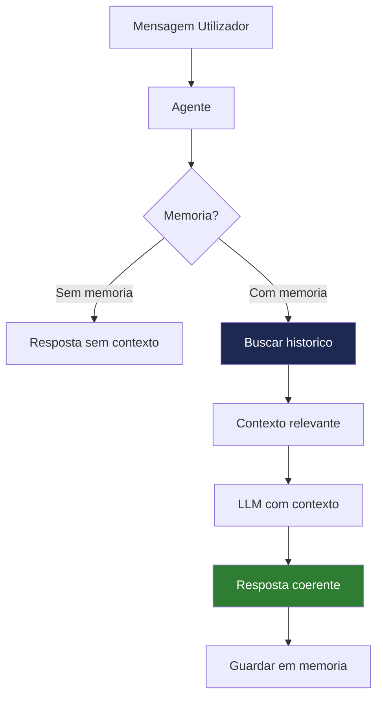

# Capítulo 18 — Histórico e Memória Conversacional no Agente EmpresaIQ


## 18.1 Introdução

Um agente inteligente moderno não deve responder apenas com base numa pergunta isolada. Ele deve ser capaz de:

- Lembrar interações anteriores
- Manter contexto da conversa
- Evoluir decisões ao longo do tempo
- Personalizar respostas ao utilizador

Este conceito é conhecido como **Memória Conversacional (Conversation Memory)**.

No contexto do EmpresaIQ, isto é crítico para criar um assistente empresarial contínuo, e não apenas um chatbot stateless.

---

## 18.2 Problema dos Agentes Tradicionais

Por defeito, modelos como Qwen ou Phi-3:

- Não têm memória persistente
- Só "sabem" o que está no prompt atual
- Perdem contexto após cada interação

**Exemplo:**

| Interação | Resultado |
|---|---|
| Utilizador: "Tenho 10 contratos ativos" | ✅ Processado |
| Utilizador: "Quantos são de software?" | ❌ Modelo não lembra da primeira informação |

---

## 18.3 Tipos de Memória em Agentes

### 1. Memória de curto prazo (Context Window)

É o texto que o modelo vê no momento.

**Limitação:**
- Depende de `n_ctx`
- Desaparece após exceder o contexto disponível

### 2. Memória conversacional (Buffer Memory)

Guarda o histórico recente da conversa:
- Últimas mensagens
- Interações diretas

### 3. Memória persistente (Long-term Memory)

Guarda informação entre sessões:
- Base de dados
- Ficheiros
- Vector DB (FAISS / Chroma)

---

## 18.4 Memória no LangChain

O LangChain fornece sistemas prontos para memória conversacional.

### ConversationBufferMemory

Guarda o histórico completo de forma simples:

```python
from langchain.memory import ConversationBufferMemory

memory = ConversationBufferMemory(
    memory_key="chat_history",
    return_messages=True
)
```

### Integração no agente

```python
agent_executor = AgentExecutor(
    agent=agent,
    tools=tools,
    memory=memory,
    verbose=True,
    max_iterations=4
)
```

> **Limitação:** Este método cresce indefinidamente, consome RAM e não é escalável para conversas longas.

---

## 18.5 Memória Inteligente (Recomendado para EmpresaIQ)

Para sistemas reais como o EmpresaIQ, deve usar-se **memória híbrida: Buffer + Resumo + Vetores**.

### ConversationSummaryMemory

O modelo resume automaticamente o histórico:

```python
from langchain.memory import ConversationSummaryMemory

memory = ConversationSummaryMemory(
    llm=llm,
    memory_key="chat_history"
)
```

**Vantagens:**
- Reduz uso de RAM
- Mantém contexto inteligente
- Evita histórico gigante

---

## 18.6 Memória com Base Vetorial (Avançado)

O conceito mais poderoso: guardar conversas como embeddings.

### Fluxo

```
1. Conversa ocorre
2. Texto é convertido em vetor
3. Guardado em FAISS
4. Recuperado quando necessário
```

### Criar embeddings

```python
from langchain.embeddings import HuggingFaceEmbeddings

embeddings = HuggingFaceEmbeddings(
    model_name="sentence-transformers/all-MiniLM-L6-v2"
)
```

### Criar base de memória vectorial

```python
from langchain.vectorstores import FAISS

vectorstore = FAISS.from_texts(
    ["Início da conversa EmpresaIQ"],
    embedding=embeddings
)
```

---

## 18.7 Memória Empresarial EmpresaIQ

No contexto do agente EmpresaIQ, a memória deve guardar:

- Clientes mencionados
- Contratos analisados
- Decisões anteriores
- Preferências do utilizador
- Serviços consultados

### Exemplo real

**Utilizador (primeira interação):**
> "Analisa o contrato A"

**Utilizador (mais tarde):**
> "Compara com o anterior"

O agente deve lembrar automaticamente do "Contrato A" sem que o utilizador precise de o repetir.

---

## 18.8 Arquitectura Recomendada

```
Utilizador
   ↓
Pergunta atual
   ↓
Memória Buffer (curto prazo)
   ↓
Memória Vetorial (longa duração)
   ↓
Contexto combinado
   ↓
Qwen2.5 LLM
   ↓
Resposta final
   ↓
Atualiza memória
```

---

## 18.9 Implementação Híbrida (ideal para 8 GB RAM)

A `ConversationBufferWindowMemory` mantém apenas as últimas `k` interações, controlando o consumo de RAM:

```python
from langchain.memory import ConversationBufferWindowMemory

memory = ConversationBufferWindowMemory(
    k=5,                        # Últimas 5 interações
    memory_key="chat_history",
    return_messages=True
)
```

---

## 18.10 Integração Final no EmpresaIQ Agent

```python
agent_executor = AgentExecutor(
    agent=agent,
    tools=tools,
    memory=memory,
    verbose=True,
    max_iterations=4,
    handle_parsing_errors=True
)
```

---

## 18.11 Boas Práticas

| Prática | Porquê |
|---|---|
| Limitar histórico (`k=5`) | Evita sobrecarga de RAM |
| Usar resumos | Para conversas longas |
| Guardar apenas dados úteis | Não armazenar lixo textual |
| Separar memória por utilizador | Crucial para sistemas multi-utilizador |

---

## 18.12 Arquitectura Final para EmpresaIQ

| Componente | Função |
|---|---|
| Buffer Memory | Curto prazo — últimas interações |
| Summary Memory | Compressão automática do histórico |
| FAISS Memory | Longo prazo — memória persistente |
| Qwen2.5 | Raciocínio e geração de resposta |

---

## 18.13 Conclusão

Adicionar memória ao agente transforma completamente o sistema:

| Sem memória | Com memória |
|---|---|
| Chatbot simples | Assistente inteligente contínuo |
| Respostas isoladas | Análise evolutiva |
| Sem contexto | Comportamento empresarial real |

No EmpresaIQ, a memória conversacional permite:

- Análise de contratos ao longo do tempo
- Acompanhamento de clientes
- Decisões consistentes entre sessões
- Automatização real de processos

> A memória é o que separa um chatbot de um verdadeiro agente inteligente.