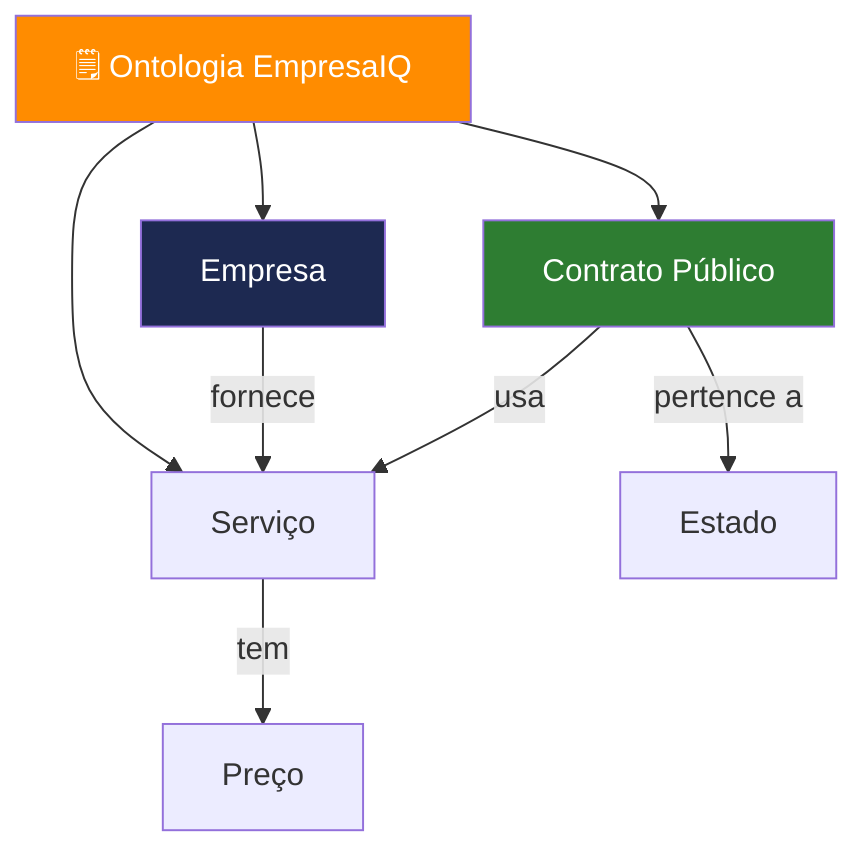

# Ontologias e Estrutura de Conhecimento

> *"Memória permite ao agente lembrar. Conhecimento permite ao agente compreender. A ontologia é o mapa que transforma dados soltos em inteligência estruturada."*

---

## O problema: dados sem estrutura

Sem ontologia, quando o EmpresaIQ lê este texto:

> "A EmpresaIQ forneceu software ao contrato público B por 120.000€"

...o modelo interpreta-o como texto. Não "sabe" que:
- **EmpresaIQ** é uma empresa (entidade)
- **software** é um serviço (tipo)
- **contrato público B** é um objecto legal com regras próprias
- **120.000€** é um valor financeiro com implicações fiscais

Uma ontologia dá ao agente esse esqueleto lógico.



---

## O que é uma ontologia

Uma ontologia é uma representação formal de conhecimento com três componentes:

### Entidades (o que existe)
- Empresas, Contratos, Serviços, Clientes, Projectos, Documentos

### Relações (como se ligam)
- Empresa **fornece** Serviço
- Cliente **contrata** Serviço
- Contrato **pertence a** Estado
- Projecto **inclui** Contrato

### Regras (o que é permitido)
- Um contrato tem sempre uma entidade adjudicante
- Um serviço tem sempre um preço associado
- Uma empresa pode ter múltiplos contratos

---

## Ontologia vs Memória vs RAG

| Sistema | Função | Analogia |
|---|---|---|
| Memória | Lembrar interações | Diário de bordo |
| RAG | Recuperar documentos | Biblioteca de pesquisa |
| **Ontologia** | Estruturar conhecimento | **Mapa conceptual** |

Os três sistemas são complementares. A ontologia é o esqueleto lógico que dá sentido ao que a memória lembra e o RAG recupera.

---

## Implementação prática — Começar simples

Para o EmpresaIQ, a ontologia mais simples possível é um dicionário Python:

```python title="ontologia_empresaiq.py"
# Ontologia EmpresaIQ v1 — estrutura mínima

ontologia = {
    "entidades": {
        "empresas": ["EmpresaIQ"],
        "servicos": ["software", "consultoria", "cibersegurança", "formação"],
        "tipos_contrato": ["publico", "privado", "framework"]
    },
    "relacoes": {
        "EmpresaIQ": {
            "fornece": ["software", "consultoria", "cibersegurança", "formação"]
        }
    },
    "regras": {
        "contrato_publico": [
            "tem_entidade_adjudicante",
            "publicado_no_portal_base",
            "sujeito_a_iva_23"
        ]
    }
}


def classificar_entidade(texto: str) -> str:
    """Identifica o tipo de entidade num texto."""
    texto_lower = texto.lower()
    for servico in ontologia["entidades"]["servicos"]:
        if servico in texto_lower:
            return f"servico:{servico}"
    for empresa in ontologia["entidades"]["empresas"]:
        if empresa.lower() in texto_lower:
            return f"empresa:{empresa}"
    return "entidade:desconhecida"


# Exemplo de uso
print(classificar_entidade("preço da consultoria"))  # servico:consultoria
print(classificar_entidade("contrato EmpresaIQ"))    # empresa:EmpresaIQ
```

---

## Integrar a ontologia no agente

A ontologia pode ser usada como contexto adicional no prompt do agente:

```python title="agente_com_ontologia.py (fragmento)"
from ontologia_empresaiq import ontologia

# Gerar descrição concisa da ontologia para o prompt
def ontologia_para_prompt() -> str:
    servicos = ", ".join(ontologia["entidades"]["servicos"])
    return f"""
Estrutura de conhecimento EmpresaIQ:
- Serviços disponíveis: {servicos}
- Tipos de contrato: público, privado, framework
- Regra: contratos públicos estão sujeitos a IVA 23%
"""

# Incluir no template do agente
template = f"""
Sés o Agente EmpresaIQ.
{ontologia_para_prompt()}

Ferramentas: {{tools}}
Pergunta: {{input}}
Thought: {{agent_scratchpad}}
"""
```

---

## Representação visual da ontologia EmpresaIQ

```
[EmpresaIQ]
    ├── fornece → [Software]
    ├── fornece → [Consultoria IA]
    └── oferece → [Cibersegurança]

[Contrato Público]
    ├── pertence a → [Estado Português]
    ├── usa → [Software]
    └── valor → [Preço + IVA 23%]

[Cliente]
    ├── contrata → [Serviço]
    └── paga → [Factura]
```

---

## Evolução futura: Graph Database

Para empresas com estruturas de dados mais complexas, a próxima evolução é usar uma base de dados de grafo como **Neo4j**:

```python
# Exemplo conceptual — Neo4j com Python
from neo4j import GraphDatabase

driver = GraphDatabase.driver("bolt://localhost:7687", auth=("neo4j", "password"))

with driver.session() as session:
    # Criar relação na ontologia
    session.run(
        "MERGE (e:Empresa {nome: $empresa}) "
        "MERGE (s:Servico {nome: $servico}) "
        "MERGE (e)-[:FORNECE]->(s)",
        empresa="EmpresaIQ", servico="Software"
    )
```

---

## Benefícios reais da ontologia no EmpresaIQ

| Sem ontologia | Com ontologia |
|---|---|
| Respostas genéricas do LLM | Respostas baseadas em estrutura real |
| Confunde serviços com empresas | Identifica correctamente cada entidade |
| Inventa relações | Segue relações definidas explicitamente |
| Escalabilidade limitada | Cresce para sistemas complexos |

---

## Resumo

Neste capítulo:
- Percebemos o que é uma ontologia e porque transforma um chatbot num sistema de inteligência estruturada
- Criamos uma ontologia mínima para o EmpresaIQ em Python
- Integrámos a ontologia no prompt do agente
- Exploramós a evolução para Neo4j em versões mais avançadas

Numa única frase: **Memória = experiência | RAG = conhecimento | Ontologia = estrutura**.

No último capítulo, fazemos um balanço completo do que construiu ao longo deste livro.

---

*Capítulo seguinte: [20. Conclusão →](./conclusao)*

## 19.1 Introdução

Enquanto a memória permite ao agente "lembrar", a ontologia permite ao agente **compreender a estrutura do mundo**.

Uma ontologia define:

- O que existe no sistema (entidades)
- Como essas entidades se relacionam
- Que regras governam essas relações

No contexto do EmpresaIQ, isto transforma o agente de um simples LLM com ferramentas num verdadeiro **sistema de inteligência empresarial estruturada**.

---

## 19.2 O Problema sem Ontologia

Sem estrutura ontológica, um agente:

- Trata contratos como texto solto
- Mistura empresas, serviços e preços
- Não entende relações entre dados
- Depende apenas de embeddings ou prompts

**Exemplo:**

> "Empresa A fornece software para contrato B"

Sem ontologia, o modelo não "sabe" que:

- Empresa A → entidade
- Software → tipo de serviço
- Contrato B → objeto legal

---

## 19.3 O que é uma Ontologia em IA

Uma ontologia é uma representação formal de conhecimento composta por:

### 🔹 Entidades (Nodes)

- Empresas
- Contratos
- Serviços
- Pessoas
- Projetos

### 🔹 Relações (Edges)

- fornece
- contrata
- pertence a
- compete com
- executa

### 🔹 Regras

- Um contrato pertence a uma entidade pública
- Um serviço tem um preço associado
- Uma empresa pode ter múltiplos contratos

---

## 19.4 Ontologia vs RAG vs Memória

| Sistema | Função |
|---|---|
| Memória | Lembrar interações |
| RAG | Recuperar informação textual |
| Ontologia | Estruturar conhecimento |

👉 A ontologia é o "esqueleto lógico" do sistema.

---

## 19.5 Ontologia no EmpresaIQ

No EmpresaIQ, a ontologia pode ser definida como:

### 🔹 Entidades principais

- Empresa
- Contrato Público
- Serviço
- Cliente
- Projeto
- Documento

### 🔹 Relações principais

- Empresa → fornece → Serviço
- Cliente → contrata → Serviço
- Contrato → pertence a → Estado
- Projeto → inclui → Contrato

---

## 19.6 Representação simples (grafo)

```
[EmpresaIQ]
    ├── fornece → [Software]
    ├── fornece → [Consultoria IA]
    └── protege → [Sistemas Cibersegurança]

[Contrato Público]
    ├── pertence a → [Estado]
    ├── usa → [Software]
    └── valor → 120.000€
```

---

## 19.7 Implementação prática (Python)

Para o sistema EmpresaIQ, podemos começar com uma ontologia simples em dicionário:

```python
ontology = {
    "Empresa": ["EmpresaIQ"],
    "Servicos": ["software", "consultoria", "ciberseguranca"],
    "Contratos": [],
    "Relacoes": {
        "EmpresaIQ": ["fornece software", "fornece consultoria", "fornece ciberseguranca"]
    }
}
```

---

## 19.8 Ontologia + Agente (Integração)

O agente pode usar ontologia para:

- Melhorar decisões de tools
- Validar respostas
- Reduzir erros de contexto
- Melhorar consistência

### Exemplo de uso

Pergunta:

> "O que faz a EmpresaIQ?"

| Sem ontologia | Com ontologia |
|---|---|
| Resposta genérica do LLM | Resposta estruturada baseada em relações reais |

---

## 19.9 Ontologia + RAG + Memória

Quando combinamos os 3 sistemas:

### 🔹 Memória

- histórico do utilizador

### 🔹 RAG

- documentos reais

### 🔹 Ontologia

- estrutura lógica do mundo

---

## 19.10 Arquitetura final EmpresaIQ

```
         +------------------+
         |   Ontologia      |
         | (estrutura lógica)|
         +--------+---------+
                  ↓
Utilizador → Memória → RAG → LLM (Qwen)
                  ↓
          Resposta estruturada
                  ↓
          Atualização memória
```

---

## 19.11 Benefícios reais

### ✔ Consistência lógica

O agente deixa de "inventar relações".

### ✔ Melhor tomada de decisão

Entende contexto empresarial real.

### ✔ Menos alucinação

As respostas seguem estrutura definida.

### ✔ Escalabilidade

Permite crescer para sistemas empresariais complexos.

---

## 19.12 Evolução futura da ontologia

Numa versão avançada do EmpresaIQ, a ontologia pode evoluir para:

- Graph Database (Neo4j)
- Knowledge Graph semântico
- Integração com RAG híbrido
- Auto-expansão da estrutura

---

## 19.13 Conclusão

A ontologia representa o passo final para transformar o EmpresaIQ num sistema de inteligência estruturada.

| Componente | Papel |
|---|---|
| Memória | experiência |
| RAG | conhecimento |
| Ontologia | estrutura |

Então o agente torna-se um verdadeiro sistema cognitivo empresarial.

---

:::tip Com ontologia, o EmpresaIQ deixa de ser apenas um chatbot e passa a ser um **sistema de inteligência organizacional local completo**.
:::
