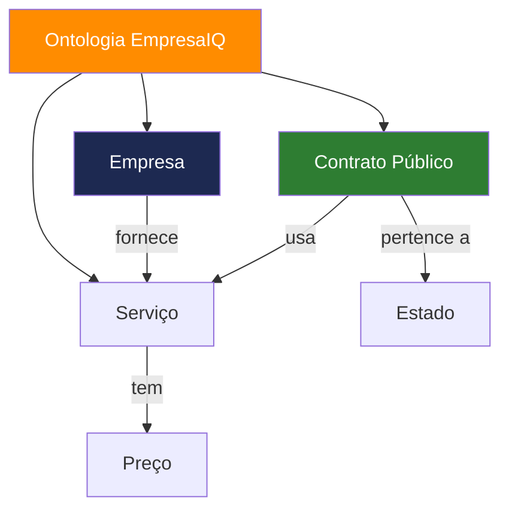

# Capítulo 19 — Ontologias e Estrutura de Conhecimento no Agente EmpresaIQ



## 19.1 Introdução

Enquanto a memória permite ao agente "lembrar", a ontologia permite ao agente **compreender a estrutura do mundo**.

Uma ontologia define:

- O que existe no sistema (entidades)
- Como essas entidades se relacionam
- Que regras governam essas relações

No contexto do EmpresaIQ, isto transforma o agente de um simples LLM com ferramentas num verdadeiro **sistema de inteligência empresarial estruturada**.

---

## 19.2 O Problema sem Ontologia

Sem estrutura ontológica, um agente:

- Trata contratos como texto solto
- Mistura empresas, serviços e preços
- Não entende relações entre dados
- Depende apenas de embeddings ou prompts

**Exemplo:**

> "Empresa A fornece software para contrato B"

Sem ontologia, o modelo não "sabe" que:

- Empresa A → entidade
- Software → tipo de serviço
- Contrato B → objeto legal

---

## 19.3 O que é uma Ontologia em IA

Uma ontologia é uma representação formal de conhecimento composta por:

### 🔹 Entidades (Nodes)

- Empresas
- Contratos
- Serviços
- Pessoas
- Projetos

### 🔹 Relações (Edges)

- fornece
- contrata
- pertence a
- compete com
- executa

### 🔹 Regras

- Um contrato pertence a uma entidade pública
- Um serviço tem um preço associado
- Uma empresa pode ter múltiplos contratos

---

## 19.4 Ontologia vs RAG vs Memória

| Sistema | Função |
|---|---|
| Memória | Lembrar interações |
| RAG | Recuperar informação textual |
| Ontologia | Estruturar conhecimento |

👉 A ontologia é o "esqueleto lógico" do sistema.

---

## 19.5 Ontologia no EmpresaIQ

No EmpresaIQ, a ontologia pode ser definida como:

### 🔹 Entidades principais

- Empresa
- Contrato Público
- Serviço
- Cliente
- Projeto
- Documento

### 🔹 Relações principais

- Empresa → fornece → Serviço
- Cliente → contrata → Serviço
- Contrato → pertence a → Estado
- Projeto → inclui → Contrato

---

## 19.6 Representação simples (grafo)

```
[EmpresaIQ]
    ├── fornece → [Software]
    ├── fornece → [Consultoria IA]
    └── protege → [Sistemas Cibersegurança]

[Contrato Público]
    ├── pertence a → [Estado]
    ├── usa → [Software]
    └── valor → 120.000€
```

---

## 19.7 Implementação prática (Python)

Para o sistema EmpresaIQ, podemos começar com uma ontologia simples em dicionário:

```python
ontology = {
    "Empresa": ["EmpresaIQ"],
    "Servicos": ["software", "consultoria", "ciberseguranca"],
    "Contratos": [],
    "Relacoes": {
        "EmpresaIQ": ["fornece software", "fornece consultoria", "fornece ciberseguranca"]
    }
}
```

---

## 19.8 Ontologia + Agente (Integração)

O agente pode usar ontologia para:

- Melhorar decisões de tools
- Validar respostas
- Reduzir erros de contexto
- Melhorar consistência

### Exemplo de uso

Pergunta:

> "O que faz a EmpresaIQ?"

| Sem ontologia | Com ontologia |
|---|---|
| Resposta genérica do LLM | Resposta estruturada baseada em relações reais |

---

## 19.9 Ontologia + RAG + Memória

Quando combinamos os 3 sistemas:

### 🔹 Memória

- histórico do utilizador

### 🔹 RAG

- documentos reais

### 🔹 Ontologia

- estrutura lógica do mundo

---

## 19.10 Arquitetura final EmpresaIQ

```
         +------------------+
         |   Ontologia      |
         | (estrutura lógica)|
         +--------+---------+
                  ↓
Utilizador → Memória → RAG → LLM (Qwen)
                  ↓
          Resposta estruturada
                  ↓
          Atualização memória
```

---

## 19.11 Benefícios reais

### ✔ Consistência lógica

O agente deixa de "inventar relações".

### ✔ Melhor tomada de decisão

Entende contexto empresarial real.

### ✔ Menos alucinação

As respostas seguem estrutura definida.

### ✔ Escalabilidade

Permite crescer para sistemas empresariais complexos.

---

## 19.12 Evolução futura da ontologia

Numa versão avançada do EmpresaIQ, a ontologia pode evoluir para:

- Graph Database (Neo4j)
- Knowledge Graph semântico
- Integração com RAG híbrido
- Auto-expansão da estrutura

---

## 19.13 Conclusão

A ontologia representa o passo final para transformar o EmpresaIQ num sistema de inteligência estruturada.

| Componente | Papel |
|---|---|
| Memória | experiência |
| RAG | conhecimento |
| Ontologia | estrutura |

Então o agente torna-se um verdadeiro sistema cognitivo empresarial.

---

:::tip Com ontologia, o EmpresaIQ deixa de ser apenas um chatbot e passa a ser um **sistema de inteligência organizacional local completo**.
:::
