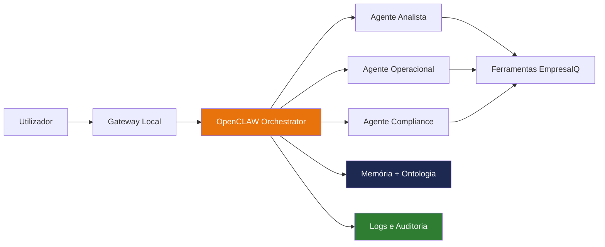
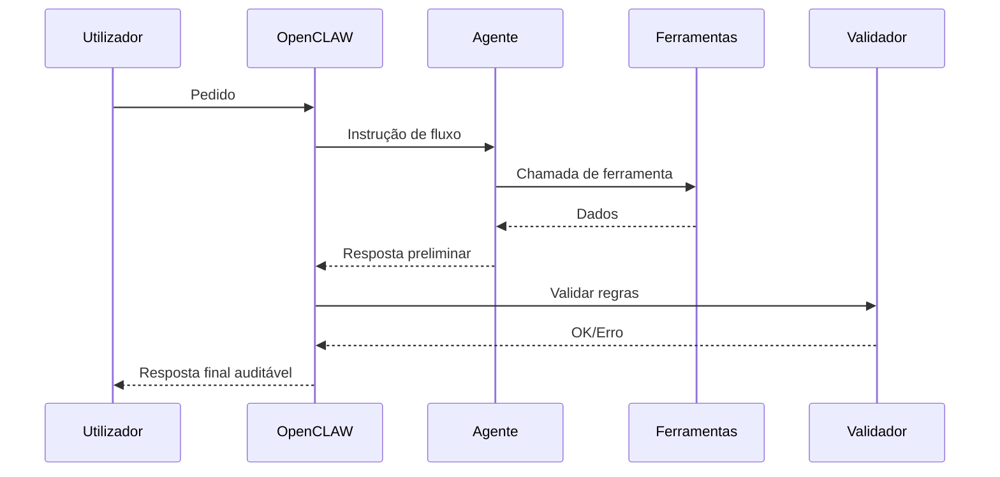

> *"Um agente local isolado resolve tarefas. Uma arquitetura OpenCLAW transforma tarefas em operações previsíveis, auditáveis e escaláveis."*

---

## O que é OpenCLAW no contexto deste livro

Neste capítulo, tratamos **OpenCLAW** como uma camada de orquestração para agentes locais, composta por:

- **C**ontexto estruturado (memória + ontologia + políticas)
- **L**aços de decisão (planear, executar, validar)
- **A**ções via ferramentas (tool calling)
- **W**orkflows com guardrails (limites, validações e fallback)

Em prática, é a passagem de um "chatbot com tools" para um **sistema local orientado a workflow**.



---

## Aplicabilidade no sistema local

OpenCLAW é especialmente útil quando a operação precisa de privacidade e previsibilidade, sem cloud:

| Cenário local | Como OpenCLAW ajuda |
| --- | --- |
| Atendimento interno com dados sensíveis | Fluxos com validações antes da resposta final |
| Análise de risco empresarial | Encadeia pesquisa, cálculo e validação por regra |
| Operação em máquinas sem GPU | Divide tarefas por agentes leves, reduzindo carga por chamada |
| Ambientes com RGPD rígido | Mantém dados e logs totalmente on-premise |

Resultado: melhor controlo operacional com o mesmo hardware base do livro.

---

## Vantagens para agentes locais

### 1) Menos alucinação operacional

Ao separar papéis (analisar, executar, validar), o erro de um agente é apanhado por outro passo do workflow.

### 2) Melhor aproveitamento de CPU e RAM

Em vez de um único agente com prompt gigante, OpenCLAW usa fluxos menores e objetivos, o que reduz contexto médio por chamada.

### 3) Governança e auditoria

Cada decisão do fluxo pode ficar registada (entrada, ferramenta usada, saída, validação), facilitando auditoria e melhoria contínua.

### 4) Integração incremental

Não exige reescrever tudo. Pode começar por um orquestrador simples a usar o agente já criado no EmpresaIQ.

---

## Integração com o agente atual do EmpresaIQ

O caminho mais seguro é por fases:

1. **Fase 1:** manter o agente atual como motor principal.
2. **Fase 2:** adicionar um orquestrador local que decide qual fluxo correr.
3. **Fase 3:** separar fluxos por domínio (risco, insolvências, relatórios).
4. **Fase 4:** ligar memória e ontologia para decisões orientadas por contexto.

### Exemplo de integração mínima

```python title="openclaw_adapter.py"
"""Integração mínima OpenCLAW sobre o agente existente."""

from agent import criar_agente, conversar


class OpenClawOrchestrator:
    def __init__(self) -> None:
        self.executor = criar_agente(verbose=False)

    def route(self, pergunta: str) -> str:
        texto = pergunta.lower()
        if "risco" in texto:
            return "fluxo_risco"
        if "insolv" in texto or "execu" in texto:
            return "fluxo_judicial"
        return "fluxo_geral"

    def handle(self, pergunta: str, thread_id: str = "openclaw-default") -> str:
        fluxo = self.route(pergunta)

        # Guardrail simples: prefixo de instrução por fluxo
        if fluxo == "fluxo_risco":
            prompt = f"[FOCO: análise de risco empresarial] {pergunta}"
        elif fluxo == "fluxo_judicial":
            prompt = f"[FOCO: processos judiciais e insolvências] {pergunta}"
        else:
            prompt = pergunta

        return conversar(self.executor, prompt, thread_id=thread_id)


if __name__ == "__main__":
    orchestrator = OpenClawOrchestrator()
    pergunta = "Qual o risco da empresa com NIF 500001234?"
    print(orchestrator.handle(pergunta))
```

---

## Padrão recomendado de operação local



---

## Boas práticas para OpenCLAW em ambiente local

| Prática | Benefício |
| --- | --- |
| Definir fluxos curtos e específicos | Menor latência e menos erro |
| Ter validações por domínio (risco, fiscal, jurídico) | Respostas mais confiáveis |
| Usar `thread_id` por utilizador | Isolamento de contexto entre sessões |
| Registar eventos por fluxo | Observabilidade e troubleshooting |
| Implementar fallback para fluxo geral | Continuidade quando regras falham |

---

## Resumo

Neste capítulo:

- Vimos como OpenCLAW se aplica ao sistema local do EmpresaIQ
- Identificámos vantagens concretas para agentes locais (controlo, custo, confiabilidade)
- Definimos um caminho de integração incremental, sem reescrever o núcleo atual
- Implementámos um adaptador mínimo para orquestração por fluxos

Com isto, o EmpresaIQ evolui de um agente único para uma base de **sistema multi-fluxo local**, preparada para crescimento empresarial.

---

*Capítulo seguinte: [21. Conclusão →](./conclusao)*
