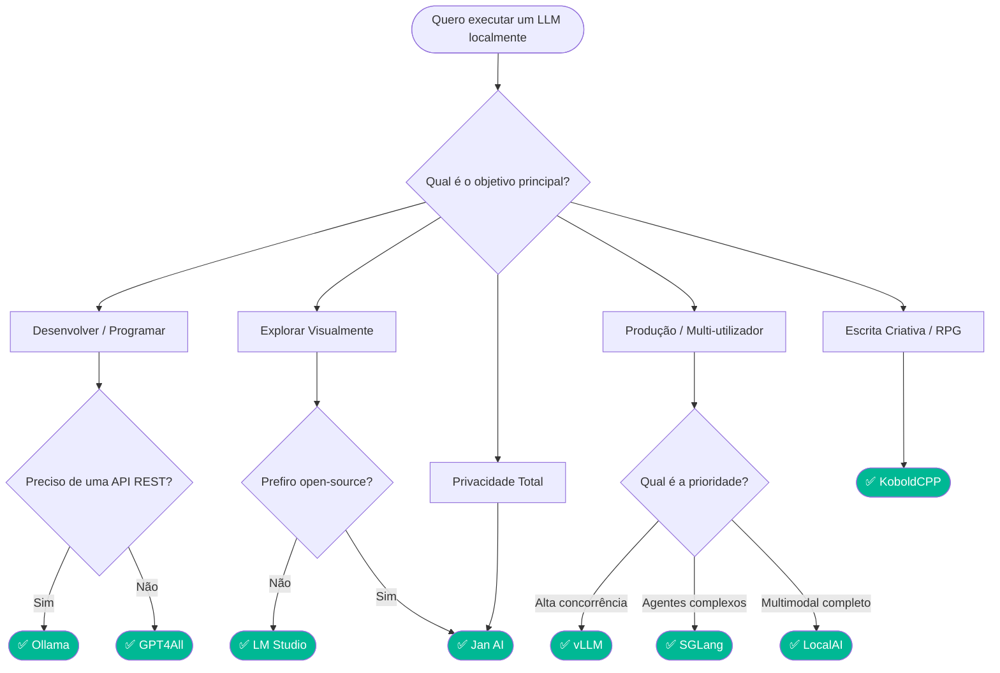
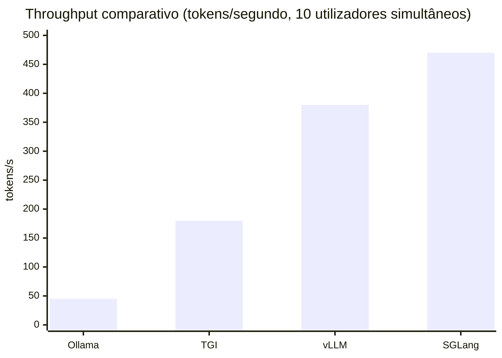
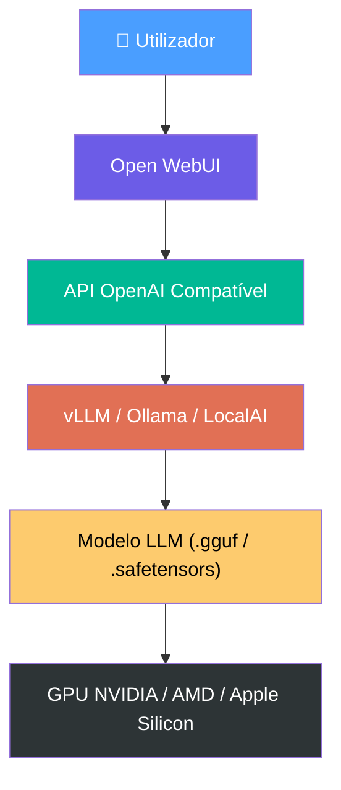
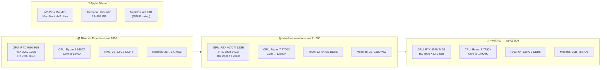
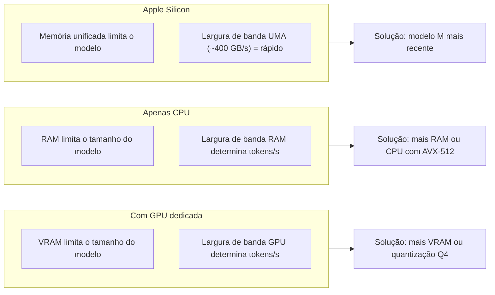

> *"Não existe uma solução universal — existe a solução certa para o problema certo."*

---

## Introdução

Nos últimos anos, a execução local de Modelos de Linguagem de Grande Escala (LLMs) tornou-se uma alternativa viável às soluções baseadas exclusivamente na cloud. Ferramentas como o Ollama, vLLM, LM Studio e LocalAI permitem executar modelos avançados diretamente em computadores pessoais ou servidores privados.

Cada solução foi desenvolvida para um objetivo específico: simplicidade, desempenho, experiência visual ou escalabilidade empresarial. Neste capítulo analisaremos as principais tecnologias disponíveis em 2026 e identificaremos os cenários ideais para cada uma.

---

## 23.1 O Ollama

O Ollama tornou-se rapidamente uma das ferramentas mais populares para executar modelos de IA localmente.

É frequentemente descrito como o **"Docker dos LLMs"** devido à sua simplicidade extrema. Com apenas um comando é possível descarregar e executar modelos como:

- Llama 3
- Qwen
- Mistral
- Phi
- Gemma
- DeepSeek

O principal objetivo do Ollama é simplificar a experiência do programador.

### Vantagens

- Instalação extremamente simples
- API REST integrada
- Compatibilidade com Windows, Linux e macOS
- Integração fácil com Python, Node.js e LangChain
- Excelente para prototipagem

### Limitações

- Menos eficiente para cargas elevadas
- Escalabilidade limitada
- Processamento concorrente reduzido

---

## 23.2 Ollama vs vLLM

Quando o objetivo deixa de ser desenvolvimento local e passa a ser produção empresarial, surge o **vLLM**.

### Ollama

Adequado para:

- Desenvolvimento local
- Testes rápidos
- Integração em aplicações pessoais
- Agentes de IA individuais

### vLLM

Adequado para:

- APIs empresariais
- Centenas de utilizadores simultâneos
- Servidores de produção
- Máximo aproveitamento de GPU

O vLLM utiliza uma tecnologia chamada **PagedAttention**, que otimiza a gestão de memória gráfica. Em cenários de carga elevada pode atingir desempenhos superiores a **3 vezes** os obtidos com Ollama.

### Comparação

| Característica          | Ollama     | vLLM         |
|-------------------------|------------|--------------|
| Facilidade de instalação | Excelente  | Média        |
| API OpenAI              | Parcial    | Completa     |
| Escalabilidade          | Baixa      | Muito Alta   |
| Utilização de GPU       | Boa        | Excelente    |
| Produção Empresarial    | Limitada   | Ideal        |

---

## 23.3 Ollama vs LM Studio

O LM Studio segue uma abordagem completamente diferente.

Enquanto o Ollama privilegia a linha de comandos e integração programática, o **LM Studio** oferece uma interface gráfica semelhante ao ChatGPT.

### LM Studio

Permite:

- Procurar modelos visualmente
- Ajustar temperatura
- Alterar contexto
- Ver estatísticas em tempo real
- Conversar sem utilizar terminal

### Quando escolher?

**Escolha LM Studio se:**

- Não pretende programar
- Quer uma experiência visual
- Pretende testar vários modelos rapidamente

**Escolha Ollama se:**

- Vai desenvolver aplicações
- Precisa de APIs
- Vai criar agentes inteligentes

---

## 23.4 GPT4All

O **GPT4All** foi criado para utilizadores iniciantes. O seu foco principal é facilitar a utilização de IA mesmo em computadores modestos.

### Vantagens

- Interface amigável
- Fácil instalação
- Funciona sem GPU dedicada

### Desvantagens

- Menos flexível
- Menos adequado para integrações avançadas

---

## 23.5 Jan AI

O **Jan AI** surgiu como uma alternativa open-source focada em privacidade.

### Filosofia Local-First

Todos os dados permanecem no computador do utilizador. Nenhuma informação é enviada para servidores externos.

### Principais Características

- Interface semelhante ao ChatGPT
- Gestão visual de modelos
- Organização de conversas
- Plugins
- API compatível com OpenAI

### O Motor Cortex

O Jan utiliza o motor **Cortex** para executar modelos. Este motor suporta:

- GGUF
- TensorRT
- NVIDIA
- AMD
- Apple Silicon

---

## 23.6 LocalAI

O **LocalAI** é frequentemente descrito como um substituto direto da API OpenAI.

Uma aplicação desenvolvida para OpenAI pode normalmente ser adaptada apenas alterando o endpoint.

### Funcionalidades

- Texto
- Embeddings
- Geração de imagens
- Reconhecimento de voz
- MCP (Model Context Protocol)

### Vantagem Principal

Um único servidor pode fornecer **serviços multimodais**, tornando o LocalAI uma plataforma especialmente versátil para quem pretende consolidar múltiplas capacidades de IA num só ponto de acesso.

---

## 23.7 KoboldCPP

O **KoboldCPP** tornou-se particularmente popular entre escritores e comunidades de Roleplay.

### Funcionalidades

- Gestão avançada de memória
- Histórias longas coerentes
- Ferramentas de narrativa
- RPG assistido por IA

É especialmente indicado para:

- Escrita criativa
- Ficção
- Jogos narrativos

---

## 23.8 Como Escolher a Ferramenta Certa

O diagrama seguinte ajuda a selecionar a ferramenta mais adequada consoante o caso de uso:



---

## 23.9 Servidores de Produção para IA

Quando o objetivo é disponibilizar IA para múltiplos utilizadores simultaneamente, surgem três soluções dominantes.

### vLLM

O padrão atual da indústria.

- **Continuous Batching** — processa pedidos de forma contínua sem esperar que um lote termine
- **PagedAttention** — gestão eficiente da memória KV cache
- Compatibilidade OpenAI total
- Elevada concorrência

### TGI (Text Generation Inference)

Desenvolvido pela Hugging Face.

- Excelente suporte a modelos recentes
- **Tensor Parallelism** — distribuição do modelo por múltiplas GPUs
- Orientado para produção empresarial

### SGLang

Uma das tecnologias mais rápidas do mercado.

- **RadixAttention** — partilha eficiente de prefixos no KV cache
- Gestão avançada de cache
- Excelente para agentes complexos e prompts estruturados

### Comparação de Desempenho (tokens/s, carga elevada)



---

## 23.10 Docker e Contentorização

Todas as plataformas modernas disponibilizam imagens Docker oficiais. A utilização de Docker oferece:

- Portabilidade
- Isolamento
- Atualizações simples
- Escalabilidade

**Arquitetura típica:**



---

## 23.11 Caso de Estudo: RTX 3060 12GB

Uma GPU RTX 3060 com 12 GB de VRAM continua a ser uma excelente escolha para IA local em 2026.

### Modelos Recomendados

| Modelo                  | Quantização | VRAM aprox. |
|-------------------------|-------------|-------------|
| Llama 3 8B              | AWQ         | ~6 GB       |
| Qwen 3 8B               | AWQ         | ~6 GB       |
| DeepSeek R1 Distill 8B  | AWQ         | ~6 GB       |
| Gemma 3 4B              | GPTQ        | ~4 GB       |
| Phi-4                   | AWQ         | ~7 GB       |

### Configuração Recomendada

- **Motor:** vLLM
- **Quantização:** AWQ ou GPTQ
- **Contexto:** 4096 tokens
- **Utilização de VRAM:** 80% a 85%

### Resultados Esperados

- 40 a 60 tokens por segundo
- API compatível com OpenAI
- Múltiplos utilizadores simultâneos

---

## 23.12 Open WebUI

O **Open WebUI** tornou-se a interface gráfica mais popular para servidores locais.

### Características

- Interface semelhante ao ChatGPT
- Upload de PDFs e imagens
- Pesquisa RAG integrada
- Gestão de utilizadores
- Histórico de conversas

É atualmente a melhor opção para complementar servidores vLLM ou Ollama, combinando a potência de inferência de um servidor dedicado com uma experiência de utilizador polida e acessível.

---

## 23.13 Hardware de Consumo para IA Local

Executar LLMs sem cloud não requer hardware de datacenter. Em 2026, máquinas de consumo correntes são mais do que suficientes para modelos até 70B com quantização. Esta secção serve de guia de compra e configuração.

### Visão Geral por Nível



---

### Placas Gráficas (GPU) — NVIDIA

| Modelo          | VRAM  | Preço aprox. | Modelos suportados          | Motor ideal    |
|-----------------|-------|--------------|-----------------------------|----------------|
| RTX 4060        | 8 GB  | ~€320        | 3B–7B Q4                    | Ollama, LM Studio |
| RTX 4060 Ti     | 16 GB | ~€450        | 7B–13B Q4/Q8                | Ollama, vLLM   |
| RTX 3060        | 12 GB | ~€280        | 7B–13B Q4/AWQ               | Ollama, vLLM   |
| RTX 4070        | 12 GB | ~€580        | 7B–13B AWQ                  | vLLM, Ollama   |
| RTX 4070 Ti Super | 16 GB | ~€800     | 13B–30B Q4/AWQ              | vLLM, SGLang   |
| RTX 4080 Super  | 16 GB | ~€1.000      | 13B–34B AWQ                 | vLLM, SGLang   |
| RTX 3090        | 24 GB | ~€700 (usada)| 13B–34B AWQ/GPTQ            | vLLM, SGLang   |
| RTX 4090        | 24 GB | ~€1.900      | 34B–70B Q4/AWQ              | vLLM, SGLang   |

### Placas Gráficas (GPU) — AMD

| Modelo          | VRAM  | Preço aprox. | Suporte llama.cpp | Observações              |
|-----------------|-------|--------------|-------------------|--------------------------|
| RX 7600         | 8 GB  | ~€270        | Sim (ROCm/Vulkan) | Entrada, bom custo-benefício |
| RX 7800 XT      | 16 GB | ~€450        | Sim (ROCm)        | Bom para 13B AWQ         |
| RX 7900 XT      | 20 GB | ~€650        | Sim (ROCm)        | Competitivo com RTX 4070 Ti |
| RX 7900 XTX     | 24 GB | ~€900        | Sim (ROCm)        | Alternativa à RTX 4090   |

> **Nota AMD:** O suporte ROCm no Windows ainda é limitado. Em Linux (Ubuntu 22.04+) o suporte é completo. Para Windows, prefira NVIDIA ou use llama.cpp com backend Vulkan.

### Apple Silicon — Memória Unificada

A grande vantagem do Apple Silicon é a **memória unificada (UMA)**: a GPU e a CPU partilham o mesmo pool de memória de alta largura de banda. Isto significa que um MacBook Pro M3 Max com 48 GB consegue carregar modelos de 30B+ sem qualquer GPU dedicada.

| Chip             | Memória Unificada | Tokens/s (7B Q4) | Tokens/s (34B Q4) | Caso de uso           |
|------------------|-------------------|------------------|-------------------|-----------------------|
| M3 (MacBook Air) | 8–16 GB           | ~30              | —                 | 3B–7B modelos         |
| M3 Pro           | 18–36 GB          | ~45              | ~12               | 7B–13B confortável    |
| M3 Max           | 36–96 GB          | ~55              | ~18               | Até 34B AWQ           |
| M4 Max           | 36–128 GB         | ~70              | ~25               | Até 70B Q4            |
| M2 Ultra (Mac Studio) | 64–192 GB   | ~80              | ~35               | 70B confortável       |

Ferramentas recomendadas para Apple Silicon: **Ollama**, **LM Studio** e **Jan AI** têm suporte nativo via Metal.

---

### Processadores (CPU)

O CPU é relevante para dois cenários:

1. **Inferência apenas com CPU** (sem GPU dedicada) — usando `llama.cpp` com AVX2/AVX-512
2. **Suporte ao servidor** — carregamento de batches, tokenização e orquestração

| CPU                        | Núcleos | RAM máx. | Tokens/s (7B Q4 CPU) | Observações                    |
|----------------------------|---------|----------|----------------------|--------------------------------|
| AMD Ryzen 5 5600X          | 6/12    | 128 GB   | ~4–6                 | Entrada, bom custo             |
| AMD Ryzen 7 7700X          | 8/16    | 128 GB   | ~6–8                 | Bom equilíbrio                 |
| AMD Ryzen 9 7950X          | 16/32   | 128 GB   | ~10–14               | Excelente para CPU-only        |
| Intel Core i5-13400        | 10/16   | 128 GB   | ~4–6                 | Acessível                      |
| Intel Core i7-13700K       | 16/24   | 128 GB   | ~7–10                | Bom desempenho geral           |
| Intel Core i9-14900K       | 24/32   | 192 GB   | ~12–16               | Máximo consumo Intel           |
| Intel Core Ultra 9 285K    | 24/24   | 192 GB   | ~14–18               | AVX-512, excelente CPU-only    |
| AMD Threadripper 7980X     | 64/128  | 2 TB     | ~25–35               | Workstation, não consumer      |

> **Dica:** Para inferência CPU-only, prefira CPUs com **AVX-512** e invista em RAM — 64 GB ou mais permite correr modelos 13B–30B diretamente em RAM.

---

### Memória RAM

A RAM é crítica quando não existe GPU suficiente para o modelo inteiro. O `llama.cpp` suporta **offloading parcial**: parte do modelo fica na VRAM e o resto em RAM.

| Cenário                          | RAM Recomendada | Notas                                   |
|----------------------------------|-----------------|-----------------------------------------|
| Uso casual (3B–7B com GPU)       | 16 GB           | GPU faz o trabalho pesado               |
| Desenvolvimento com agentes      | 32 GB           | Múltiplos processos em paralelo         |
| Modelos 13B–30B com offloading   | 64 GB           | Layers em RAM quando VRAM insuficiente  |
| Modelos 70B apenas CPU           | 128 GB          | Necessário para Q4 completo             |
| Modelos 70B+ ou multi-modelo     | 192–256 GB      | Workstation / Mac Studio Ultra          |

**Tipo de RAM:** Para plataformas AMD AM5 e Intel 12ª/13ª geração, prefira **DDR5-6000** para maior largura de banda, o que melhora diretamente a velocidade de inferência em CPU.

---

### Armazenamento

Os modelos LLM ocupam espaço significativo. Planeie o armazenamento adequadamente:

| Modelo                | Tamanho aprox. (Q4) |
|-----------------------|---------------------|
| 3B (Phi-3 Mini)       | ~2 GB               |
| 7B (Llama 3, Qwen)    | ~4–5 GB             |
| 13B                   | ~8 GB               |
| 30B (DeepSeek, etc.)  | ~18 GB              |
| 70B (Llama 3, Qwen)   | ~40 GB              |

Recomendação: SSD NVMe com pelo menos **1 TB** para trabalho confortável com múltiplos modelos.

---

### Configurações Completas Recomendadas

#### Configuração Iniciante — ~€700

```
CPU:  AMD Ryzen 5 5600X
GPU:  NVIDIA RTX 3060 12GB
RAM:  32 GB DDR4-3600
SSD:  1 TB NVMe
SO:   Ubuntu 22.04 LTS ou Windows 11
Ferramenta: Ollama + LM Studio
Modelos: Qwen 3 8B Q4, Phi-4, Gemma 3 4B
```

#### Configuração Intermédia — ~€1.400

```
CPU:  AMD Ryzen 7 7700X
GPU:  NVIDIA RTX 4070 Ti Super 16GB
RAM:  64 GB DDR5-6000
SSD:  2 TB NVMe
SO:   Ubuntu 22.04 LTS
Ferramenta: vLLM + Open WebUI
Modelos: Qwen 3 14B AWQ, DeepSeek R1 Distill 14B
```

#### Configuração Avançada — ~€3.200

```
CPU:  AMD Ryzen 9 7950X
GPU:  NVIDIA RTX 4090 24GB
RAM:  128 GB DDR5-5600
SSD:  4 TB NVMe
SO:   Ubuntu 22.04 LTS
Ferramenta: vLLM + SGLang + Open WebUI
Modelos: Llama 3 70B Q4, Qwen 3 72B AWQ
```

#### Configuração Apple Silicon — Mac Studio M2 Ultra

```
Chip:    Apple M2 Ultra
Memória: 192 GB Unificada
SSD:     2 TB
Ferramenta: Ollama + LM Studio (Metal nativo)
Modelos: Até 70B sem quantização agressiva
```

---

### Qual é o Bottleneck?



---

## Conclusão

Não existe uma solução universal para todos os cenários.

| Ferramenta  | Melhor Para                                     |
|-------------|------------------------------------------------|
| **Ollama**  | Desenvolvimento local e agentes pessoais       |
| **LM Studio** | Exploração visual de modelos                 |
| **Jan AI**  | Privacidade total e uso offline                |
| **LocalAI** | Plataforma multimodal completa                 |
| **vLLM**    | Produção empresarial com alta concorrência     |
| **SGLang**  | Agentes avançados e prompts complexos          |
| **Open WebUI** | Interface de utilizador para qualquer servidor |

Para um projeto executado localmente com recursos limitados e possibilidade de crescimento futuro, uma arquitetura baseada em **Open WebUI + vLLM + Qwen + RAG + Docker** representa atualmente uma das soluções mais equilibradas entre desempenho, simplicidade e escalabilidade.
